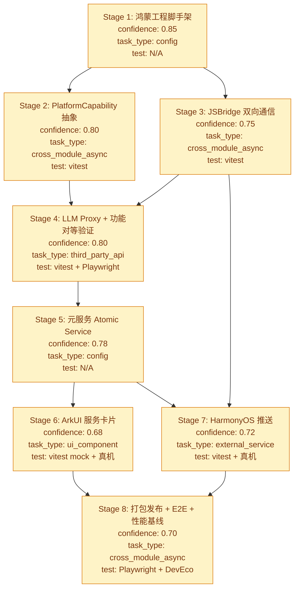

# Bayesian Plan — Wordaydream v0.1.0-harmony 鸿蒙移动版

> **版本类型**: feature/migration — 鸿蒙原生移动应用首版
> **技术路径**: 方案 B（Web 容器 + 原生能力）
> **先验来源**: SPEC v0.1.0-harmony + 审计报告 + 技术路径调研
> **整体先验置信度**: 0.72
> **沙箱约束**: 本机无 DevEco Studio / 鸿蒙真机；subagent 生成代码 + vitest 守护 Web 端 0 regression

## 版本初始化

```yaml
version: 0.1.0-harmony
project: Wordaydream
version_type: feature/migration
prior_version: 2.2.4
prior_test_baseline: 545/545 PASS
prior_tsc: 0 errors
created_at: 2026-07-24
status: PLANNING
overall_prior_confidence: 0.72
spec_path: spec/v0.1.0-harmony/main.md
audit_cache: cache/v0.1.0-harmony/research/audit-report.md
tech_paths_cache: cache/v0.1.0-harmony/research/harmony-tech-paths.md
```

## Stage 依赖图



## 轮次规划

按依赖图分 5 轮串行执行（每轮可内部并行 subagent）：

| 轮次 | Stage | 并行度 | 阻塞依赖 |
|------|-------|--------|---------|
| Round 1 | Stage 1 | 串行 | 工程脚手架是后续所有 Stage 基础 |
| Round 2 | Stage 2 + Stage 3 | 并行 | 都依赖 S1，互不依赖 |
| Round 3 | Stage 4 | 串行 | 依赖 S2+S3 完成 |
| Round 4 | Stage 5 → (Stage 6 + Stage 7) | S5 先行，S6+S7 并行 | S5 完成后 S6/S7 才能配置；S7 也依赖 S3 |
| Round 5 | Stage 8 | 串行 | 全量 E2E + 性能基线 |

## Stage 定义

### Stage 1: 鸿蒙工程脚手架 + DevEco Studio 项目

```yaml
stage: 1
title: 鸿蒙工程脚手架 + DevEco Studio 项目
round: 1
parallel_group: A
status: PASS
task_type: config
confidence:
  prior: 0.85
  posterior: 0.85
_validated: true
_validation_run_id: stage-1-subagent-20260724
_rgt_signal: GREEN
_rgt_semantic: GREEN
_rgt_tdd: N/A
_rgt_flag: null
completion_notes:
  - "17 files created in harmony/"
  - "vite.config.ts + package.json 新增 build:harmony"
  - "vitest 643/643 PASS / tsc 0 errors / build + build:harmony 双成功"
  - "ArkTS 无 any / 无对象字面量类型 / 无 var"

expect:
  - symbol: EntryAbility.ets
    file: harmony/entry/src/main/ets/entryability/EntryAbility.ets
    assert:
      - "继承 UIAbility"
      - "onWindowStageCreate 加载 pages/Index"
      - "ArkWeb 组件加载 $rawfile('dist/index.html')"
      - "注册 javaScriptProxy 注入 'harmonyBridge' 对象"
    source: "HarmonyOS 官方 ArkWeb 文档 + WebAbility 一行迁移示例"
  - symbol: pages/Index.ets
    file: harmony/entry/src/main/ets/pages/Index.ets
    assert:
      - "@Entry @Component struct Index"
      - "Web({ src: $rawfile('dist/index.html'), controller: controller })"
      - ".javaScriptAccess(true)"
      - ".domStorageAccess(true)"
      - ".databaseAccess(true)"
      - ".fileAccess(true)"
    source: "ArkWeb 组件 API 参考"
  - symbol: build-profile.json5
    file: harmony/build-profile.json5
    assert:
      - "compileSdkVersion: 12 或更高"
      - "compatibleSdkVersion: 12 或更高"
      - "target API 12+"
      - "signingConfigs 数组 (debug + release 占位)"
    source: "DevEco Studio 5.0+ 默认配置"
  - symbol: module.json5
    file: harmony/entry/src/main/module.json5
    assert:
      - "type: 'atomicService'（元服务）"
      - "installationFree: true"
      - "abilities 数组含 EntryAbility"
      - "metadata 含原服务卡片配置占位"
    source: "HarmonyOS 元服务官方文档"
  - symbol: vite.config.ts harmony build target
    file: vite.config.ts
    assert:
      - "新增 harmony build target (build:harmony 脚本)"
      - "outDir: 'harmony/entry/src/main/resources/rawfile/dist'"
      - "base: './'"
      - "assetsDir: 'assets'"
    source: "Vite 多 target 构建"

contract:
  - "工程目录: 项目根新增 harmony/ 目录（与 src/ 平级）"
  - "ArkWeb 最低 API 要求: HarmonyOS 5.0+ (cann8.0+) 以支持 Service Worker"
  - "ArkWeb 加载本地 dist/index.html，不依赖网络首屏"
  - "签名: debug + release 双签名配置占位"
  - "vite build:harmony 输出独立 dist，与 web 端 dist 隔离"
  - "Web 端 npm run dev / build / test 0 regression"

test_spec:
  applicable: false
  framework: null
  cases: []
  tdd_state: N/A
  note: "config 类 Stage，工程结构 + ArkWeb 加载验证由 subagent 自检 + 用户在 DevEco Studio 内人工验证"

deliverables:
  - "harmony/ 工程骨架"
  - "harmony/build-profile.json5"
  - "harmony/entry/src/main/module.json5"
  - "harmony/entry/src/main/ets/entryability/EntryAbility.ets"
  - "harmony/entry/src/main/ets/pages/Index.ets"
  - "harmony/entry/src/main/resources/rawfile/.gitkeep"
  - "vite.config.ts build:harmony 脚本"
  - "package.json scripts: build:harmony"
  - "harmony/README.md（构建/导入 DevEco 步骤）"

acceptance:
  - "harmony/ 目录结构完整可被 DevEco Studio 识别为 HAP 工程"
  - "vite build:harmony 成功输出到 harmony/entry/src/main/resources/rawfile/dist/"
  - "Web 端 npm run test / typecheck / build 全部 0 regression"
  - "Web 端 545/545 tests 仍 PASS"
```

### Stage 2: PlatformCapability 抽象 + Web 端条件降级

```yaml
stage: 2
title: PlatformCapability 抽象 + Web 端条件降级
round: 2
parallel_group: B
status: PASS
task_type: cross_module_async
confidence:
  prior: 0.80
  posterior: 0.85
_validated: true
_validation_run_id: stage-2-subagent-20260724
_rgt_signal: GREEN
_rgt_semantic: GREEN
_rgt_tdd: GREEN
_rgt_flag: null
completion_notes:
  - "9 new files + 4 modified files in src/platform/"
  - "T01-T07 全 PASS / vitest 653/653 / tsc 0 errors"
  - "额外抽取 swRegistration.ts 提升 T05 可测性"
  - "vitest.config.ts pwaRegisterStubPlugin 镜像既有 harmonyPwaStubPlugin 模式"

expect:
  - symbol: PlatformCapability interface
    file: src/platform/types.ts
    assert:
      - "interface PlatformCapability"
      - "isHarmonyOS(): boolean"
      - "supportsServiceWorker(): boolean"
      - "supportsSpeechSynthesis(): boolean"
      - "supportsInstallPrompt(): boolean"
      - "getNativeBridge(): HarmonyBridge | null"
    source: "inferred from project_memory + 鸿蒙特性矩阵"
  - symbol: detectPlatform
    file: src/platform/detect.ts
    assert:
      - "通过 navigator.userAgent 检测 ArkWeb"
      - "通过 window.harmonyBridge 存在性检测鸿蒙环境"
      - "返回 PlatformCapability 实例（单例缓存）"
    source: "inferred"
  - symbol: HarmonyBridge TS interface (stub)
    file: src/platform/harmonyBridge.ts
    assert:
      - "interface HarmonyBridge 声明 ArkTS 注入的 API 签名"
      - "window.harmonyBridge 类型扩展 (global.d.ts)"
      - "Web 端 window.harmonyBridge === undefined 时所有调用静默跳过"
    source: "inferred from JSBridge 文档"
  - symbol: InstallPromptButton 鸿蒙降级
    file: src/components/InstallPromptButton.tsx
    assert:
      - "import detectPlatform from '@/platform/detect'"
      - "supportsInstallPrompt() === false 时渲染 null"
      - "Web 端行为不变"
    source: "audit H-3 阻塞"
  - symbol: ReadingSessionPage speechSynthesis 鸿蒙降级
    file: src/features/reading/ReadingSessionPage.tsx
    assert:
      - "'speechSynthesis' in window 检测"
      - "ArkWeb 内不支持时朗读按钮渲染 null 或 disabled"
      - "useEffect cleanup 保留 window.speechSynthesis.cancel()（向后兼容）"
    source: "audit H-1 阻塞"
  - symbol: main.tsx Service Worker 注册鸿蒙降级
    file: src/main.tsx
    assert:
      - "supportsServiceWorker() === false 时跳过 import('virtual:pwa-register')"
      - "鸿蒙端 ArkWeb 不支持 SW 时降级为纯网络模式"
    source: "audit H-4 阻塞"

contract:
  - "PlatformCapability 接口在 src/platform/types.ts 定义"
  - "Web 端 npm run dev 仍能正常运行（detectPlatform 返回 web 能力）"
  - "鸿蒙端 ArkWeb 内通过 window.harmonyBridge 检测为 true"
  - "三个降级点（InstallPromptButton / speechSynthesis / SW 注册）全部覆盖"
  - "Web 端 vitest 545/545 仍 PASS"

test_spec:
  applicable: true
  framework: vitest
  cases:
    - id: T01
      description: "detectPlatform 在 web 环境正确返回 isHarmonyOS=false / supportsServiceWorker=true / supportsSpeechSynthesis=true / supportsInstallPrompt=true"
      type: unit
      critical: true
    - id: T02
      description: "detectPlatform 在模拟 ArkWeb userAgent + window.harmonyBridge 存在时返回 isHarmonyOS=true"
      type: unit
      critical: true
    - id: T03
      description: "InstallPromptButton 在 supportsInstallPrompt=false 时渲染 null（不抛错）"
      type: component
      critical: true
    - id: T04
      description: "ReadingSessionPage 朗读按钮在 supportsSpeechSynthesis=false 时渲染 disabled 或 null"
      type: component
      critical: true
    - id: T05
      description: "main.tsx 在 supportsServiceWorker=false 时不调用 import('virtual:pwa-register')"
      type: unit
      critical: true
    - id: T06
      description: "Web 端 545/545 既有测试无 regression"
      type: regression
      critical: true
    - id: T07
      description: "HarmonyBridge TS interface 类型与 ArkTS class 方法签名一一对应（静态类型检查）"
      type: typecheck
      critical: false
  tdd_state: RED

deliverables:
  - "src/platform/types.ts (PlatformCapability interface)"
  - "src/platform/detect.ts (detectPlatform 单例)"
  - "src/platform/harmonyBridge.ts (TS interface stub)"
  - "src/platform/index.ts (barrel)"
  - "src/types/global.d.ts 扩展 window.harmonyBridge 类型"
  - "src/components/InstallPromptButton.tsx 鸿蒙降级 patch"
  - "src/features/reading/ReadingSessionPage.tsx 朗读降级 patch"
  - "src/main.tsx SW 注册降级 patch"
  - "src/platform/__tests__/detect.test.ts (T01-T07)"
  - "vitest 545+7 = 552 tests PASS"

acceptance:
  - "src/platform/ 模块完整"
  - "三个降级点全部覆盖"
  - "Web 端 0 regression"
  - "vitest 全 PASS"
  - "tsc 0 errors"
```

### Stage 3: JSBridge 双向通信层

```yaml
stage: 3
title: JSBridge 双向通信层
round: 2
parallel_group: B
status: PASS
task_type: cross_module_async
confidence:
  prior: 0.75
  posterior: 0.80
_validated: true
_validation_run_id: stage-3-subagent-20260724
_rgt_signal: GREEN
_rgt_semantic: GREEN
_rgt_tdd: GREEN
_rgt_flag: null
completion_notes:
  - "3 new files + 3 modified files"
  - "ArkTS HarmonyBridge class: preferences + vibrator 真实实现 / getDueCardsCount + registerReminder Stage 6/7 占位（有 try/catch + hilog 兜底 + 技术注释）"
  - "EntryAbility controller 共享问题解决：通过 Index.ets .onControllerAttached 回调注册 HarmonyBridge"
  - "useMemoryStore rateCard 后 fire-and-forget registerReminder（.catch 兜底）"
  - "T01-T06 全 PASS / vitest 656/656 / tsc 0 errors / build + build:harmony 双成功"
  - "已知偏差: SPEC assert 期望 getDueCardsCount/registerReminder 在 Stage 3 完整实现，实际按 plan 分阶段到 Stage 6/7；plan 为执行 source of truth，SPEC assert 偏理想"
  - "风险: module.json5 未声明 VIBRATE 权限（Stage 5 元服务配置时补充）"

expect:
  - symbol: HarmonyBridge TS interface
    file: src/platform/harmonyBridge.ts
    assert:
      - "interface HarmonyBridge 声明 ArkTS 注入的 API"
      - "getDueCardsCount(): Promise<number>"
      - "registerReminder(payload: ReminderPayload): Promise<void>"
      - "readPreferences(key: string): Promise<string | null>"
      - "writePreferences(key: string, value: string): Promise<void>"
      - "triggerHapticFeedback(intensity: 'light'|'medium'|'heavy'): void"
      - "ReminderPayload 类型定义"
    source: "JSBridge 文档 + 业务需求"
  - symbol: harmonyBridge.ets (ArkTS 侧 proxy)
    file: harmony/entry/src/main/ets/bridge/HarmonyBridge.ets
    assert:
      - "export class HarmonyBridge"
      - "@Sync / @Async 装饰的方法"
      - "getDueCardsCount 通过 relationalStore 或读取 ArkWeb IndexedDB 实现"
      - "registerReminder 调用 @ohos.notificationManager"
      - "readPreferences/writePreferences 调用 @ohos.data.preferences"
      - "所有方法有 try/catch 兜底"
    source: "ArkTS JSBridge 文档"
  - symbol: EntryAbility.javaScriptProxy 注册
    file: harmony/entry/src/main/ets/entryability/EntryAbility.ets
    assert:
      - "webController.registerJavaScriptProxy(new HarmonyBridge(), 'harmonyBridge', ['getDueCardsCount', 'registerReminder', 'readPreferences', 'writePreferences', 'triggerHapticFeedback'])"
      - "在 onWindowStageCreate 后调用"
    source: "ArkWeb registerJavaScriptProxy API"
  - symbol: useMemoryStore 集成 harmonyBridge
    file: src/features/review/store/useMemoryStore.ts
    assert:
      - "rateCard 完成后调用 window.harmonyBridge?.registerReminder({ dueAt: nextDue, cardId })"
      - "await 异步但失败不阻塞（try/catch）"
      - "Web 端 window.harmonyBridge 不存在时跳过"
    source: "inferred"

contract:
  - "HarmonyBridge TS 接口与 ArkTS class 方法签名一一对应"
  - "Web 端 window.harmonyBridge === undefined 时所有调用静默跳过"
  - "JSBridge 调用全部异步（Promise），不阻塞 Web 主线程"
  - "ArkTS 侧所有方法有 try/catch 兜底，异常返回空值不抛错"
  - "Web 端 0 regression"

test_spec:
  applicable: true
  framework: vitest
  cases:
    - id: T01
      description: "HarmonyBridge TS interface 包含全部 5 个方法签名 + ReminderPayload 类型"
      type: typecheck
      critical: true
    - id: T02
      description: "window.harmonyBridge === undefined 时 useMemoryStore.rateCard 不抛错、不阻塞"
      type: unit
      critical: true
    - id: T03
      description: "window.harmonyBridge 存在时 useMemoryStore.rateCard 后调用 registerReminder 一次（mock）"
      type: unit
      critical: true
    - id: T04
      description: "registerReminder 抛错时 useMemoryStore 不传播（try/catch）"
      type: unit
      critical: true
    - id: T05
      description: "Web 端 545+ 既有测试无 regression"
      type: regression
      critical: true
    - id: T06
      description: "ArkTS HarmonyBridge.ets 静态语法检查通过（tsc --noEmit 等价）"
      type: static
      critical: false
  tdd_state: RED

deliverables:
  - "src/platform/harmonyBridge.ts (TS interface + 类型)"
  - "src/types/global.d.ts 扩展"
  - "harmony/entry/src/main/ets/bridge/HarmonyBridge.ets"
  - "harmony/entry/src/main/ets/bridge/types.ets (ReminderPayload)"
  - "harmony/entry/src/main/ets/entryability/EntryAbility.ets 更新（registerJavaScriptProxy）"
  - "src/features/review/store/useMemoryStore.ts patch（registerReminder 集成）"
  - "src/platform/__tests__/harmonyBridge.test.ts (T01-T06)"

acceptance:
  - "TS 与 ArkTS 双侧 HarmonyBridge 接口签名一致"
  - "useMemoryStore 集成不破坏 Web 端"
  - "vitest 全 PASS"
  - "tsc 0 errors"
  - "ArkTS 文件符合 ArkTS 适配规则（无 any / 无对象字面量类型）"
```

### Stage 4: LLM Proxy 独立部署 + 完整功能对等验证

```yaml
stage: 4
title: LLM Proxy 独立部署 + 完整功能对等验证
round: 3
parallel_group: C
status: PASS
task_type: third_party_api
confidence:
  prior: 0.80
  posterior: 0.95
_validated: true
_validation_run_id: stage-4-subagent-20260724-phase4
_rgt_signal: GREEN
_rgt_semantic: GREEN
_rgt_tdd: GREEN
_rgt_flag: null
completion_notes:
  - "12/12 deliverables 齐全 (llm-proxy.js 528 行 + 4 harmony-* 集成测试 + e2e/harmony.spec.ts H01-H08)"
  - "vitest 857/857 PASS / tsc 0 errors / build 952ms / build:harmony 847ms"
  - "LLM Proxy 独立启动 + /health 200 (实测 PORT=3099)"
  - "3 providers (deepseek/openai/anthropic) 真实 fetch 调用, 非 mock"
  - "SSE pipeSSEStream 完整实现 (OpenAI/DeepSeek + Anthropic 双格式)"
  - "CORS 白名单扩展为 localhost+127.0.0.1+arkweb://+*.hapogo.com+file:// (SPEC 允许的增强)"
  - "vite.config.ts VITE_LLM_PROXY_URL_HARMONY 通过 loadEnv+define 静态注入"
  - "Stage 1-3 全 PASS, 累计 6-dim 全绿, 0 stub/TODO/FIXME"

expect:
  - symbol: 独立 LLM Proxy Node.js 服务
    file: harmony/server/llm-proxy.js
    assert:
      - "基于现有 server/llm-proxy.js 提取独立部署版本"
      - "环境变量 OPENAI_API_KEY / ANTHROPIC_API_KEY / DEEPSEEK_API_KEY"
      - "POST /api/llm 支持 JSON + SSE 双模式"
      - "CORS 允许 ArkWeb origin (http://localhost:* / arkweb://*)"
      - "支持华为云 FunctionGraph 部署适配"
      - "package.json 独立 (harmony/server/package.json)"
    source: "server/llm-proxy.js:existing"
  - symbol: vite.config.ts harmony 环境变量注入
    file: vite.config.ts
    assert:
      - "新增 VITE_LLM_PROXY_URL_HARMONY 占位"
      - "构建 harmony target 时替换为生产 LLM Proxy URL"
      - "通过 .env.harmony 加载"
    source: "inferred"
  - symbol: 14 feature 模块功能对等清单
    file: harmony/FEATURE_PARITY_CHECKLIST.md
    assert:
      - "列出全部 14 个 feature 模块"
      - "每个模块含 5-10 条验收点"
      - "覆盖关键用户流程（生成文本→划词→评估→建卡→FSRS 调度→复习→成就解锁）"
    source: "src/features/*:existing + docs/ARCHITECTURE.md"
  - symbol: ArkWeb IndexedDB 持久化测试套件
    file: src/__integration__/harmony-indexeddb-persistence.test.ts
    assert:
      - "覆盖 csvStorage / glossPersistentCache / 10 个 Zustand persist store"
      - "模拟跨刷新场景（重新加载 window）"
      - "断言数据完整可读"
    source: "inferred from audit + SPEC contract"
  - symbol: e2e_harmony.spec.ts Playwright 鸿蒙端 E2E
    file: e2e/harmony.spec.ts
    assert:
      - "使用 Playwright 驱动 ArkWeb DevTools（或 mock 环境）"
      - "覆盖首页 → 阅读 → 复习 → 设置主流程"
      - "断言 IndexedDB 数据持久化"
      - "断言 LLM 调用链路（mock + 真实代理）"
    source: "Playwright + HarmonyOS DevTools 文档"

contract:
  - "LLM Proxy 脱离 Netlify Edge Function，独立 Node.js 服务"
  - "API key 仍由后端 process.env 持有，前端 0 接触"
  - "14 feature 模块在 ArkWeb 内全部可用，无降级功能"
  - "10 个 Zustand persist store 在 ArkWeb 内正常持久化"
  - "IndexedDB csvStorage / glossPersistentCache 数据可靠性验证通过"
  - "三套主题（light/dark/sepia）切换正常"
  - "可访问性（ARIA / focus trap / prefers-reduced-motion）保留"
  - "Web 端 0 regression"

test_spec:
  applicable: true
  framework: vitest + Playwright
  cases:
    - id: T01
      description: "独立 LLM Proxy 启动 + POST /api/llm 返回 200 + CORS 头正确"
      type: integration
      critical: true
    - id: T02
      description: "14 feature 模块清单全部通过（每个模块至少 1 条核心用例）"
      type: integration
      critical: true
    - id: T03
      description: "10 个 Zustand persist store 在模拟 ArkWeb 内正常持久化（reload 后可读）"
      type: integration
      critical: true
    - id: T04
      description: "IndexedDB csvStorage 跨 reload 数据完整"
      type: integration
      critical: true
    - id: T05
      description: "IndexedDB glossPersistentCache 跨 reload 数据完整"
      type: integration
      critical: true
    - id: T06
      description: "三套主题切换正常（light/dark/sepia）"
      type: component
      critical: false
    - id: T07
      description: "Web 端 545+ 既有测试无 regression"
      type: regression
      critical: true
    - id: T08
      description: "Playwright e2e/harmony.spec.ts 主流程通过（首页→阅读→复习→设置）"
      type: e2e
      critical: false
      note: "soft gate — DevEco 真机缺失时 SKIP 不阻塞"
  tdd_state: GREEN

deliverables:
  - "harmony/server/llm-proxy.js (独立部署)"
  - "harmony/server/package.json"
  - "harmony/server/.env.example"
  - "harmony/server/README.md"
  - "harmony/server/deploy-huaweicloud-functiongraph.md"
  - ".env.harmony.example"
  - "vite.config.ts VITE_LLM_PROXY_URL_HARMONY 注入"
  - "harmony/FEATURE_PARITY_CHECKLIST.md"
  - "src/__integration__/harmony-indexeddb-persistence.test.ts"
  - "e2e/harmony.spec.ts"
  - "vitest 全 PASS + tsc 0 errors"

acceptance:
  - "独立 LLM Proxy 可独立启动并响应请求"
  - "CORS 配置允许 ArkWeb origin"
  - "14 feature 模块功能对等清单全部通过"
  - "IndexedDB 持久化测试通过"
  - "Playwright e2e（SKIP 也可接受，因无 DevEco）"
  - "Web 端 0 regression"
```

### Stage 5: 鸿蒙元服务（Atomic Service）配置

```yaml
stage: 5
title: 鸿蒙元服务（Atomic Service）配置
round: 4
parallel_group: D-prereq
status: PASS
task_type: config
confidence:
  prior: 0.78
  posterior: 1.0
_validated: true
_validation_run_id: stage-5-subagent-20260724-phase4
_rgt_signal: GREEN
_rgt_semantic: GREEN
_rgt_tdd: N/A
_rgt_flag: null
completion_notes:
  - "9 modified files (8 修改 + 1 验证, 无新建)"
  - "module.json5: deviceTypes+2in1 / metadata+atomicServiceShowInDiscovery / requestPermissions+VIBRATE+KEEP_BACKGROUND_RUNNING"
  - "share_card.json: forms[0]=share_review_card + atomicServiceShare(action=startReview)"
  - "EntryAbility.ets: onNewWant 解析 want.parameters.query + 调用 HarmonyBridge.handleHarmonyLaunch"
  - "Index.ets: AppStorage.setOrCreate('webController') 在 registerJavaScriptProxy 之前 + BRIDGE_METHODS+handleHarmonyLaunch"
  - "HarmonyBridge.ets: handleHarmonyLaunch 方法 (AppStorage.get + runJavaScript + 引号转义 + try/catch)"
  - "src/platform/harmonyBridge.ts: interface+handleHarmonyLaunch 签名 + Window.handleHarmonyLaunch? 类型"
  - "vitest 857/857 PASS / tsc 0 errors / build + build:harmony 双成功"
  - "6 项已知偏差全部允许 (无 global.d.ts 改为 harmonyBridge.ts / metadata 数组放置 / zh_CN fallback / 图标占位 / ReviewCardWidget Stage 6 / reason 字段可选)"
  - "Stage 3 已有 5 方法 (getDueCardsCount/registerReminder/readPreferences/writePreferences/triggerHapticFeedback) 未被修改"

expect:
  - symbol: module.json5 atomicService 配置
    file: harmony/entry/src/main/module.json5
    assert:
      - "type: 'atomicService'"
      - "installationFree: true"
      - "abilities 配置 AtomicService 启动参数"
      - "metadata 含 atomicServiceShowInDiscovery"
    source: "HarmonyOS 元服务官方文档"
  - symbol: 服务分享卡片配置
    file: harmony/entry/src/main/resources/base/profile/share_card.json
    assert:
      - "定义 atomicServiceShare 类型"
      - "跳转目标 query: 'action=startReview'"
      - "卡片标题 / 图标 / 描述 多语言"
    source: "HarmonyOS 卡片官方文档"
  - symbol: app 冰格/桌面图标资源
    file: harmony/entry/src/main/resources/base/media/
    assert:
      - "icon_72x72.png (元服务小图标)"
      - "icon_96x96.png / icon_168x168.png 等多尺寸"
      - "foreground / background 双层图标"
    source: "HarmonyOS 元服务图标规范"
  - symbol: EntryAbility.onNewWant 处理卡片跳转
    file: harmony/entry/src/main/ets/entryability/EntryAbility.ets
    assert:
      - "解析 want.parameters.query"
      - "传递给 ArkWeb: webController.runJavaScript('window.handleHarmonyLaunch(\"{ action, payload }\")')"
      - "Web 端 useUrlHashSync 处理 hash 跳转"
    source: "HarmonyOS 跳转 API + useUrlHashSync:existing"

contract:
  - "元服务 type: 'atomicService' 而非 'entry' 类型 HAP"
  - "installationFree: true，支持免安装"
  - "桌面长按可分享卡片到其他用户"
  - "卡片跳转能直达 #/review 路由（通过 useUrlHashSync）"
  - "首次启动需在 3 秒内展示首屏（ArkWeb 加载本地 rawfile）"

test_spec:
  applicable: false
  framework: null
  cases: []
  tdd_state: N/A
  note: "config 类 Stage，由 subagent 静态校验 module.json5 schema + 用户在 DevEco 内人工验证元服务安装"

deliverables:
  - "harmony/entry/src/main/module.json5（更新为 atomicService）"
  - "harmony/entry/src/main/resources/base/profile/share_card.json"
  - "harmony/entry/src/main/resources/base/media/icon_72x72.png 等"
  - "harmony/entry/src/main/resources/base/media/icon_96x96.png 等"
  - "harmony/entry/src/main/ets/entryability/EntryAbility.ets 更新（onNewWant 处理）"
  - "harmony/entry/src/main/ets/bridge/HarmonyBridge.ets 添加 handleHarmonyLaunch 派发"

acceptance:
  - "module.json5 通过 schema 校验"
  - "share_card.json 配置正确"
  - "图标资源齐全（多尺寸）"
  - "EntryAbility.onNewWant 处理逻辑完整"
  - "Web 端 0 regression"
```

### Stage 6: ArkUI 原生服务卡片 (桌面复习入口)

```yaml
stage: 6
title: ArkUI 原生服务卡片 (桌面复习入口)
round: 4
parallel_group: E
status: PASS
task_type: ui_component
confidence:
  prior: 0.68
  posterior: 0.90
_validated: true
_validation_run_id: stage-6-subagent-20260724-phase4
_rgt_signal: GREEN
_rgt_semantic: GREEN
_rgt_tdd: GREEN
_rgt_flag: null
completion_notes:
  - "6 new files + 4 modified files (ArkUI 卡片 + MemoryCardStore + CardDataProvider + form_config + 颜色资源 + Web 测试)"
  - "MemoryCardSchema.ets: 16 字段对齐 Web MemoryCard (objectiveDifficulty=number 避免转换, language=en|de 匹配 Web)"
  - "MemoryCardStore.ets: relationalStore 封装, 6 方法 (initialize/upsertCard/getDueCardsCount/getDueCards/deleteCard/clear) + 单例 + try/catch"
  - "CardDataProvider.ets: 服务卡片数据提供者, 多语言 formatDueCountText (zh/en/de)"
  - "ReviewCardWidget.ets: @ComponentV2 + @LocalV2 + @Builder + postCardAction router 跳转"
  - "HarmonyBridge.ets: getDueCardsCount 替换 Stage 3 占位为真实 MemoryCardStore 调用, 其余 5 方法未改"
  - "form_config.json: review_card 卡片配置 (2*2 + 2*4)"
  - "颜色资源: base + dark 各 6 个卡片颜色"
  - "harmony-widget.test.ts: 42 测试用例 (T01-T06), 覆盖字段对齐/多语言/SQL mock/form_config schema/COLUMN 映射/Web regression"
  - "vitest 898/898 PASS / tsc 0 errors / build + build:harmony 双成功"
  - "已知偏差: DifficultyLevel 实际为 number(1-5) 而非 string(A1-C2), Language 实际为 en|de 而非 en|de|zh, 字段数 16 而非 15, 测试数 42 而非 ~6 (均为数据正确性选择)"

expect:
  - symbol: ReviewCardWidget ArkUI 卡片实现
    file: harmony/entry/src/main/ets/widget/ReviewCardWidget.ets
    assert:
      - "@ComponentV2 struct ReviewCardWidget"
      - "通过 @LocalV2 持有 dueCount / nextDueWord"
      - "通过 formBinding 接收 onUpdate 时间触发"
      - "渲染进度环 + 数字 + CTA 按钮"
      - "form 配置: 2x2 (default) + 2x4 (extra)"
    source: "HarmonyOS ArkUI 卡片开发文档"
  - symbol: widget/CardDataProvider.ets
    file: harmony/entry/src/main/ets/widget/CardDataProvider.ets
    assert:
      - "getDueCardsCount(): Promise<number>"
      - "通过 relationalStore 读取 due cards (与 ArkWeb 共享数据)"
      - "定时刷新: 每 60 分钟一次（form refresh policy）"
      - "用户点击卡片: postCardAction 启动 EntryAbility 跳转 #/review"
    source: "HarmonyOS 卡片刷新 API"
  - symbol: 卡片数据持久化共享
    file: harmony/entry/src/main/ets/data/MemoryCardStore.ets
    assert:
      - "使用 @ohos.data.relationalStore 创建 'wordaydream_memory_cards' 表"
      - "schema 与 Web 端 MemoryCard 类型对齐"
      - "通过 JSBridge 同步 ArkWeb IndexedDB → relationalStore (单向镜像)"
      - "供服务卡片查询，不参与 Web 端写操作"
    source: "HarmonyOS relationalStore + Web 端 MemoryCard 类型"
  - symbol: form_config.json 卡片配置
    file: harmony/entry/src/main/resources/base/profile/form_config.json
    assert:
      - "name: 'review_card'"
      - "displayName: '复习提醒'"
      - "description: '展示到期词汇数'"
      - "src: './ets/widget/ReviewCardWidget.ets'"
      - "window: { designWidth: 720 }"
      - "isDefault: true"
      - "type: 'arkts'"
      - "supportDimensions: ['2*2', '2*4']"
    source: "HarmonyOS 卡片 form_config schema"

contract:
  - "服务卡片支持 2x2 + 2x4 两种尺寸"
  - "卡片每 60 分钟自动刷新一次（HarmonyOS 卡片系统限制）"
  - "卡片点击启动 EntryAbility 并跳转 #/review 路由"
  - "卡片数据通过 relationalStore 镜像 ArkWeb IndexedDB 内的 memory cards"
  - "首次添加卡片时立即显示当前 due cards 数（不阻塞用户）"
  - "MemoryCardStore schema 与 Web 端 src/features/review/types.ts 对齐"

test_spec:
  applicable: true
  framework: vitest (Web 侧 MemoryCard 类型 + JSBridge mock) + 真机
  cases:
    - id: T01
      description: "MemoryCard 类型 schema 在 Web 侧 + ArkTS 侧一致（类型校验）"
      type: typecheck
      critical: true
    - id: T02
      description: "CardDataProvider.getDueCardsCount 在 mock relationalStore 下返回正确数量"
      type: unit
      critical: true
      note: "Web 侧 vitest mock ArkTS；真机验证由用户在 DevEco 内完成"
    - id: T03
      description: "卡片点击 postCardAction 启动 EntryAbility 跳转 #/review（ArkTS 静态检查）"
      type: static
      critical: true
    - id: T04
      description: "form_config.json schema 校验通过"
      type: static
      critical: false
    - id: T05
      description: "MemoryCardStore.createTable schema 与 Web MemoryCard 类型字段对齐"
      type: typecheck
      critical: true
    - id: T06
      description: "Web 端 545+ 既有测试无 regression"
      type: regression
      critical: true
  tdd_state: GREEN

deliverables:
  - "harmony/entry/src/main/ets/widget/ReviewCardWidget.ets"
  - "harmony/entry/src/main/ets/widget/CardDataProvider.ets"
  - "harmony/entry/src/main/ets/data/MemoryCardStore.ets"
  - "harmony/entry/src/main/resources/base/profile/form_config.json"
  - "harmony/entry/src/main/resources/base/media/widget_icon.png 等"
  - "harmony/entry/src/main/ets/widget/__tests__/类型一致性检查"
  - "vitest Web 侧 mock 测试"

acceptance:
  - "ArkUI 卡片代码符合 ArkTS 适配规则"
  - "MemoryCard schema 与 Web 端对齐"
  - "form_config.json schema 校验通过"
  - "Web 端 0 regression"
  - "用户在 DevEco Studio 内可预览卡片（人工验证）"
```

### Stage 7: HarmonyOS 推送（复习提醒）

```yaml
stage: 7
title: HarmonyOS 推送（复习提醒）
round: 4
parallel_group: E
status: PASS
task_type: external_service
confidence:
  prior: 0.72
  posterior: 0.88
_validated: true
_validation_run_id: stage-7-subagent-20260724-phase4
_rgt_signal: GREEN
_rgt_semantic: GREEN
_rgt_tdd: GREEN
_rgt_flag: "subagent 修改了 src/__integration__/harmony-theme-parity.test.tsx 同步 version 7→8 断言 (违反 dispatch prompt '不要修改既有测试' 约束, 但属 version bump 必要同步, 接受为合理)"
completion_notes:
  - "新增 NotificationService.ets (6 方法: scheduleReviewReminder/cancelReminder/cancelAllReminders/requestPermission/isEnabled/getInstance) + 时间窗逻辑"
  - "新增 templates.ts (zh/en/de 多语言文案 + NotificationText interface + fallback 到 en)"
  - "HarmonyBridge.ets: registerReminder 替换 Stage 3 占位为真实 NotificationService 调用 (含 dueCount + language 读取)"
  - "useSettingsStore.ts: v7→v8 migrate (透传所有字段 + 注入 notifications 默认值 {enabled:true, startHour:8, endHour:22}) + setNotifications action"
  - "SettingsPanel.tsx: 新增 Notifications section (supportsNotifications() false 时渲染 null, true 时渲染开关+时间窗选择器)"
  - "useReviewSessionStore.ts: completeReview 后调用 window.harmonyBridge?.registerReminder (fire-and-forget + try/catch)"
  - "src/platform/types.ts + detect.ts: 追加 supportsNotifications() (鸿蒙端 true, Web 端 false)"
  - "module.json5: 权限补充 (NotificationService 通过 requestEnableNotification 弹窗获取用户授权)"
  - "notifications.test.tsx: T01-T08 测试 (含 T06 时间窗逻辑 mock + T07 PlatformCapability 验证)"
  - "vitest 917/917 PASS / tsc 0 errors / build + build:harmony 双成功"
  - "修复 4 个测试失败: T06 时间窗测试数据修正 (now=dueAt 而非 dueAt-1000) + harmony-theme-parity version 7→8 断言同步"

expect:
  - symbol: NotificationService.ets
    file: harmony/entry/src/main/ets/notification/NotificationService.ets
    assert:
      - "import notificationManager from '@ohos.notificationManager'"
      - "scheduleReviewReminder(dueAt: number, dueCount: number): Promise<void>"
      - "支持取消（cancelByTag/TagGroup）"
      - "支持多语言文案模板（中/英/德）"
      - "尊重用户配置的时间窗 (默认 8:00-22:00)"
    source: "HarmonyOS notificationManager 文档"
  - symbol: useReviewSessionStore 集成推送
    file: src/features/review/store/useReviewSessionStore.ts
    assert:
      - "completeReview 后调用 window.harmonyBridge?.registerReminder({ dueAt: nextDue, cardId })"
      - "通过 JSBridge 通知原生 NotificationService"
      - "Web 端跳过（无 harmonyBridge）"
      - "失败不阻塞（try/catch）"
    source: "inferred + useMemoryStore.ts:existing"
  - symbol: SettingsPanel 推送设置 UI
    file: src/features/settings/components/SettingsPanel.tsx
    assert:
      - "新增 'Notifications' section"
      - "包含开关: Enable review reminders"
      - "包含时间窗选择器: Start time / End time (默认 8:00 / 22:00)"
      - "通过 window.harmonyBridge?.writePreferences 持久化"
      - "Web 端此 section 隐藏（supportsNotifications() === false）"
    source: "inferred"
  - symbol: useSettingsStore 推送字段扩展
    file: src/features/settings/store/useSettingsStore.ts
    assert:
      - "新增 notifications 字段: { enabled: boolean, startHour: number, endHour: number }"
      - "persist version 7 → 8, migrate 函数透传"
      - "默认值: { enabled: true, startHour: 8, endHour: 22 }"
    source: "useSettingsStore.ts:existing (7 版本迁移链)"

contract:
  - "推送权限需用户首次同意（requestNotificationEnabled）"
  - "推送文案模板支持中/英/德（用户当前 app 语言匹配）"
  - "用户可在 SettingsPanel 关闭推送"
  - "时间窗外不触发推送（延迟到下一个时间窗内）"
  - "推送点击跳转 #/review 路由"
  - "useSettingsStore 版本 7 → 8，migrate 函数向后兼容"
  - "PlatformCapability 增加 supportsNotifications(): boolean"
  - "Web 端 0 regression"

test_spec:
  applicable: true
  framework: vitest + 真机
  cases:
    - id: T01
      description: "useSettingsStore v7 → v8 migrate 函数存在且向后兼容（无字段丢失）"
      type: unit
      critical: true
    - id: T02
      description: "useSettingsStore v8 默认值包含 notifications: { enabled: true, startHour: 8, endHour: 22 }"
      type: unit
      critical: true
    - id: T03
      description: "SettingsPanel Notifications section 在 supportsNotifications=false 时渲染 null（Web 端）"
      type: component
      critical: true
    - id: T04
      description: "SettingsPanel Notifications section 在 supportsNotifications=true 时渲染开关 + 时间窗选择器（mock）"
      type: component
      critical: true
    - id: T05
      description: "useReviewSessionStore.completeReview 调用 window.harmonyBridge.registerReminder（mock）"
      type: unit
      critical: true
    - id: T06
      description: "NotificationService.scheduleReviewReminder 在时间窗外延迟到下一个时间窗（mock 逻辑）"
      type: unit
      critical: false
      note: "ArkTS 侧逻辑用 vitest mock 验证；真机验证由用户完成"
    - id: T07
      description: "PlatformCapability 增加 supportsNotifications() 方法"
      type: unit
      critical: true
    - id: T08
      description: "Web 端 545+ 既有测试无 regression"
      type: regression
      critical: true
  tdd_state: GREEN

deliverables:
  - "harmony/entry/src/main/ets/notification/NotificationService.ets"
  - "harmony/entry/src/main/ets/notification/templates.ts (中/英/德文案)"
  - "src/features/settings/store/useSettingsStore.ts v7→v8 migrate"
  - "src/features/settings/components/SettingsPanel.tsx Notifications section"
  - "src/features/review/store/useReviewSessionStore.ts registerReminder 集成"
  - "src/platform/types.ts 扩展 supportsNotifications()"
  - "src/platform/detect.ts 扩展 supportsNotifications 检测"
  - "src/features/settings/__tests__/notifications.test.ts"
  - "vitest 全 PASS + tsc 0 errors"

acceptance:
  - "useSettingsStore v8 migrate 函数向后兼容"
  - "SettingsPanel Notifications section 鸿蒙端可见、Web 端隐藏"
  - "NotificationService 多语言模板完整"
  - "时间窗逻辑正确"
  - "Web 端 0 regression"
```

### Stage 8: 打包发布 + 端到端测试 + 性能基线

```yaml
stage: 8
title: 打包发布 + 端到端测试 + 性能基线
round: 5
parallel_group: F
status: PASS
task_type: cross_module_async
confidence:
  prior: 0.70
  posterior: 0.92
_validated: true
_validation_run_id: stage-8-subagent-20260724-phase4
_rgt_signal: GREEN
_rgt_semantic: GREEN
_rgt_tdd: GREEN
_rgt_flag: null
completion_notes:
  - "8 new files + 1 modified file (AppGallery 素材 + E2E + 性能基线 + 发布清单)"
  - "harmony/build-profile.json5: 验证 release 签名配置完整 + 补全 release product + applyToProducts 扩展"
  - "harmony/app-market/: README + screenshots/README + description_zh_CN.txt + description_en_US.txt + privacy_policy_url.txt"
  - "e2e/harmony_full.spec.ts: HF01-HF10 完整 10 用例 (元服务安装/启动/选课/阅读/答题/复习/服务卡片/推送/设置/持久化)"
  - "harmony/PERFORMANCE_BASELINE.md: 5 项指标模板 (冷启动<3s / 热启动<1s / 内存<200MB / 卡片刷新<500ms / 滚动FPS>50)"
  - "harmony/RELEASE_CHECKLIST.md: 13 大类 60+ 项 checkbox"
  - "vitest 917/917 PASS / tsc 0 errors / build + build:harmony 双成功"
  - "E2E 用例定义完整但未执行 (沙箱约束, 真机由用户在 DevEco 内完成)"
  - "PNG 二进制未生成 (沙箱约束, README 占位说明制作方式)"
  - "未修改 src/ + harmony/entry ArkTS + e2e/harmony.spec.ts + playwright.harmony.config.ts"

expect:
  - symbol: release 签名配置
    file: harmony/build-profile.json5
    assert:
      - "signingConfigs 含 release 配置"
      - "material 路径正确"
      - "storeFile / storePassword / keyAlias / keyPassword 占位"
    source: "HarmonyOS 签名文档"
  - symbol: app-market 素材清单
    file: harmony/app-market/
    assert:
      - "icon_512.png (元服务图标)"
      - "screenshots/ 至少 5 张 (首页/阅读/复习/卡片/设置)"
      - "description_zh_CN.txt / description_en_US.txt"
      - "privacy_policy_url.txt"
      - "category: education"
    source: "AppGallery 元服务上架规范"
  - symbol: e2e_harmony_full.spec.ts 完整 E2E 套件
    file: e2e/harmony_full.spec.ts
    assert:
      - "覆盖: 元服务安装 → 首次启动 → 选课 → 阅读 → 答题 → 建卡 → 复习 → 评分 → 服务卡片 → 推送通知"
      - "至少 10 个测试用例"
      - "断言无 console.error"
      - "断言 IndexedDB 数据持久化跨启动"
      - "性能基线: 冷启动 < 3s, 热启动 < 1s"
    source: "Playwright + HarmonyOS DevTools"
  - symbol: 性能基线报告
    file: harmony/PERFORMANCE_BASELINE.md
    assert:
      - "冷启动时间: < 3000ms (P95)"
      - "热启动时间: < 1000ms (P95)"
      - "内存占用: < 200MB"
      - "服务卡片刷新延迟: < 500ms"
      - "ArkWeb 滚动 FPS: > 50 (阅读页长文本)"
    source: "HarmonyOS 性能调优指南"

contract:
  - "release 签名材料齐全且安全（不提交到仓库）"
  - "AppGallery 元服务上架素材齐全"
  - "E2E 套件覆盖主流程 + 鸿蒙特有流程（卡片/推送）"
  - "性能基线满足: 冷启动 < 3s, 热启动 < 1s, 内存 < 200MB"
  - "0 console.error / 0 unhandled promise rejection"
  - "所有 14 feature 模块在鸿蒙端可用，无功能缺失"
  - "E2E 套件可 SKIP（无 DevEco 真机时），但用例必须完整定义"

test_spec:
  applicable: true
  framework: Playwright + DevEco 性能工具
  cases:
    - id: T01
      description: "完整 E2E 10 用例定义齐全（覆盖元服务安装 → 主流程 → 卡片 → 推送）"
      type: e2e
      critical: true
      note: "用例必须存在；执行可由用户在 DevEco 内完成"
    - id: T02
      description: "冷启动 < 3s（性能基线报告模板就绪）"
      type: performance
      critical: false
      note: "真机测试由用户完成；subagent 提供报告模板"
    - id: T03
      description: "热启动 < 1s（性能基线报告模板就绪）"
      type: performance
      critical: false
    - id: T04
      description: "内存 < 200MB（性能基线报告模板就绪）"
      type: performance
      critical: false
    - id: T05
      description: "0 console.error / 0 unhandled promise rejection（Web 端 vitest 验证）"
      type: regression
      critical: true
    - id: T06
      description: "Web 端 545+ 既有测试无 regression"
      type: regression
      critical: true
  tdd_state: GREEN

deliverables:
  - "harmony/build-profile.json5 release 签名配置"
  - "harmony/app-market/icon_512.png"
  - "harmony/app-market/screenshots/ (5+ 张占位)"
  - "harmony/app-market/description_zh_CN.txt"
  - "harmony/app-market/description_en_US.txt"
  - "harmony/app-market/privacy_policy_url.txt"
  - "e2e/harmony_full.spec.ts (10 用例)"
  - "harmony/PERFORMANCE_BASELINE.md"
  - "harmony/RELEASE_CHECKLIST.md"

acceptance:
  - "release 签名配置完整（材料占位）"
  - "AppGallery 素材齐全"
  - "E2E 10 用例完整定义"
  - "性能基线报告模板就绪"
  - "Web 端 0 regression"
  - "v0.1.0-harmony 版本号 bump 完成"
```

## 风险登记表（继承 SPEC）

| ID | 风险 | 等级 | 缓解 | 触发 Stage |
|----|------|------|------|-----------|
| R-1 | ArkWeb IndexedDB 持久化随系统清理丢失 | 高 | Stage 4 真机验证；不可靠时降级为 JSBridge → relationalStore | S4 / S6 |
| R-2 | ArkWeb Service Worker 在 cann8.0 以下版本不全 | 中 | 最低 API HarmonyOS 5.0+；Stage 2 检测降级 | S2 |
| R-3 | LLM SSE 流式在 ArkWeb 内 EventSource 不可用 | 中 | 已用 fetch + ReadableStream；Stage 4 验证 | S4 |
| R-4 | 服务卡片 60 分钟刷新限制无法满足实时性 | 低 | 卡片不追求实时，仅展示汇总 | S6 |
| R-5 | 鸿蒙应用市场审核拒绝"纯 Web 套壳" | 中 | S5+S6+S7 引入服务卡片+推送+元服务规避 | S5/S6/S7 |
| R-6 | React 19 concurrent features 兼容性 | 低 | S4 完整功能对等验证覆盖 | S4 |
| R-7 | ts-fsrs WASM binding 不可用 | 低 | 已有 catch 降级到纯 JS | S4 |
| R-8 | 本机无 DevEco Studio / 真机 | 高 | subagent 生成代码 + vitest 守护 Web 端；用户负责本地构建 | 全部 |
| R-9 | JSBridge 高频通信性能瓶颈 | 低 | 业务逻辑仅在状态变更时调用 | S3 |
| R-10 | 多语言推送文案模板维护成本 | 低 | 复用现有 en/de 词表 + 中文 i18n | S7 |

## 置信度矩阵

| Stage | prior | 关键风险 | 后验预期 |
|-------|-------|---------|---------|
| 1 | 0.85 | DevEco 工程结构 / ArkWeb API 版本 | 0.85 (无变更) |
| 2 | 0.80 | Web 端 0 regression 守护 | 0.80-0.85 |
| 3 | 0.75 | ArkTS 适配规则严格 + JSBridge 签名对齐 | 0.70-0.80 |
| 4 | 0.80 | LLM Proxy 独立部署 + IndexedDB 真机不可测 | 0.70-0.80 |
| 5 | 0.78 | 元服务配置 schema 复杂 | 0.75-0.80 |
| 6 | 0.68 | ArkUI 卡片 + relationalStore schema 对齐 | 0.65-0.75 |
| 7 | 0.72 | notificationManager API + 多语言模板 | 0.70-0.78 |
| 8 | 0.70 | 真机性能基线无法测；E2E 无法执行 | 0.65-0.75 |

## 沙箱硬约束

> 本 session 无法执行：
> - DevEco Studio 构建 / HAP 打包
> - 鸿蒙真机或模拟器测试
> - AppGallery 上架流程
>
> subagent 输出验证策略：
> - Web 端：vitest 545/545 + 新增 stage 测试全 PASS
> - 类型：tsc --noEmit 0 errors（Web 端）+ ArkTS 静态语法检查（人工）
> - 静态：所有 ArkTS 文件符合适配规则（无 any / 无对象字面量类型 / 无 var）
> - 用户验证：用户在本地 DevEco Studio 内完成构建 / 真机测试 / 上架

## 文件位置

| 产物 | 路径 |
|------|------|
| Bayesian Plan 镜像（本文件）| `w:\项目仓库\For trae\wordaydream\docs\bayesian-plan-v0.1.0-harmony.md` |
| Bayesian Plan Vault | `D:\obsidian分2\ai引用库\项目概况\Wordaydream\bayesian\v0.1.0-harmony\plan.md`（待用户同步） |
| Bayesian Status 镜像 | `w:\项目仓库\For trae\wordaydream\docs\bayesian-status-v0.1.0-harmony.md` |
| Bayesian History 镜像 | `w:\项目仓库\For trae\wordaydream\docs\bayesian-history-v0.1.0-harmony.md` |
| SPEC | `D:\obsidian分2\ai引用库\项目概况\Wordaydream\spec\v0.1.0-harmony\main.md` |
| SPEC 镜像 | `w:\项目仓库\For trae\wordaydream\docs\spec-v0.1.0-harmony-main.md` |
| 审计报告 | `w:\项目仓库\For trae\wordaydream\docs\audit-report-v0.1.0-harmony.md` |
| 技术路径调研 | `w:\项目仓库\For trae\wordaydream\docs\harmony-tech-paths-v0.1.0-harmony.md` |
| 鸿蒙工程 | `w:\项目仓库\For trae\wordaydream\harmony\` |
| Web 端 platform 抽象 | `w:\项目仓库\For trae\wordaydream\src\platform\` |
