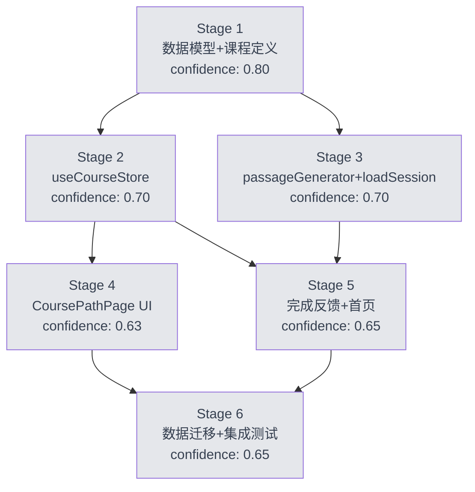

# Bayesian Plan — wordaydream v2.3.0 课程化重构

> 输入: `docs/spec-v2.3.0-main.md` (用户已批准 Approval Gate)
> 原则: Prior P(θ) → Evidence D (subagent 产出) → Posterior P(θ|D) (验证后更新)

## 总览

- **Stage 数**: 6
- **依赖结构**: DAG (Stage 1 为根, Stage 6 为汇)
- **整体 confidence (prior)**: 0.78
- **风险等级**: 中 (主要风险在数据迁移与 UI 设计偏好)

## Stage 依赖图 (Mermaid)



## 置信度矩阵

| Stage | 名称 | Prior | 主要不确定性 | 证据来源 |
|-------|------|-------|-------------|---------|
| 1 | 数据模型+课程定义 | 0.80 | 静态词表切片策略 | LibreLingo 强参考 |
| 2 | useCourseStore | 0.70 | checkCompletion 多阈值耦合 | 推断为主 |
| 3 | passageGenerator 扩展 | 0.70 | LLM targetLemmas 命中率 | 现有代码 + 推断 |
| 4 | CoursePathPage UI | 0.63 | 设计偏好与现有 paper 美学冲突 | 设计自由度高 |
| 5 | 完成反馈+首页 | 0.65 | Modal 触发条件竞态 | 推断 |
| 6 | 数据迁移+集成测试 | 0.65 | schemaVersion 迁移幂等性 | 需实测 |

## task_type → test_applicable 映射

| Stage | task_type | test_applicable | 框架 | 强制程度 |
|-------|-----------|----------------|------|---------|
| 1 | config | false | — | 可选 |
| 2 | algorithm | true | vitest | 强制 |
| 3 | cross_module_async | true | vitest | 强制 |
| 4 | ui_component | true | vitest + @testing-library/react | 强制 |
| 5 | ui_component | true | vitest + @testing-library/react | 强制 |
| 6 | config | true | vitest | 推荐 |

## Stage 完整定义

### Stage 1: 数据模型 + 静态课程定义

```yaml
stage: 1
name: "数据模型 + 静态课程定义"
task_type: config
confidence:
  prior: 0.80
  posterior: 0.85
test_spec:
  applicable: false
  framework: null
  cases: []
  tdd_state: N/A
files:
  - src/features/course/types.ts
  - src/data/courses/en.ts
  - src/data/courses/de.ts
  - src/data/courses/index.ts
expect:
  - interface Course { id; sourceLanguage; targetLanguage; title; modules: Module[] }
  - interface Module { id; courseId; cefrLevel: 'A1'|'A2'|'B1'|'B2'; title; lessons: Lesson[]; prerequisiteModuleIds: string[] }
  - interface Lesson { id; moduleId; title; theme; targetLemmas: string[]; order; completionCriteria }
  - interface CompletionCriteria { minWordsEncountered; minWordsLearned; minReviewAccuracy; requiredSessionTypes }
  - courses 静态定义: en/de 各 4 Module (A1-B2), 每个 5-8 Lesson, targetLemmas ≤15
contract:
  - "Course.id 格式: '{targetLang}-from-{sourceLang}'"
  - "Module.id 格式: '{targetLang}-{cefrLower}'"
  - "Lesson.id 格式: '{moduleId}-{themeSlug}'"
  - "Lesson.targetLemmas.length <= 15"
  - "CompletionCriteria.requiredSessionTypes 至少含 'reading'"
validated: true
_validation_run_id: main-session-light
_rgt_signal: GREEN
_rgt_semantic: GREEN
_rgt_tdd: N/A
_rgt_flag: null
```

### Stage 2: useCourseStore

```yaml
stage: 2
name: "useCourseStore + 解锁 + 完成判定"
task_type: algorithm
confidence:
  prior: 0.70
  posterior: 0.80
test_spec:
  applicable: true
  framework: "vitest"
  cases:
    - id: "T01"
      description: "checkCompletion: 三阈值全部满足时返回 true 并标记 completed"
      type: unit
      critical: true
    - id: "T02"
      description: "checkCompletion: 任一阈值未满足时返回 false, status 保持 in-progress"
      type: unit
      critical: true
    - id: "T03"
      description: "unlockNext: 当前 Module 内有下一个 locked Lesson 时解锁并返回新 lessonId"
      type: unit
      critical: true
    - id: "T04"
      description: "unlockNext: 当前 Module 全部完成时跳到下一 Module 首个 Lesson (校验 prerequisiteModuleIds)"
      type: unit
      critical: true
    - id: "T05"
      description: "recordEncounter: 同一 lemma 多次调用只算 1 (去重)"
      type: unit
      critical: true
    - id: "T06"
      description: "recordLearning: 同一 lemma 多次调用只算 1 (去重)"
      type: unit
      critical: true
    - id: "T07"
      description: "recordReview: reviewAccuracy = correctCount / totalCount 正确累加"
      type: unit
      critical: true
    - id: "T08"
      description: "enrollCourse: 设置 currentCourseId, 首个 Module 首个 Lesson status='available', 其余 'locked'"
      type: unit
      critical: true
    - id: "T09"
      description: "startLesson: 校验 status === 'available', 设置 currentLessonId, status='in-progress', startedAt=Date.now()"
      type: unit
      critical: false
    - id: "T10"
      description: "persist: localStorage key='wordaydream:course', version=1"
      type: unit
      critical: false
  tdd_state: GREEN
files:
  - src/features/course/store/useCourseStore.ts
  - src/features/course/store/useCourseStore.test.ts
expect:
  - Zustand persist, key='wordaydream:course', version=1
  - state: enrolledCourseIds, currentCourseId, currentModuleId, currentLessonId, lessonProgress
  - lessonProgress: Record<string, LessonProgress>
  - LessonProgress: { status, wordsEncountered: string[], wordsLearned: string[], reviewCorrectCount, reviewTotalCount, startedAt, completedAt }
  - status: 'locked' | 'available' | 'in-progress' | 'completed'
  - actions: enrollCourse, startLesson, recordEncounter, recordLearning, recordReview, checkCompletion, unlockNext
contract:
  - "persist key: 'wordaydream:course'"
  - "version: 1"
  - "lessonProgress key = lessonId"
  - "recordEncounter/recordLearning 内部去重 (用 string[] 而非 number, 便于审计)"
  - "checkCompletion 返回 boolean, 通过则副作用标记 completed (不直接 unlockNext)"
validated: true
_validation_run_id: stage2-subagent
_rgt_signal: GREEN
_rgt_semantic: GREEN
_rgt_tdd: GREEN
_rgt_flag: null
```

### Stage 3: passageGenerator 扩展 + loadSession 关联

```yaml
stage: 3
name: "passageGenerator targetLemmas + loadSession lessonId"
task_type: cross_module_async
confidence:
  prior: 0.70
  posterior: 0.78
test_spec:
  applicable: true
  framework: "vitest"
  cases:
    - id: "T01"
      description: "generatePassage: targetLemmas 非空时 LLM prompt 包含 'MUST INCLUDE' 指令"
      type: unit
      critical: true
    - id: "T02"
      description: "generatePassage: targetLemmas 命中率 < 60% 时 console.warn 但不抛错"
      type: unit
      critical: true
    - id: "T03"
      description: "generatePassage: targetLemmas 为空时走原逻辑 (向后兼容)"
      type: unit
      critical: true
    - id: "T04"
      description: "loadSession: lessonId 非空时 session.lessonId = lessonId"
      type: unit
      critical: true
    - id: "T05"
      description: "loadSession: passage 生成后对每个 token 调用 useCourseStore.recordEncounter(lessonId, lemma)"
      type: unit
      critical: true
    - id: "T06"
      description: "loadSession: lessonId 为空时不调用 recordEncounter (向后兼容)"
      type: unit
      critical: true
  tdd_state: GREEN
files:
  - src/features/reading/services/passageGenerator.ts
  - src/features/reading/store/useReadingSessionStore.ts
  - src/types/index.ts
expect:
  - generatePassage(options) 新增 options.targetLemmas?: string[]
  - loadSession(language, difficulty, options?) 新增 options.lessonId?: string
  - ReadingSession 新增 lessonId?: string
contract:
  - "generatePassage 签名向后兼容 (targetLemmas 可选)"
  - "loadSession 签名向后兼容 (lessonId 可选)"
  - "ReadingSession.lessonId 可选, 旧数据无此字段不报错"
  - "recordEncounter 调用必须用 lemma (去重后), 不是 surface form"
validated: true
_validation_run_id: stage3-subagent
_rgt_signal: GREEN
_rgt_semantic: GREEN
_rgt_tdd: GREEN
_rgt_flag: null
```

### Stage 4: 课程导航页 (CoursePathPage)

```yaml
stage: 4
name: "CoursePathPage + LessonCard + ModuleSection"
task_type: ui_component
confidence:
  prior: 0.63
  posterior: 0.75
test_spec:
  applicable: true
  framework: "vitest + @testing-library/react"
  cases:
    - id: "T01"
      description: "CoursePathPage: 渲染当前 Course 的 Module 列表"
      type: component
      critical: true
    - id: "T02"
      description: "LessonCard: status='locked' 时不可点击 + 显示锁图标"
      type: component
      critical: true
    - id: "T03"
      description: "LessonCard: status='available' 或 'in-progress' 时可点击, 触发 onStartLesson(lessonId)"
      type: component
      critical: true
    - id: "T04"
      description: "ModuleSection: prerequisiteModuleIds 未满足时整段禁用"
      type: component
      critical: true
    - id: "T05"
      description: "ModuleSection: 折叠状态用 localStorage 持久化"
      type: component
      critical: false
    - id: "T06"
      description: "CoursePathPage: 路由 hash '#/course' 可访问"
      type: integration
      critical: true
    - id: "T07"
      description: "LessonCard: 进度条展示 wordsEncountered/targetLemmas.length"
      type: component
      critical: false
    - id: "T08"
      description: "prefers-reduced-motion: 所有动画支持降级"
      type: component
      critical: true
  tdd_state: GREEN
files:
  - src/features/course/components/CoursePathPage.tsx
  - src/features/course/components/CoursePathPage.module.css
  - src/features/course/components/LessonCard.tsx
  - src/features/course/components/LessonCard.module.css
  - src/features/course/components/ModuleSection.tsx
  - src/features/course/components/ModuleSection.module.css
  - src/features/course/components/CoursePathPage.test.tsx
expect:
  - CoursePathPage: Module 列表 + 整体进度 + 顶部课程切换
  - LessonCard: title + theme 图标 + 进度条 + status badge
  - ModuleSection: 可折叠 + 整体完成度 + prerequisite 禁用
contract:
  - "路由 hash: '#/course'"
  - "LessonCard 点击 'available'/'in-progress' 触发 onStartLesson(lessonId)"
  - "ModuleSection 折叠状态 localStorage key: 'wordaydream:course:collapsed-modules'"
  - "CSS 必须遵循 warm white #faf8f5 + dark ink #1c1917 配色"
  - "Reading area ≥ 60% width, max-width 42rem"
validated: true
_validation_run_id: stage4-subagent
_rgt_signal: GREEN
_rgt_semantic: GREEN
_rgt_tdd: GREEN
_rgt_flag: null
```

### Stage 5: 完成反馈 + 首页改造

```yaml
stage: 5
name: "LessonCompleteModal + CurrentLessonCard + HomePage"
task_type: ui_component
confidence:
  prior: 0.65
  posterior: 0.72
test_spec:
  applicable: true
  framework: "vitest + @testing-library/react"
  cases:
    - id: "T01"
      description: "LessonCompleteModal: status === 'completed' 且本会话未展示过时弹出"
      type: component
      critical: true
    - id: "T02"
      description: "LessonCompleteModal: 展示 '课时完成' + lesson.title + 统计 (X词/Y词/Z%)"
      type: component
      critical: true
    - id: "T03"
      description: "LessonCompleteModal: 有 unlockNext 时显示 '下一课' 按钮, 无则 '返回课程'"
      type: component
      critical: true
    - id: "T04"
      description: "CurrentLessonCard: 有 currentLesson 时展示 title + Module.title + 进度环"
      type: component
      critical: true
    - id: "T05"
      description: "CurrentLessonCard: 无 currentLesson 时展示 '选择课程' CTA"
      type: component
      critical: true
    - id: "T06"
      description: "CurrentLessonCard: 点击 '继续学习' 调用 loadSession(language, difficulty, lessonId)"
      type: component
      critical: true
    - id: "T07"
      description: "HomePage: CurrentLessonCard 在 HeroSection 下方优先展示"
      type: component
      critical: false
    - id: "T08"
      description: "prefers-reduced-motion: Modal 与进度环支持降级"
      type: component
      critical: true
  tdd_state: YELLOW
files:
  - src/features/course/components/LessonCompleteModal.tsx
  - src/features/course/components/LessonCompleteModal.module.css
  - src/features/home/CurrentLessonCard.tsx
  - src/features/home/CurrentLessonCard.module.css
  - src/features/home/HomePage.tsx
  - src/features/home/CurrentLessonCard.test.tsx
expect:
  - LessonCompleteModal: 完成时弹出 + 统计 + 下一课/返回按钮
  - CurrentLessonCard: 当前课时 + Module + 进度环 + 继续学习按钮
  - HomePage: 集成 CurrentLessonCard
contract:
  - "LessonCompleteModal 触发条件: lessonProgress[lessonId].status === 'completed' 且本会话内未展示过 (用 useRef 标记)"
  - "CurrentLessonCard 点击 '继续学习' 调用 loadSession(language, difficulty, lessonId)"
  - "无 currentLesson 时 CTA 跳转 '#/course'"
  - "CSS 必须遵循 warm white + dark ink 配色, 无 emoji"
validated: true
_validation_run_id: stage5-subagent
_rgt_signal: YELLOW
_rgt_semantic: GREEN
_rgt_tdd: YELLOW
_rgt_flag: "Plan T01-T03 (LessonCompleteModal 独立测试) 未实现, subagent 把测试编号重新分配给 CurrentLessonCard. LessonCompleteModal 逻辑通过 HomePage 集成间接验证, 但缺少直接测试. Stage 6 需补充 LessonCompleteModal.test.tsx"
```

### Stage 6: 数据迁移 + 集成测试

```yaml
stage: 6
name: "useWordlistStore v5 迁移 + 集成测试"
task_type: config
confidence:
  prior: 0.65
  posterior: 0.78
test_spec:
  applicable: true
  framework: "vitest"
  cases:
    - id: "T01"
      description: "migrateWordlistToCourse: schemaVersion 4 → 5 迁移函数存在"
      type: unit
      critical: true
    - id: "T02"
      description: "迁移幂等: 重复运行不破坏数据"
      type: unit
      critical: true
    - id: "T03"
      description: "迁移后旧用户 progress[lemma] 按归属分配到 lessonProgress"
      type: unit
      critical: true
    - id: "T04"
      description: "无课程归属的词记入 'legacy' 桶"
      type: unit
      critical: false
    - id: "T05"
      description: "persistMigration.test.ts: 新增 useCourseStore 扫描"
      type: unit
      critical: true
    - id: "T06"
      description: "迁移后旧用户打开应用: currentCourseId=null, 引导选课"
      type: integration
      critical: false
  tdd_state: GREEN
files:
  - src/features/wordlist/store/useWordlistStore.ts
  - src/__tests__/persistMigration.test.ts
expect:
  - useWordlistStore schemaVersion 4 → 5
  - migrateWordlistToCourse 迁移函数
  - persistMigration.test.ts 扩展
contract:
  - "迁移后旧用户打开应用: currentCourseId=null, 引导选课"
  - "迁移幂等 (重复运行不破坏数据)"
  - "迁移函数不抛错 (容错处理未知 lemma)"
validated: true
_validation_run_id: stage6-subagent
_rgt_signal: GREEN
_rgt_semantic: GREEN
_rgt_tdd: GREEN
_rgt_flag: null
```

## Phase 0 历史摘要

首次迭代,无历史 bayesian 文档。SPEC 为 v2.3.0 起点。

## Phase 2 版本预览

无上一版本。当前生产版本为 v2.2.4 (修复语法划线 + 答题反馈 + 流式 JSON 提取)。

## 执行计划

按依赖图顺序执行:
1. Stage 1 (数据模型, config, 无测试) → 主 session 直接 dispatch subagent
2. Stage 2 (useCourseStore, algorithm, 强制 TDD) → dispatch with test_spec
3. Stage 3 (passageGenerator + loadSession, cross_module_async, 强制 TDD) → dispatch with test_spec
4. Stage 4 (CoursePathPage UI, ui_component, 强制 TDD) → dispatch with test_spec
5. Stage 5 (完成反馈 + 首页, ui_component, 强制 TDD) → dispatch with test_spec
6. Stage 6 (数据迁移, config + 测试) → dispatch with test_spec

**并行机会**: Stage 2 与 Stage 3 可并行 (都依赖 Stage 1, 互不依赖)。Stage 4 与 Stage 5 不可并行 (Stage 5 依赖 Stage 2 + Stage 4 的组件)。

**保守策略**: 顺序执行,每个 Stage 完成后更新本文件的 _validated / posterior / _rgt_* 字段。
