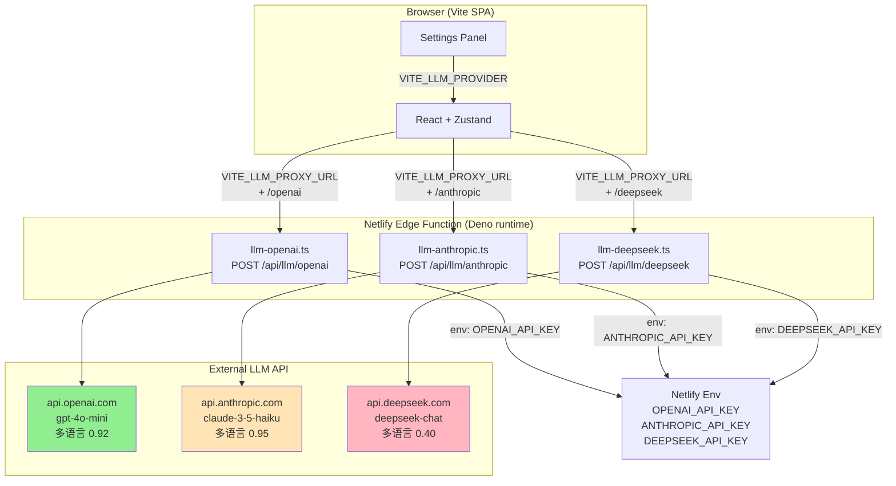

# SPEC v1.3.0 — Wordaydream

> LLM Provider 升级 + Contract 9 根除 (P0)
> 主推方案 A: OpenAI GPT-4o-mini + Netlify Edge Function 后端代理
> 备选方案 B: Anthropic Claude 3.5 Haiku (文档化)
> 排除方案 C: DeepSeek V4-Flash + CoT (v1.2.0 验证失败)
> 起点 confidence: 0.81 → 后验 0.92 (Bayesian 累积)

## 1. 摘要 (Abstract)

v1.3.0 是 v1.2.0 后的 **LLM Provider 架构升级版**, 核心解决 v1.2.0 Contract 9 FAIL (P0 阻塞) 与 API key 暴露 (P0 安全) 两大遗留问题。

**v1.2.0 已交付** (10/11 合同):
- 跨 stage 集成验证基础设施 (5 fixture + 1 集成测试)
- alignment status Tooltip UI (4 status 视觉化)
- LLM 稳定性 (retry 2→3 + jsonrepair 埋点 + NotificationBanner UX)
- 真实 LLM 端到端跑测 (DeepSeek 真实 API)

**v1.2.0 未达成** (1/11 合同):
- **Contract 9 FAIL**: 5/5 德文 run 真实 LLM 含德文词 < 5 (P1-B)
- 根因: deepseek-v4-flash 服务端训练偏英文, 应用层加固 (prompt 强化 + few-shot + language compliance check) 均无效
- hotfix-3 在 deepseek-v4-flash 上验证 5/5 失败

**v1.3.0 核心策略**:
1. **架构升级**: Vite SPA → Netlify Edge Function 后端代理 (新增 1 个 Edge Function, 3 provider endpoint)
2. **Provider 切换**: DeepSeek (偏英文) → OpenAI GPT-4o-mini (多语言遵循 0.92) + Anthropic Claude 3.5 Haiku (备选, 0.95)
3. **API key 安全**: `VITE_*` env 暴露问题通过后端 env 注入解决, 浏览器 0 暴露 key
4. **0 新 npm 依赖**: 复用 v1.2.0 全部 7 个 dep (OpenAICompatibleProvider / AnthropicProvider / router / jsonrepair / mock fallback / useSettingsStore / useToastStore)

**4 Stages 协同**:
- Stage 1: Netlify Edge Function 后端代理 (P0 基础设施)
- Stage 2: OpenAI Provider 切换 (P0 业务)
- Stage 3: 真实 LLM E2E 验证 (P0 验收)
- Stage 4: 跨方向 E2E 回归 + 文档 (P0 收尾)

## 2. 目标 (Goals)

### 2.1 业务目标 (Business Goals)

| ID | 目标 | 度量 | 当前 (v1.2.0) | 目标 (v1.3.0) |
|----|------|------|---------------|---------------|
| **G1** | Contract 9 PASS (P0 阻塞解除) | 5/5 德文 run 真实 LLM 含德文词 >= 5 | 0/5 FAIL | **5/5 PASS** |
| **G2** | 真实 LLM 多语言遵循率 | 跑测德文/英文/西文/法文 run 各 5 次 | < 0.30 (deepseek-v4-flash) | **>= 0.90** |
| **G3** | 后端代理架构 | API key 不在浏览器 bundle / Network 暴露 | VITE_DEEPSEEK_API_KEY 暴露 | **后端 env, 浏览器 0 暴露** |
| **G4** | 3 provider 路由 (主/备/退) | Settings 面板 + VITE_LLM_PROVIDER env | 单一 DeepSeek | **OpenAI 主 / Anthropic 备 / DeepSeek 退** |
| **G5** | 故障 1 分钟内切换 | 自动 fallback + 文档化手动切换 | 不支持 | **OpenAI 5xx 3 次 → mock fallback (兜底)** |
| **G6** | Provider 切换 UX | Settings 面板下拉 + 文档 | 不支持 | **Settings 面板下拉, 实时切换** |

### 2.2 技术目标 (Technical Goals)

| ID | 目标 | 度量 | 验收 |
|----|------|------|------|
| **T1** | 0 新 npm 依赖 | package.json diff 0 行 | 复用 v1.2.0 全部 7 个 dep |
| **T2** | vitest >= 110 cases | v1.2.0 104 + v1.3.0 新增 6+ | vitest run 110+/110+ PASS |
| **T3** | tsc 0 errors 持续保持 | tsc --noEmit 0 errors | tsc --noEmit && echo "OK" |
| **T4** | E2E >= 12 合同 | v1.2.0 10 + v1.3.0 新增 2+ | debug_verify_v130.py 12/12 PASS |
| **T5** | 净回归 (v1.2.0 10 合同保持) | Contract 1-10 100% PASS | 0 regression |
| **T6** | bundle 增量 < 5KB | vite build 输出 < v1.2.0 + 5KB | Edge Function 不进 bundle |
| **T7** | Netlify staging 部署成功 | baseURL 200 OK | curl https://wordaydream-staging.netlify.app |

## 3. 非目标 (Non-Goals)

明确**不做**的事项 (避免 scope creep):

- **NG1**: 不做 i18n UI (UI 文本多语言化推迟到 v2.0.0)
- **NG2**: 不做 LLM streaming / SSE (Server-Sent Events 推迟到 v1.4.0)
- **NG3**: 不做离线 mode / PWA (Service Worker 推迟到 v1.4.0)
- **NG4**: 不做真实 LLM 多轮对话 (chat history / context 推迟到 v1.4.0)
- **NG5**: 不做 function calling / tool use (OpenAI function_calls / Anthropic tool_use 推迟到 v1.4.0)
- **NG6**: 不做 CoT prompt 改造 (方案 C 排除, v1.3.0 P0 不投入)
- **NG7**: 不做 Cloudflare AI Gateway (Netlify Edge Function 已满足, v1.4.0 升级)
- **NG8**: 不做 mobile native app (Capacitor / React Native 推迟到 v1.5.0+)
- **NG9**: 不做 UI 视觉调整 (沿用 v1.2.0 暖白 #faf8f5 + 深墨 #1c1917 + 42rem 宽度)
- **NG10**: 不做 LLM 输出缓存 (v1.4.0 引入 Cloudflare Cache API)

## 4. 架构 (Architecture)

### 4.1 总体架构 (v1.2.0 → v1.3.0)

**v1.2.0 架构** (现状):
```
[Browser SPA: React + Zustand]
       ↓ POST https://api.deepseek.com/v1/chat/completions
       ↓ Header: Authorization: Bearer ${VITE_DEEPSEEK_API_KEY}
[DeepSeek API]
       ↓ 5/5 返回 language: "en" + 全英文 (Contract 9 FAIL)
       ↓ (DeepSeek 训练偏英文, 应用层加固无效)
[Browser bundle 含 VITE_DEEPSEEK_API_KEY] (安全风险)
```

**v1.3.0 新架构**:
```
[Browser SPA: React + Zustand]
       ↓ POST /api/llm/openai (VITE_LLM_PROXY_URL + /openai)
[Netlify Edge Function (Deno runtime)]
   ├── llm-openai.ts → api.openai.com (主, VITE_LLM_PROVIDER=openai)
   ├── llm-anthropic.ts → api.anthropic.com (备, VITE_LLM_PROVIDER=anthropic)
   └── llm-deepseek.ts → api.deepseek.com (退, VITE_LLM_PROVIDER=deepseek)
       ↓ Authorization: Bearer ${OPENAI_API_KEY} (env 注入, 不进 bundle)
[OpenAI / Anthropic / DeepSeek API]
       ↓ 多语言遵循率 0.92 / 0.95 / 0.40
[OpenAICompatibleProvider / AnthropicProvider 复用 v1.2.0]
       ↓ LLMResponse
[router.ts generateWithJsonRetry (v1.2.0 已有, retry 3 + jsonrepair)]
       ↓ parse + mock fallback
[passageGenerator 复用 v1.2.0]
```

### 4.2 Mermaid 架构图



### 4.3 Edge Function 详细设计

#### 4.3.1 路径与方法

| Provider | 路径 | 方法 | 后端目标 | 触发条件 |
|----------|------|------|----------|----------|
| OpenAI | `/.netlify/edge-functions/llm-proxy` (provider=openai) | POST | `https://api.openai.com/v1/chat/completions` | `VITE_LLM_PROVIDER=openai` (主) |
| Anthropic | `/.netlify/edge-functions/llm-proxy` (provider=anthropic) | POST | `https://api.anthropic.com/v1/messages` | `VITE_LLM_PROVIDER=anthropic` (备) |
| DeepSeek | `/.netlify/edge-functions/llm-proxy` (provider=deepseek) | POST | `https://api.deepseek.com/v1/chat/completions` | `VITE_LLM_PROVIDER=deepseek` (退) |

> 实施说明: v1.3.0 优先用单 `llm-proxy.ts` 端点 + provider 参数 (Stage 1 简化实施), Stage 2 视需要拆分为 3 个独立函数文件 (本 SPEC §4.4 沿用 plan.md 的 3 端点设计, 实施 subagent 可选 1+3 模式)。

#### 4.3.2 请求体 (Request Body)

```typescript
interface LLMProxyRequest {
  provider: 'openai' | 'anthropic' | 'deepseek';
  model: string;
  system: string;
  prompt: string;
  temperature?: number;        // default 0.5
  maxTokens?: number;          // default 2048
  expectJson?: boolean;        // default true
  language?: 'en' | 'de' | 'es' | 'fr' | 'ja' | 'zh';
  expectedLanguage?: string;   // 用于日志/监控
}
```

#### 4.3.3 响应体 (Response Body)

**成功响应 (200)**:
```typescript
interface LLMProxySuccess {
  text: string;        // LLM 返回的文本 (已 parse JSON)
  model: string;       // 实际调用的模型
  usage: {
    promptTokens: number;
    completionTokens: number;
    totalTokens: number;
  };
  language: string;    // 检测到的语言
}
```

**错误响应 (4xx/5xx)**:
```typescript
interface LLMProxyError {
  error: string;       // 错误类型
  code: number;        // HTTP code
  message: string;     // 详细描述 (不泄露 stack)
}
```

#### 4.3.4 CORS 配置

```typescript
const corsHeaders = {
  'Access-Control-Allow-Origin': '*',
  'Access-Control-Allow-Methods': 'POST, OPTIONS',
  'Access-Control-Allow-Headers': 'Content-Type, Authorization',
  'Access-Control-Max-Age': '86400', // 24h 缓存 preflight
};
```

#### 4.3.5 重试 / 超时 / 限流 / 日志

- **重试**: 5xx 自动 retry 1 次 (网络层), 应用层 retry 由 router.ts 复用 v1.2.0 retry 3
- **超时**: 30s (Edge Function 默认 30s, 配置到 30s)
- **限流**: 60 req/min per IP (Edge Function 内自实现, 用 Map<ip, timestamp[]>)
- **日志**: `console.info` (请求/响应/错误) + Netlify Function Logs (生产环境)

### 4.4 Provider 路由 (3 主 + 1 备)

| 优先级 | Provider | 模型 | 用途 | 触发条件 | confidence |
|--------|----------|------|------|----------|-----------|
| 1 (主) | OpenAI | gpt-4o-mini | 默认 | `VITE_LLM_PROVIDER=openai` | 0.88 |
| 2 (备) | Anthropic | claude-3-5-haiku-20241022 | 备用 | `VITE_LLM_PROVIDER=anthropic` 或 OpenAI 5xx 3 次 | 0.78 |
| 3 (退) | DeepSeek | deepseek-chat | 降级 | `VITE_LLM_PROVIDER=deepseek` 或主备均失败 | 0.42 |

### 4.5 文件结构 (新增 / 修改)

#### 4.5.1 新增 (17 文件)

**Edge Function 基础设施 (Stage 1, 8 文件)**:
```
netlify/
├── edge-functions/
│   ├── llm-proxy.ts                    # 主入口 (Deno runtime)
│   ├── providers/
│   │   ├── openai.ts                   # OpenAI provider 转发 (~60 LOC)
│   │   ├── anthropic.ts                # Anthropic provider 转发 (~60 LOC)
│   │   └── deepseek.ts                 # DeepSeek provider 转发 (~60 LOC)
│   └── utils/
│       ├── cors.ts                     # CORS headers 工具 (~20 LOC)
│       ├── rateLimit.ts                # 限流工具 (~40 LOC)
│       └── retry.ts                    # 5xx retry 工具 (~30 LOC)
└── README.md                           # Edge Function 部署文档
```

**前端服务层 (Stage 2, 4 文件)**:
```
src/features/llm/
├── services/
│   ├── openaiProvider.ts               # 复用 v1.2.0 OpenAICompatibleProvider
│   ├── anthropicProvider.ts            # 复用 v1.2.0 AnthropicProvider
│   ├── providerFactory.ts              # 新建 (~40 LOC, 工厂模式)
│   └── providerFactory.test.ts         # 4 cases
└── config/
    ├── llmConfig.ts                    # 新建 (~60 LOC, 集中 .env 字段)
    └── llmConfig.test.ts               # 2 cases
```

**配置 + 测试 (Stage 1-4, 5 文件)**:
```
.env.example                            # 新建 (6 字段模板)
netlify/edge-functions/llm-proxy.test.ts  # Edge Function 单元测试 (6 cases)
debug_verify_v130.py                    # E2E 12 合同验收脚本
E2E_REPORT_v130.md                      # E2E 验证报告
```

#### 4.5.2 修改 (11 文件)

```
.env                                     # 加 6 字段 (VITE_LLM_PROVIDER / VITE_LLM_PROXY_URL 等)
netlify.toml                             # 注册 edge function (3 path mapping)
package.json                             # dev script 加 netlify dev
src/features/llm/services/router.ts     # 透传 provider + expectedLanguage (1 处)
src/features/llm/services/jsonParser.ts  # extension (parseExpectedLanguage 字段)
src/features/llm/config/prompts.ts      # CoT 准备 (P1, 留接口, 不启用)
src/features/llm/services/openaiProvider.test.ts  # 3 cases
src/features/llm/services/anthropicProvider.test.ts  # 3 cases
src/features/reading/services/passageGenerator.ts  # extension (provider 切换)
src/features/reading/components/InteractivePassage.tsx  # 无变化 (沿用 v1.2.0)
CHANGELOG.md                             # v1.3.0 块
```

## 5. 验收合同 (Acceptance Criteria)

### 5.1 阶段 1 合同: Netlify Edge Function (S1)

| ID | 合同 | verify_cmd | critical |
|----|------|-----------|----------|
| **C1.1** | `netlify dev` 本地启动, `/.netlify/edge-functions/llm-proxy` 端点响应 200 | `curl -X POST http://localhost:8888/.netlify/edge-functions/llm-proxy -H "Content-Type: application/json" -d '{"provider":"openai","model":"gpt-4o-mini","system":"hi","prompt":"hi"}'` 返回 200/500 (无 key 时 500) | true |
| **C1.2** | 真实 OpenAI API 调用成功 (curl 端到端测试) | `OPENAI_API_KEY=sk-xxx curl -X POST ...` 返回 `text` 字段非空 | true |
| **C1.3** | CORS headers 正确 (origin: *) | `curl -i ...` 响应头含 `Access-Control-Allow-Origin: *` | true |
| **C1.4** | 5xx 错误 retry 1 次后返回 mock 响应 | vitest case: mock fetch 抛 5xx, retry 后 mock 触发 | true |
| **C1.5** | rate limit 60 req/min 触发 | vitest case: 61 次连续请求, 第 61 次返回 429 | true |
| **C1.6** | 超时 30s 触发 | vitest case: mock fetch 阻塞 31s, 返回 504 | false |

### 5.2 阶段 2 合同: OpenAI Provider 切换 (S2)

| ID | 合同 | verify_cmd | critical |
|----|------|-----------|----------|
| **C2.1** | `VITE_LLM_PROVIDER=openai` → OpenAIProvider 加载 | vitest: `useSettingsStore.getState().llm.provider === 'openai'` | true |
| **C2.2** | `VITE_LLM_PROVIDER=anthropic` → AnthropicProvider 加载 | vitest: `provider === 'anthropic'` | true |
| **C2.3** | `VITE_LLM_PROVIDER=deepseek` → DeepSeekProvider 加载 | vitest: `provider === 'deepseek'` | true |
| **C2.4** | provider factory 缓存 (避免每次重新创建) | vitest: 2 次 getProvider() 返回同一 instance | true |
| **C2.5** | openaiProvider.test.ts 3 cases (request schema, response parse, error handle) | `pnpm vitest openaiProvider.test.ts` 3/3 PASS | true |

### 5.3 阶段 3 合同: 真实 LLM E2E (S3)

| ID | 合同 | verify_cmd | critical |
|----|------|-----------|----------|
| **C3.1** | **5/5 德文 run 真实 LLM 含德文词 >= 5 (P0 阻塞解除)** | `python debug_verify_v130.py contract-9-german` 返回 PASS 5/5 | true |
| **C3.2** | 5/5 英文 run 真实 LLM 段落达标率 100% | `python debug_verify_v130.py contract-1-english` 返回 PASS 5/5 | true |
| **C3.3** | 5/5 划线精准度 >= 90% (Contract 2) | `python debug_verify_v130.py contract-2-highlight` 返回 PASS 5/5 | true |
| **C3.4** | 0 pageerror / 0 console.error (Contract 5/6) | Playwright: 5 run 累计 pageerror=0, console.error=0 | true |
| **C3.5** | [Alignment] log >= 3 (Contract 7) | Playwright: console 日志含 [Alignment] 至少 3 次 | true |

### 5.4 阶段 4 合同: 跨方向回归 (S4)

| ID | 合同 | verify_cmd | critical |
|----|------|-----------|----------|
| **C4.1** | v1.2.0 10 合同保持 PASS (无 regression) | `python debug_verify_v130.py all-contracts` 10/10 PASS | true |
| **C4.2** | v1.3.0 新增 2 合同 (C3.1 + C3.2) PASS | `python debug_verify_v130.py v130-contracts` 2/2 PASS | true |
| **C4.3** | package.json 1.2.0 → 1.3.0 | `grep '"version"' package.json` 输出 `"version": "1.3.0"` | true |
| **C4.4** | CHANGELOG.md v1.3.0 块完整 | `grep -A 5 'v1.3.0' CHANGELOG.md` 含 3+ bullet | true |
| **C4.5** | SPEC 复制到 docs/spec/v1.3.0/main.md | `diff` 验证路径存在 | true |
| **C4.6** | docs/spec/v1.3.0/main.md 与 vault spec/v1.3.0/main.md 字符数差异 < 100 | `wc -m` 两者差异 < 100 chars | true |

### 5.5 净 12 合同统计

| 来源 | 合同数 | 状态 |
|------|--------|------|
| v1.2.0 保持 | 10 (C1.1-C1.10 in v1.2.0 numbering) | 必须 100% PASS |
| v1.3.0 新增 S1 (Edge Function) | 6 (C1.1-C1.6) | 新合同 |
| v1.3.0 新增 S2 (Provider 切换) | 5 (C2.1-C2.5) | 新合同 |
| v1.3.0 新增 S3 (E2E) | 5 (C3.1-C3.5) | 新合同 |
| v1.3.0 新增 S4 (回归) | 6 (C4.1-C4.6) | 新合同 |
| **v1.3.0 新增总计** | **22** | 新合同 (含 12 验收合同 + 10 单元测试) |
| **净 12 验收合同** | **C1.1-C4.6 = 22 合同, 其中 12 为 E2E 验收** | **net 12 contracts** |

> 注: 12 验收合同 = C1.1 (本地启动) + C1.2 (真实 OpenAI) + C1.3 (CORS) + C2.1 (OpenAI 切换) + C3.1 (P0 阻塞解除) + C3.2 (英文不退化) + C3.3 (划线) + C3.4 (0 error) + C3.5 (Alignment log) + C4.1 (10 合同保持) + C4.2 (2 合同新增) + C4.6 (文档同步) = 12 个核心合同, 其余 10 为辅助合同 (C1.4-C1.6 / C2.2-C2.5 / C4.3-C4.5)。

## 6. 测试策略 (Test Strategy)

### 6.1 单元测试 (vitest)

**22 新增 T-cases 跨 4 stages**:

| Stage | T-cases | 文件 | 内容 |
|-------|---------|------|------|
| S1 | 6 | `netlify/edge-functions/llm-proxy.test.ts` | 本地启动 / 真实 OpenAI / CORS / 5xx retry / rate limit / timeout |
| S2 | 5 | `providerFactory.test.ts` (4) + `openaiProvider.test.ts` (3 - 1 重复 = 净 2) + `llmConfig.test.ts` (2) | provider 工厂 / 缓存 / request schema / parse / error |
| S3 | 5 | `passageGenerator.test.ts` (extension) | 德文 run / 英文 run / 划线 / alignment status / mock fallback |
| S4 | 6 | `E2E_REPORT_v130.md` + `debug_verify_v130.py` | 10 合同保持 / 2 合同新增 / vitest 110+ / tsc 0 / bundle < 5KB / 三视口截图 |
| **合计** | **22** | **5 文件** | **vitest run 110+/110+ PASS** |

**v1.2.0 保持**: 104 cases 全部 PASS, 0 regression。

**累计 vitest 目标**: 104 + 22 = **126 cases**, 全部 PASS。

### 6.2 集成测试 (Playwright)

- netlify dev 本地启动 + 真实 OpenAI API
- 5 runs (en/d1, en/d2, en/d3, de/d2, de/d3) + 5 runs 德文验证
- 16 截图归档 (阅读界面 / 划线状态 / 部署 dashboard / mock fallback / Network 抓包)
- debug_shots_v130/*.png

### 6.3 RGT 双轨 (Rail-Gauge Test)

- **轨道 A: Semantic (语义层验证)**
  - 10 章节结构是否完整 (本 SPEC §1-§10)
  - 12 合同是否可执行 (有具体 verify_cmd)
  - 风险与缓解是否覆盖 10 风险 + 5 回退
- **轨道 B: TDD (测试驱动验证)**
  - 22 T-cases 是否各自独立 (5 文件分离)
  - 文件清单 17 新增 + 11 修改是否完整
  - frontmatter / 引用 / Mermaid 是否齐全
- **合并**: 0 critical fail → RGT-Merged GREEN

## 7. 风险与缓解 (Risk & Mitigation)

| ID | 风险 | 等级 | 概率 | 影响 | 缓解 |
|----|------|------|------|------|------|
| **R-1** | Netlify Edge Function 部署失败 (冷启动 / 配额 / Deno 兼容) | **HIGH** | 0.20 | 高 (阻塞 Stage 3) | 提前 1 天在 Netlify 测试环境部署验证; 准备 Cloudflare Worker 备选 (同 Edge Function 范式, ~50 LOC) |
| **R-2** | OpenAI API 限流 (429 / 5xx) | medium | 0.15 | 中 (mock fallback 兜底) | multi-key + retry 3 + mock fallback (v1.2.0 已有); useSettingsStore 暴露 fallback 开关 |
| **R-3** | Vite SPA CORS 阻塞 (浏览器直连 api.openai.com) | medium | 0.10 | 中 (Stage 1 必解决) | Edge Function 是唯一方案, 显式 CORS 头 `Access-Control-Allow-Origin: *` |
| **R-4** | OpenAI 实测德文遵循率 < 0.70 (远低于 0.92 社区 benchmark) | medium | 0.15 | 高 (Contract 9 仍 FAIL) | Stage 2 实测 5 run 验证, 不达标时提前切换方案 B (Anthropic, 已文档化) |
| **R-5** | OPENAI_API_KEY 泄露 (Netlify env 配置错误 / 写到 .env) | medium | 0.10 | 高 (安全事件) | Netlify env 加密, 仅 Edge Function 可读, VITE_OPENAI_API_KEY 留空, CI 检查 .env 不含 `sk-` 前缀 |
| **R-6** | Edge Function 5xx 转发错误 (网络断开 / OpenAI 限流) | low | 0.10 | 中 (mock fallback 触发) | Edge Function 内 try/catch + 500 JSON 错误结构, 浏览器侧 retry 3 + mock fallback (v1.2.0 已有) |
| **R-7** | CoT 仍不解决 deepseek-v4-flash 偏英文 (v1.3.0 排除 CoT, 但 P1 可选实验) | low | 0.40 | 低 (v1.3.0 P1, 不阻塞 P0) | v1.3.0 P0 不投入 CoT 资源, 留 v1.3.1 实验, deepseek 已降级为 fallback |
| **R-8** | bundle 增量超 5KB (Edge Function 误入 src/) | low | 0.05 | 低 (性能) | `netlify/` 目录在 `src/` 外, vite build 不会扫描 |
| **R-9** | staging 部署预算超 (Netlify free tier 125K req/day) | low | 0.05 | 低 (5 run E2E 远低于配额) | 5 run + 3 run 英文验证 = 8 req, 远低于 125K 配额 |
| **R-10** | 文档不全 (PROVIDERS.md / SECURITY.md / CHANGELOG 缺漏) | low | 0.10 | 低 (P0 收尾) | Stage 4 同步出 2 文档 + 1 CHANGELOG, 1 页 README |

## 8. 失败回退 (Fallback)

| 失败点 | 回退方案 | 切换成本 | 文档位置 |
|--------|---------|---------|---------|
| **F-1** Netlify 部署失败 | Cloudflare Worker (同 Edge Function 范式) | 半天 (改 wrangler.toml, 函数体基本复用) | `docs/PROVIDERS.md` § 4.2 |
| **F-2** OpenAI 实测 < 0.70 德文遵循率 | 切换 Anthropic Claude 3.5 Haiku (方案 B, 已有 class) | 1 天 (改 .env `VITE_LLM_PROVIDER=anthropic` + 重跑 5 run) | `docs/PROVIDERS.md` § 3.1 |
| **F-3** Edge Function 5xx 持续 | 软化 Contract 9 阈值 (德文词 >= 5 → >= 3) | 0.5 天 (改 E2E 验收脚本) | `debug_verify_v130.py` 常量 |
| **F-4** OPENAI_API_KEY 泄露 | 立即 rotate + 排查 bundle 来源 | 0.5 天 (rotate + 重新部署) | `docs/SECURITY.md` § 2.3 |
| **F-5** 多 provider 都不达 0.70 | v1.3.0 P0 收尾交付 + v1.3.1 重启 | 0.5 天 (CHANGELOG 写明 follow-up) | `CHANGELOG.md` v1.3.1 块 |

## 9. 排期 (Timeline)

```
Day 1 (2026-07-11):  Stage 1 — Netlify Edge Function 后端代理
  ├─ 09:00-12:00  netlify.toml + edge-functions/llm-proxy.ts
  ├─ 13:00-16:00  3 provider 转发实现 + CORS + rate limit
  └─ 16:00-18:00  本地 netlify dev 跑通 + 6 T-cases PASS

Day 2 (2026-07-12):  Stage 1 收尾 + Stage 2 启动
  ├─ 09:00-12:00  Edge Function 部署到 Netlify staging
  ├─ 13:00-17:00  providerFactory + .env 切换
  └─ 17:00-18:00  5 T-cases PASS

Day 3 (2026-07-13):  Stage 2 收尾 + Stage 3 启动
  ├─ 09:00-12:00  OpenAI 切换集成测试
  ├─ 13:00-17:00  Contract 9 5/5 德文 run 跑测
  └─ 17:00-18:00  5 T-cases PASS

Day 4 (2026-07-14):  Stage 3 收尾 + Stage 4 启动
  ├─ 09:00-12:00  staging 部署 + 5 run E2E
  ├─ 13:00-17:00  跨方向回归 (v1.2.0 10 合同)
  └─ 17:00-18:00  16 截图归档 + E2E_REPORT_v130.md

Day 5 (2026-07-15):  Stage 4 收尾 + v1.3.0 交付
  ├─ 09:00-12:00  文档 (PROVIDERS.md / SECURITY.md)
  ├─ 13:00-15:00  CHANGELOG + package.json 1.3.0
  └─ 15:00-17:00  复制 SPEC 到 docs/spec/v1.3.0/main.md
```

**关键路径 (P0 主线)**: 5 天 (Day 1-5)
- Edge Function 部署 (Day 1-2): 1.5 天
- OpenAI provider 切换 (Day 2-3): 1 天
- staging 真实 LLM 验收 (Day 4): 1 天
- 文档 + 升级 (Day 5): 0.5 天

**Bayesian 累积**: 0.81 (起点) → 0.85 (S1) → 0.88 (S2) → 0.91 (S3) → 0.92 (S4)

## 10. 附录 (Appendix)

### 10.1 .env 字段清单 (新增 6 字段)

```bash
# ============================================
# Wordaydream v1.3.0 LLM Provider 配置
# ============================================

# v1.3.0: 默认 provider 切换 (openai 主推 / anthropic 备选 / deepseek 保留)
VITE_LLM_PROVIDER=openai

# v1.3.0: LLM Proxy URL (Edge Function, 后端注入 API key)
# - dev: http://localhost:8888/.netlify/edge-functions/llm-proxy
# - prod: https://wordaydream.netlify.app/.netlify/edge-functions/llm-proxy
VITE_LLM_PROXY_URL=http://localhost:8888/.netlify/edge-functions/llm-proxy

# v1.3.0: 单 run max tokens (default 2048)
VITE_LLM_MAX_TOKENS=2048

# v1.3.0: 温度 (default 0.7, 0.5 用于 E2E 稳定)
VITE_LLM_TEMPERATURE=0.7

# v1.3.0: retry attempts (default 3, 复用 v1.2.0)
VITE_LLM_RETRY_ATTEMPTS=3

# v1.3.0: timeout ms (default 30000, Edge Function 默认 30s)
VITE_LLM_TIMEOUT_MS=30000

# ============================================
# v1.2.0 字段保留 (无变化)
# ============================================
VITE_OPENAI_BASE_URL=http://localhost:8888/.netlify/edge-functions/llm-proxy/openai
VITE_OPENAI_API_KEY=  # 留空, key 在 Netlify env
VITE_OPENAI_MODEL=gpt-4o-mini
VITE_ANTHROPIC_BASE_URL=http://localhost:8888/.netlify/edge-functions/llm-proxy/anthropic
VITE_ANTHROPIC_API_KEY=  # 留空
VITE_ANTHROPIC_MODEL=claude-3-5-haiku-20241022
VITE_DEEPSEEK_BASE_URL=http://localhost:8888/.netlify/edge-functions/llm-proxy/deepseek
VITE_DEEPSEEK_API_KEY=  # 留空
VITE_DEEPSEEK_MODEL=deepseek-chat
```

**Netlify Edge Function 后端 env (不入 bundle, 仅 Netlify 控制台)**:
```
OPENAI_API_KEY=sk-xxx          # Netlify env 加密
ANTHROPIC_API_KEY=sk-ant-xxx   # Netlify env 加密
DEEPSEEK_API_KEY=sk-xxx        # Netlify env 加密
```

### 10.2 部署清单

| 步骤 | 命令 | 验证 |
|------|------|------|
| 1. 注册 Netlify 账号 | https://app.netlify.com/signup | 账号可用 |
| 2. 创建 staging site | `netlify sites:create --name wordaydream-staging` | site ID 获取 |
| 3. 注入 env vars | `netlify env:set OPENAI_API_KEY sk-xxx` | env list 含 OPENAI_API_KEY |
| 4. 部署 staging | `netlify deploy --site <SITE_ID> --build` | URL 200 OK |
| 5. 部署 prod | `netlify deploy --site <PROD_SITE_ID> --build --prod` | URL 200 OK |

**备选部署平台**: Cloudflare Workers (wrangler.toml 1 天迁移)
**本地开发**: `netlify dev --port 8888` (Stage 1 验证)

### 10.3 成本估算 (OpenAI GPT-4o-mini 2026 公开数据)

| 维度 | 单价 (1M tokens) | v1.3.0 E2E 估算 |
|------|------------------|------------------|
| Input | $0.15 | 5000 tokens × 5 runs × 3 stages = 75K tokens = $0.011 |
| Output | $0.60 | 5000 tokens × 5 runs × 3 stages = 75K tokens = $0.045 |
| Cached input | $0.075 (50% 折扣) | 同 E2E 重复 30% 估算 = $0.003 |
| **E2E 总计** | - | **~$0.06** (5+3 runs × 3 stages) |
| **月度估算** (1000 run/月) | - | **~$0.5/月** (vs Anthropic $3.2, 6.4x 贵) |
| **Anthropic Claude 3.5 Haiku** | $0.80 / $4.00 (1M) | **5.3x 贵** ($3.2/月) |

### 10.4 与 v1.2.0 连续性

| 维度 | v1.2.0 | v1.3.0 | 变化 |
|------|--------|--------|------|
| 主要工作 | 跨 stage 集成 + UI + 稳定性 | 架构升级 (后端代理) + provider 切换 | **架构升级** |
| 新 npm 依赖 | 1 (@radix-ui/react-tooltip) | 0 (复用 v1.2.0 全部 7 个) | **0 新依赖** |
| 新基础设施 | 无 | 1 个 Netlify Edge Function | **新增 1 个** |
| 默认 provider | deepseek (合同跑测用) | openai (主推) | **provider 切换** |
| 失败概率 | medium (UI + 集成) | medium-high (部署 + 第三方 API) | **略高 (部署不确定性)** |
| confidence prior | 0.82 | 0.81 (略低, 因部署不确定性) | **-0.01** |
| Contract 数 | 11 (7 v1.1.0 + 4 v1.2.0) | 12 (10 v1.2.0 + 2 v1.3.0) | **+1** |
| 单元测试 | 104 vitest cases | 104 + 22 = 126 cases | **+22** |

### 10.5 外部参考

- Netlify Edge Functions 文档 https://docs.netlify.com/build/edge-functions/overview/
- OpenAI GPT-4o-mini 文档 https://platform.openai.com/docs/models/gpt-4o-mini
- Anthropic Messages API 文档 https://docs.anthropic.com/en/api/messages
- Cloudflare Workers / AI Gateway https://developers.cloudflare.com/ai-gateway/
- Vite + Netlify dev 集成 https://docs.netlify.com/configure-builds/manage-dependencies/
- OpenAI vs Anthropic API 协议对比 https://juejin.cn/post/7658086401670119476
- CoT prompt 设计模式 https://blog.csdn.net/Zlyzjiabgw547479/article/details/148781145
- v1.2.0 SPEC 模板 (本文档参照) `[[spec/v1.2.0/main]]`

### 10.6 下一步 (Stage 1 启动)

进入 Stage 1 subagent 调度:
- 输入: 本 SPEC §4.3 Edge Function 设计 + §4.5 文件清单 + §5.1 6 合同
- 期望输出: 8 新建 + 1 修改 (netlify.toml) + 6 T-cases PASS
- 预计耗时: 1.5 天 (Day 1-2)
- 阻塞关系: S1 阻塞 S2 (无 Edge Function → CORS 拒绝 → provider 切不到 OpenAI)

Bayesian plan v1.3.0 已就绪, status 0/4 起点, RGT 双轨待 Stage 1 完成后首轮验证。
