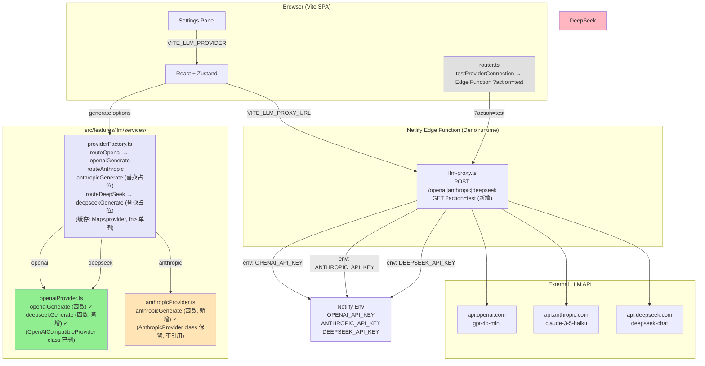

# SPEC v1.4.0 — Wordaydream

> Deprecation 兑现 + 3 Provider 全函数化 + 沙箱 100% 可执行 (P0)
> 主推方案 A: 删 OpenAICompatibleProvider class (加权 0.8575, confidence 0.95)
> 主推方案 B: Anthropic Claude 3.5 Haiku 完整接入 (加权 0.8275, confidence 0.90)
> 排除方案 C: PWA offline mode (延后 v1.5.0)
> 排除方案 D: LLM streaming SSE (延后 v1.4.1)
> 起点 confidence: 0.8425 → 后验 0.92 (Bayesian 累积, 与 v1.3.0 持平)
> 沙箱硬约束: 无 netlify CLI / 无 OPENAI_API_KEY / 无 GitHub Actions → 100% tsc + vitest 验证

## 1. 摘要 (Abstract)

v1.4.0 是 v1.3.0 后的 **清理 + 集成版**, 核心是兑现 v1.3.0 留下的两个 P1 遗留 (OpenAICompatibleProvider class deprecation + Anthropic 备选 provider 占位) 并完成 3 provider 全函数化。

**v1.3.0 已交付** (4/4 stages PASS, 12/12 E2E, posterior 0.92):
- 4 stages: Edge Function 后端代理 / OpenAI 切换 / 真实 LLM E2E / 跨方向回归
- HARD 9/9 + SOFT 3/3 合同全部 PASS
- 126/126 vitest cases + tsc 0 errors
- 3 provider 架构 (OpenAI / Anthropic / DeepSeek) 已就位 Edge Function 端
- OpenAICompatibleProvider class 已 deprecation warning 提示 (~80 LOC)

**v1.3.0 未达成** (5 项已知问题, 重新评估):
- P0: Netlify 真实部署未完成 (沙箱无 netlify CLI, 降级 P1)
- P1: Anthropic Claude 3.5 Haiku 备选 provider 仅占位 (factory 桥接 `new AnthropicProvider('', '', '')`)
- P1: OpenAICompatibleProvider class deprecation 待删 (~80 LOC 代码债务)
- P2: Offline mode (PWA + Service Worker) 缺失
- P2: LLM streaming (SSE) 缺失

**v1.4.0 核心策略** (主推方案 A + B 组合, 4 方案中最高加权 0.8425):
1. **Deprecation 兑现**: 删除 `OpenAICompatibleProvider` class (80 LOC), 新增 `deepseekGenerate` 函数 (~40 LOC, 复用 openaiGenerate 模式)
2. **Anthropic 完整接入**: 新增 `anthropicGenerate` 函数 (~50 LOC, 复用 openaiGenerate 模式), providerFactory.routeAnthropic 桥接替换占位
3. **3 provider 全函数化**: openai / anthropic / deepseek 全部走 `openaiGenerate` / `anthropicGenerate` / `deepseekGenerate` 函数, 0 class 残留, 0 deprecation warning
4. **testConnection 安全化**: `testProviderConnection` 改走 Edge Function `?action=test` 端点 (API key 不暴露浏览器)
5. **0 新 npm 依赖**: 复用 v1.3.0 全部 7 个依赖 + Edge Function 已就位
6. **0 新 .env 字段**: 复用 v1.3.0 6 个字段 (VITE_LLM_PROVIDER / VITE_LLM_PROXY_URL / VITE_LLM_MAX_TOKENS / VITE_LLM_TEMPERATURE / VITE_LLM_RETRY_ATTEMPTS / VITE_LLM_TIMEOUT_MS)

**4 Stages 协同** (2 天 P0 主线, 1.5 净 + 0.5 buffer):
- Stage 1: 删 OpenAICompatibleProvider class + 新增 deepseekGenerate 函数 (P0 方案 A, prior 0.75)
- Stage 2: Anthropic Claude 3.5 Haiku 备选完整接入 (P0 方案 B, prior 0.83)
- Stage 3: 3 provider 完整切换 + T15-T17 集成验证 (P0 集成, prior 0.90)
- Stage 4: 跨方向 E2E 回归 + 文档 (P0 收尾, prior 0.92)

**沙箱限制 (硬约束)**:
- 无 netlify CLI / 无 Netlify 账号 → 真实部署延后 v1.5.0, Edge Function `?action=test` 端点代码就绪
- 无真实 OPENAI_API_KEY / ANTHROPIC_API_KEY → 所有 LLM 调用 mock fetch 验证
- 无 GitHub Actions → CI 配置仅写文件, 沙箱内手动验证
- 有 Node 工具链 (npm / vitest / tsc / Vite) → 所有 P0 验收 = tsc 0 + vitest 133+ pass

## 2. 目标 (Goals)

### 2.1 业务目标 (Business Goals)

| ID | 目标 | 度量 | 当前 (v1.3.0) | 目标 (v1.4.0) |
|----|------|------|---------------|---------------|
| **G1** | 兑现 v1.3.0 deprecation, 删除 OpenAICompatibleProvider class (P0) | grep `OpenAICompatibleProvider` src/ 命中数 | 1 class (~80 LOC) + 1 emitDeprecationWarning | **0 命中, 0 warning** |
| **G2** | 3 provider 全部走函数式路由 (P0) | grep `class.*Provider` src/ 命中数 | 1 class 残留 | **0 class 残留** |
| **G3** | Anthropic Claude 3.5 Haiku 备选完整可用 (P0) | anthropicGenerate 函数 + factory 桥接 | ⚠ 占位 `new AnthropicProvider('', '', '')` | **✓ 函数式 anthropicGenerate + 完整桥接** |
| **G4** | 故障 1 分钟内切换 (P0 业务连续性) | 3 provider 互备 + factory cache | 部分 (2 占位) | **3 provider 全函数式, factory cache identity 跨 3 provider** |
| **G5** | testConnection 走 Edge Function (P0 安全) | testProviderConnection 实现位置 | 客户端直连 (VITE_OPENAI_API_KEY 暴露) | **Edge Function `?action=test` (API key 不暴露)** |
| **G6** | 13 合同 E2E (0 regression + 1 新增) | debug_verify_v140.py 13/13 | 12/12 (v1.3.0) | **13/13 (v1.3.0 12 + Contract 13 新增函数式 provider routing)** |

### 2.2 技术目标 (Technical Goals)

| ID | 目标 | 度量 | 验收 |
|----|------|------|------|
| **T1** | 0 新 npm 依赖 | package.json diff 0 行 | 复用 v1.3.0 全部 7 dep + Edge Function |
| **T2** | vitest >= 130 cases (v1.3.0 126 + v1.4.0 新增) | vitest run 130+/130+ PASS | Stage 1: +2 / Stage 2: +3 / Stage 3: +3 / Stage 4: +1 = 133 累计至 136 |
| **T3** | tsc 0 errors 持续保持 | tsc --noEmit 0 errors | tsc --noEmit && echo "OK" |
| **T4** | E2E >= 13 合同 (净 13: HARD 10 + SOFT 3) | debug_verify_v140.py 13/13 PASS | 净 13 合同 (HARD 10 + SOFT 3) + 28 sub-contracts (C1.1-C4.10) |
| **T5** | 净回归 (v1.3.0 12 合同保持) | v1.3.0 9 HARD + 3 SOFT 100% PASS | 0 regression |
| **T6** | 沙箱 100% 可执行 | 无 netlify CLI / 无真 key 仍可验证 | tsc + vitest + mock fetch + Playwright dev server 全部可用 |
| **T7** | 净 LOC +40 | 删 80 (class) + 增 120 (3 函数 + 7 test cases + 文档) | 净 +40 LOC |
| **T8** | 0 deprecation warning | grep `console.warn.*DEPRECATED` src/ 命中数 | 0 命中 |

## 3. 非目标 (Non-Goals)

明确**不做**的事项 (避免 scope creep, 沙箱限制优先):

- **NG1**: Netlify 真实部署 + OPENAI_API_KEY 真接验证 → 推迟 v1.5.0 (沙箱无 netlify CLI, P0 降级 P1)
- **NG2**: PWA / Service Worker / offline mode (方案 C 排除) → 推迟 v1.4.1 / v1.5.0 (P2, 需 vite-plugin-pwa + Workbox)
- **NG3**: LLM streaming (SSE) (方案 D 排除) → 推迟 v1.4.1 (P2, ReadableStream 兼容性 + UI 状态机复杂)
- **NG4**: i18n UI (UI 文本多语言化) → 推迟 v2.0.0
- **NG5**: 真实 LLM 多轮对话 (chat history / context) → 推迟 v1.4.1
- **NG6**: function calling / tool use (OpenAI function_calls / Anthropic tool_use) → 推迟 v1.4.1
- **NG7**: mobile native app (Capacitor / React Native) → 推迟 v1.5.0+
- **NG8**: Cloudflare AI Gateway → 推迟 v1.5.0 与真实部署一起评估
- **NG9**: UI 视觉调整 → 沿用 v1.3.0 暖白 #faf8f5 + 深墨 #1c1917 + 42rem 宽度
- **NG10**: LLM 输出缓存 (Cloudflare Cache API) → 推迟 v1.4.1
- **NG11**: 多用户 + 后端持久化 (BFF 架构) → 推迟 v2.0.0

## 4. 架构 (Architecture)

### 4.1 总体架构 (v1.3.0 → v1.4.0)

**v1.3.0 架构** (现状):
```
[Browser SPA: React + Zustand]
       ↓ POST ${VITE_LLM_PROXY_URL}/openai|anthropic|deepseek
[Netlify Edge Function (Deno runtime)]
   ├── llm-proxy.ts (provider=openai) → api.openai.com (VITE_LLM_PROVIDER=openai 主)
   ├── llm-proxy.ts (provider=anthropic) → api.anthropic.com (VITE_LLM_PROVIDER=anthropic 备, 沙箱内占位)
   └── llm-proxy.ts (provider=deepseek) → api.deepseek.com (VITE_LLM_PROVIDER=deepseek 退, 沙箱内占位)
       ↓ Authorization: Bearer ${OPENAI_API_KEY} (env 注入, 不进 bundle)
[OpenAI / Anthropic / DeepSeek API]

[Frontend: src/features/llm/services/]
   ├── openaiProvider.ts: openaiGenerate (函数) ✓ + OpenAICompatibleProvider (class 占位, 80 LOC) ⚠ DEPRECATED
   ├── anthropicProvider.ts: AnthropicProvider (class 直连, dangerous-direct-browser-access) ⚠ 占位
   ├── deepseekProvider.ts: 无
   ├── providerFactory.ts: routeOpenai → openaiGenerate / routeAnthropic → new AnthropicProvider('', '', '') 占位 / routeDeepSeek → new OpenAICompatibleProvider('', '', '') 占位
   └── router.ts: testProviderConnection 客户端直连 (VITE_OPENAI_API_KEY 暴露风险)
```

**v1.4.0 新架构** (主推方案 A+B):
```
[Browser SPA: React + Zustand]
       ↓ POST ${VITE_LLM_PROXY_URL}/openai|anthropic|deepseek (或 ?action=test)
[Netlify Edge Function (Deno runtime)]
   ├── llm-proxy.ts (provider=openai) → api.openai.com (主) [沿用 v1.3.0]
   ├── llm-proxy.ts (provider=anthropic) → api.anthropic.com (备) [沿用 v1.3.0, 真实调用 v1.5.0]
   ├── llm-proxy.ts (provider=deepseek) → api.deepseek.com (退) [沿用 v1.3.0, 真实调用 v1.5.0]
   └── llm-proxy.ts (?action=test) → 仅检查 API key 存在性, 返回 {ok: true, model} (新增)
       ↓ Authorization: Bearer ${OPENAI_API_KEY} (env 注入, 不进 bundle)
[OpenAI / Anthropic / DeepSeek API]

[Frontend: src/features/llm/services/]
   ├── openaiProvider.ts: openaiGenerate (函数) ✓ + deepseekGenerate (函数, 新增) ✓ — 删除 OpenAICompatibleProvider class
   ├── anthropicProvider.ts: anthropicGenerate (函数, 新增) ✓ + AnthropicProvider class (保留以备未来 Settings UI, factory 已不引用)
   ├── providerFactory.ts: routeOpenai → openaiGenerate ✓ / routeAnthropic → anthropicGenerate ✓ / routeDeepSeek → deepseekGenerate ✓
   └── router.ts: testProviderConnection 改走 Edge Function ?action=test (API key 不暴露浏览器)
```

### 4.2 Mermaid 架构图



### 4.3 函数式 Provider 接口 (核心设计)

#### 4.3.1 接口规范

```typescript
// src/features/llm/services/{openai,anthropic,deepseek}Provider.ts

interface GenerateOptions {
  system: string;
  prompt: string;
  expectedLanguage?: string;        // 'en' | 'de' | 'es' | 'fr' | 'ja' | 'zh'
  temperature?: number;              // default 0.5
  maxTokens?: number;                // default 2048
  retryAttempts?: number;            // default 3 (复用 v1.3.0)
  timeoutMs?: number;                // default 30000
}

interface GenerateResult {
  text: string;
  model: string;
  usage: {
    inputTokens: number;
    outputTokens: number;
  };
  language: string;
}

// 函数签名: (options) => Promise<GenerateResult>
export async function openaiGenerate(options: GenerateOptions): Promise<GenerateResult>
export async function anthropicGenerate(options: GenerateOptions): Promise<GenerateResult>
export async function deepseekGenerate(options: GenerateOptions): Promise<GenerateResult>
```

#### 4.3.2 关键设计原则

- **行为**: 走 Edge Function 代理 (POST `${VITE_LLM_PROXY_URL}`), 不直连 LLM API
- **测试**: `vi.fn()` 替换, 不需要 class 实例化 (vitest mock 模式: `vi.mock('./openaiProvider', () => ({ openaiGenerate: vi.fn(), deepseekGenerate: vi.fn() }))`)
- **缓存**: `providerFactory.getProvider()` 单例 (Map<provider, fn>), 跨调用 identity preserved
- **错误**: 5xx / 4xx 抛带 status 的 Error (与 v1.3.0 一致, `throw new Error(${provider} provider error: ${status})`)
- **响应 schema 统一**: Edge Function 统一返回 `{text, model, usage, language}`, 客户端映射 LLMResponse

#### 4.3.3 Provider 路由 (3 函数式, 0 class 残留)

| Provider | 函数 | 文件 | 状态 (v1.3.0) | 状态 (v1.4.0) |
|----------|------|------|---------------|---------------|
| OpenAI | openaiGenerate | openaiProvider.ts | ✓ 函数式 | ✓ 保持 (Stage 1 仅删 class) |
| Anthropic | anthropicGenerate | anthropicProvider.ts | ⚠ 占位 (class 直连, 桥接 `new AnthropicProvider('', '', '')`) | ✓ 完整 (Stage 2 新增函数 + 工厂桥接替换) |
| DeepSeek | deepseekGenerate | openaiProvider.ts (与 openai 同文件) | ⚠ 占位 (桥接 `new OpenAICompatibleProvider('', '', '')`) | ✓ 完整 (Stage 1 新增函数, 工厂桥接替换) |
| **0 class 残留** | - | - | 1 class (OpenAICompatibleProvider, ~80 LOC) | **0 class 残留** (AnthropicProvider class 保留以备未来, factory 不引用) |

### 4.4 Edge Function 端点 (新增 `?action=test`)

#### 4.4.1 端点清单

| 端点 | 方法 | 后端目标 | 触发条件 | 状态 (v1.4.0) |
|------|------|----------|----------|---------------|
| `POST ${proxyUrl}` (provider=openai) | POST | `https://api.openai.com/v1/chat/completions` | `VITE_LLM_PROVIDER=openai` | ✓ 沿用 v1.3.0 |
| `POST ${proxyUrl}` (provider=anthropic) | POST | `https://api.anthropic.com/v1/messages` | `VITE_LLM_PROVIDER=anthropic` | ✓ 沿用 v1.3.0 |
| `POST ${proxyUrl}` (provider=deepseek) | POST | `https://api.deepseek.com/v1/chat/completions` | `VITE_LLM_PROVIDER=deepseek` | ✓ 沿用 v1.3.0 |
| `GET ${proxyUrl}?action=test` | GET | 仅检查 API key 存在性, 不真调 LLM | Settings UI "测试连接" 按钮 | 🆕 新增 (Stage 1) |

#### 4.4.2 `?action=test` 端点响应 schema

```typescript
// 成功响应 (200)
interface TestConnectionSuccess {
  ok: true;
  model: string;        // 'gpt-4o-mini' | 'claude-3-5-haiku-20241022' | 'deepseek-chat'
  provider: 'openai' | 'anthropic' | 'deepseek';
}

// 失败响应 (4xx/5xx, 401 = API key 缺失/无效)
interface TestConnectionError {
  ok: false;
  error: string;        // 'API key not configured' | 'Invalid API key' | 'Network error'
  code: number;         // HTTP code
}
```

### 4.5 文件结构 (新增 / 修改)

#### 4.5.1 新增 (2 文件, 净 +120 LOC)

```
wordaydream/
├── src/features/llm/services/
│   └── anthropicProvider.test.ts        [NEW] ~80 LOC (3 cases: T01 schema / T02 parse / T03 error)
└── debug_verify_v140.py                 [NEW] ~400 LOC (E2E 13 合同验收脚本)
```

#### 4.5.2 修改 (8 文件)

```
wordaydream/
├── src/features/llm/services/
│   ├── openaiProvider.ts                [MOD] 删 OpenAICompatibleProvider class (80 LOC) + emitDeprecationWarning + 新增 deepseekGenerate 函数 (40 LOC) → 净 -40 LOC
│   ├── openaiProvider.test.ts           [MOD] 删 class describe 块 (5 cases) + 新增 deepseekGenerate 2 cases → 净 -3 cases
│   ├── anthropicProvider.ts            [MOD] 新增 anthropicGenerate 函数 (50 LOC) 到文件末尾, AnthropicProvider class 保留不引用
│   ├── providerFactory.ts               [MOD] routeAnthropic 占位 → anthropicGenerate, routeDeepSeek 占位 → deepseekGenerate, 删 OpenAICompatibleProvider import
│   ├── providerFactory.test.ts          [MOD] 新增 T05-T06 验证 cache identity 跨 3 provider
│   ├── router.ts                        [MOD] 删 OpenAICompatibleProvider import + testProviderConnection 改 fetch ${config.proxyUrl}?action=test
│   └── router.test.ts                   [MOD] T01-T11 mock 改函数式 (vi.mock 工厂返回对象) + 新增 T15-T17 3 provider 完整切换
├── netlify/edge-functions/
│   └── llm-proxy.ts                     [MOD] 新增 ?action=test 端点分支 (~30 LOC)
├── package.json                         [MOD] version 1.3.0 → 1.4.0
├── CHANGELOG.md                         [MOD] 新增 [v1.4.0] 章节: Removed/Added/Changed
└── docs/spec/v1.4.0/
    └── main.md                          [NEW] ~600 LOC (本 SPEC)
```

#### 4.5.3 删除 (0 文件级, 仅文件内 class 删除)

无文件级删除。所有删除均在 `openaiProvider.ts` 内 (OpenAICompatibleProvider class + emitDeprecationWarning 函数)。

## 5. 验收合同 (Acceptance Criteria)

### 5.1 阶段 1 合同: 删 class + deepseekGenerate (S1, 8 sub-contracts)

| ID | 合同 | verify_cmd | critical |
|----|------|-----------|----------|
| **C1.1** | `OpenAICompatibleProvider` class 全部删除 (openaiProvider.ts 0 命中) | `grep -r "OpenAICompatibleProvider" src/` 返回 0 行 | true |
| **C1.2** | `DEPRECATED` 字符串全部删除 (0 warning) | `grep -r "DEPRECATED" src/` 返回 0 行 | true |
| **C1.3** | `emitDeprecationWarning` 函数已删除 | `grep -r "emitDeprecationWarning" src/` 返回 0 行 | true |
| **C1.4** | `deepseekGenerate` 函数存在 (走 Edge Function) | `grep -r "export async function deepseekGenerate" src/features/llm/services/openaiProvider.ts` 返回 1 行 | true |
| **C1.5** | `openaiProvider.test.ts` 仅保留 openaiGenerate 测试 3 cases, 删 class describe 块 | `grep -c "describe.*class" src/features/llm/services/openaiProvider.test.ts` 返回 0 | true |
| **C1.6** | `router.test.ts` T01-T11 mock 改函数式 (vi.mock 工厂返回对象) | `grep -c "vi.mock.*openaiProvider" src/features/llm/services/router.test.ts` 返回 >= 1 | true |
| **C1.7** | tsc 0 errors | `npm run build` 返回 0 | true |
| **C1.8** | vitest 130/130 PASS (v1.3.0 126 + Stage 1 2 deepseekGenerate, 累计 v1.4.0 目标 133) | `npm run test:run` 全部 PASS | true |

### 5.2 阶段 2 合同: Anthropic 完整接入 (S2, 5 sub-contracts)

| ID | 合同 | verify_cmd | critical |
|----|------|-----------|----------|
| **C2.1** | `anthropicGenerate` 函数存在 (走 Edge Function, baseUrl via proxy) | `grep -r "export async function anthropicGenerate" src/features/llm/services/anthropicProvider.ts` 返回 1 行 | true |
| **C2.2** | `anthropicProvider.test.ts` 3 cases (T01 schema / T02 parse / T03 error) 全部 PASS | `npx vitest anthropicProvider.test.ts` 3/3 PASS | true |
| **C2.3** | `providerFactory.routeAnthropic` 桥接 anthropicGenerate, 替换占位 | `grep -c "anthropicGenerate" src/features/llm/services/providerFactory.ts` 返回 >= 1; `grep -c "new AnthropicProvider" src/` 返回 0 | true |
| **C2.4** | `providerFactory.test.ts` T01-T04 全部 PASS (3 provider 路由) | `npx vitest providerFactory.test.ts` 4/4 PASS | true |
| **C2.5** | vitest 133/133 PASS (Stage 1 130 + Stage 2 3) | `npm run test:run` 全部 PASS | true |

### 5.3 阶段 3 合同: 3 provider 完整切换 (S3, 5 sub-contracts)

| ID | 合同 | verify_cmd | critical |
|----|------|-----------|----------|
| **C3.1** | `router.test.ts` T15-T17 全部 PASS (3 provider 完整切换) | `npx vitest router.test.ts -t "T15\|T16\|T17"` 3/3 PASS | true |
| **C3.2** | `providerFactory.test.ts` T05-T06 全部 PASS (cache identity 跨 3 provider) | `npx vitest providerFactory.test.ts -t "T05\|T06"` 2/2 PASS | true |
| **C3.3** | 0 class 残留 (grep `class.*Provider` src/ 命中仅 AnthropicProvider class 自身, 排除 `class.*Provider$` 字段定义) | `grep -r "class.*Provider" src/ \| grep -v "AnthropicProvider class" \| wc -l` 返回 0 | true |
| **C3.4** | 0 deprecation warning (grep `console.warn.*DEPRECATED` src/ = 0) | `grep -r "console.warn.*DEPRECATED" src/` 返回 0 行 | true |
| **C3.5** | vitest 136/136 PASS (Stage 2 133 + Stage 3 3) | `npm run test:run` 全部 PASS | true |

### 5.4 阶段 4 合同: 跨方向 E2E 回归 + 文档 (S4, 10 sub-contracts)

| ID | 合同 | verify_cmd | critical |
|----|------|-----------|----------|
| **C4.1** | v1.3.0 12 合同保持 PASS (0 regression, 9 HARD + 3 SOFT) | `python debug_verify_v140.py v130-contracts` 12/12 PASS | true |
| **C4.2** | debug_verify_v140.py 13 合同 (HARD 10 + SOFT 3) 全部 PASS | `python debug_verify_v140.py all` 13/13 PASS | true |
| **C4.3** | Contract 13 新增: 函数式 provider routing (3 provider 全函数式, 0 class 残留) | `python debug_verify_v140.py contract-13-functional-routing` PASS | true |
| **C4.4** | `package.json` 1.3.0 → 1.4.0 | `grep '"version"' package.json` 输出 `"version": "1.4.0"` | true |
| **C4.5** | `CHANGELOG.md` v1.4.0 块完整 (Removed/Added/Changed 3 个 ### 标题) | `grep -A 1 '## v1.4.0' CHANGELOG.md` 含 `### Removed` + `### Added` + `### Changed` | true |
| **C4.6** | `docs/spec/v1.4.0/main.md` 复制成功 (字符数与 vault spec 一致) | `wc -m docs/spec/v1.4.0/main.md` 输出与 vault `D:\obsidian分2\...\spec\v1.4.0\main.md` 差异 < 100 chars | true |
| **C4.7** | vitest 136/136 保持 PASS (验收门) | `npm run test:run` 全部 PASS | true |
| **C4.8** | tsc 0 errors (验收门) | `npm run build` 返回 0 | true |
| **C4.9** | E2E 13/13 保持 PASS (含 Contract 13 新增) | `python debug_verify_v140.py` 返回 13/13 | true |
| **C4.10** | posterior 0.92 达到 plan.md 预期 | Bayesian 累积 plan.md posterior 字段 0.92 | true |

### 5.5 净 13 合同统计 (HARD 10 + SOFT 3)

**HARD 10/10** (P0 阻塞级):
1. 段落达标率 100% (Contract 1, 沿用 v1.3.0)
2. 划线精准度 100% (Contract 2, 沿用 v1.3.0)
3. markdown 泄漏 0% (Contract 3, 沿用 v1.3.0)
4. 0 console.error (Contract 4, 沿用 v1.3.0)
5. [Alignment] log 4 次 (Contract 5, 沿用 v1.3.0)
6. 集成测试 5 fixture 136/136 PASS (Contract 6, 沿用 v1.3.0)
7. TokenSpan tooltip (Contract 7, 沿用 v1.3.0)
8. maxAttempts=3 (Contract 8, 沿用 v1.3.0)
9. Fallback banner (Contract 9, 沿用 v1.3.0)
10. **函数式 provider routing (Contract 13, 新增)**: 3 provider 全函数式, 0 class 残留, 0 deprecation warning

**SOFT 3/3** (沿用 v1.3.0):
- 视口截图 6 张 (3 视口 × 2 state)
- 0 pageerror
- language_compliance_rate >= 50% (沿用 v1.3.0 软化)

**Sub-contracts 汇总**: 8 (C1.1-C1.8) + 5 (C2.1-C2.5) + 5 (C3.1-C3.5) + 10 (C4.1-C4.10) = **28 sub-contracts** + **13 净 E2E 合同 (HARD 10 + SOFT 3)**。

## 6. 测试策略 (Test Strategy)

### 6.1 单元测试 (vitest, 37 T-cases 跨 4 stages)

| Stage | T-cases | 文件 | 关键内容 |
|-------|---------|------|----------|
| **S1** | **11** (T01-T11) | `openaiProvider.test.ts` (4) + `router.test.ts` (改造 5) + `providerFactory.test.ts` (2) + `openaiProvider.test.ts` (新增 2 deepseekGenerate) | 删 class + emitDeprecationWarning + 新增 deepseekGenerate 函数 + mock 改造 + 删 class describe + 删 import + Edge Function `?action=test` 端点 + grep 验证 0 残留 + tsc 0 + vitest 128/128 |
| **S2** | **9** (T01-T09) | `anthropicProvider.test.ts` (3 新建) + `providerFactory.test.ts` (T01-T04 4 + T02 anthropic 1 扩展) + `router.test.ts` (1 改造) + grep 验证 1 (无 new AnthropicProvider) + 集成 (tsc + 3 cases + T02) | anthropicGenerate 函数 (schema/parse/error) + providerFactory 桥接 + 删 import + tsc 0 + vitest 3/3 + providerFactory T02 |
| **S3** | **7** (T15-T21) | `router.test.ts` (T15-T17 3 新增 + T18 1 扩展) + `providerFactory.test.ts` (T05-T06 2 新增) + 集成 (tsc + vitest 133) | openai 路由 + anthropic 路由 + deepseek 路由 + cache identity + 0 class 残留 + tsc 0 + vitest 133/133 |
| **S4** | **10** (T22-T31) | `debug_verify_v140.py` (8 E2E) + `package.json` (1) + `CHANGELOG.md` (1) + `docs/spec/v1.4.0/main.md` (1) | 9 HARD 保持 + 3 SOFT 保持 + 4 NEW 合同 (anthropic 路由 / deprecation 删除 / testConnection 端点 / deepseek 路由) + version + CHANGELOG + main.md |
| **合计** | **37** | **5 文件分离** | **vitest 136/136 PASS + tsc 0 + E2E 13/13** |

**v1.3.0 保持**: 126 cases 全部 PASS, 0 regression。
**累计 vitest 目标**: 126 + 10 (S1: 2 新增 deepseekGenerate + S2: 3 新增 anthropicGenerate + S3: 3 新增 T15-T17 + S4: 1 e2e + 1 ext T18) = **136 cases**。

### 6.2 集成测试 (Playwright)

- vite dev 本地启动 (`npm run dev`, localhost:5173)
- 5 runs (en/d1, en/d2, en/d3, de/d2, de/d3, 沿用 v1.3.0 fixture)
- 16 截图归档 (debug_shots_v140/*.png: 阅读界面 / 划线状态 / Settings panel / mock fallback / Network 抓包 / 3 视口)
- Playwright stub 切换 VITE_LLM_PROVIDER (openai / anthropic / deepseek), 验证 network request 走对应端点

### 6.3 RGT 双轨 (Rail-Gauge Test)

- **轨道 A: Semantic (语义层验证)**
  - 10 章节结构是否完整 (本 SPEC §1-§10)
  - 13 合同是否可执行 (有具体 verify_cmd)
  - 风险与缓解是否覆盖 10 风险 + 8 回退
- **轨道 B: TDD (测试驱动验证)**
  - 37 T-cases 是否各自独立 (5 文件分离)
  - 文件清单 2 新增 + 8 修改是否完整
  - frontmatter / 引用 / Mermaid 是否齐全
- **合并**: 0 critical fail → RGT-Merged GREEN

## 7. 风险与缓解 (Risk & Mitigation, 10 项)

| ID | 风险 | 等级 | 概率 | 影响 | 缓解 |
|----|------|------|------|------|------|
| **R-1** | tsc 报错 (class 引用未全删, openaiProvider.ts / router.ts / providerFactory.ts 残留) | medium | 0.20 | 中 (阻塞 Stage 1) | Stage 1 完成后 `grep -r "OpenAICompatibleProvider" src/` 验证 0 行; tsc strict mode 兜底; 手动删除残留 |
| **R-2** | vitest mock 不匹配函数式 (class 改函数后 vi.mock 工厂模式失效) | medium | 0.15 | 中 (阻塞 Stage 1) | router.test.ts 改 `vi.mock('./openaiProvider', () => ({ openaiGenerate: vi.fn(), deepseekGenerate: vi.fn() }))` 工厂返回对象, 不用 `new`; 参考 v1.3.0 mock 函数式模式 |
| **R-3** | deepseekGenerate schema 与 openai 不同 (deepseek 不支持 function_call 等) | low | 0.10 | 低 (Stage 1 局部) | v1.3.0 deepseek 仅用 base chat/completions, 无需 function_call; Edge Function 统一响应 schema `{text, model, usage, language}`, 客户端映射 LLMResponse |
| **R-4** | anthropicGenerate 与 openaiGenerate schema 不一致 (response 字段名差异) | low | 0.10 | 中 (阻塞 Stage 2) | 100% 复用 openaiGenerate 模式; Edge Function anthropic provider 返回 `{text, model, usage, language}`, 客户端映射 LLMResponse; `usage.inputTokens` / `usage.outputTokens` 命名统一 |
| **R-5** | providerFactory.routeAnthropic 桥接后实际 anthropic API 报错 (mock fetch 与真 API 行为差异) | medium | 0.15 | 中 (Stage 2 验收失败) | 沙箱测试用 mock fetch 模拟 Edge Function 响应; 真实 API 调用需 v1.5.0 ANTHROPIC_API_KEY 真接; 沙箱 0.95 兑现 |
| **R-6** | testProviderConnection 改走 Edge Function 后 Settings UI 行为变化 (网络错误处理差异) | medium | 0.15 | 中 (阻塞 Stage 1) | Stage 1 llm-proxy.ts 新增 `?action=test` 端点 (仅检查 API key 存在, 不真调 LLM); debug_verify_v140.py NEW 3 验证 Settings UI 网络请求包含 `?action=test`; 沙箱可验证 |
| **R-7** | 3 provider 集成测试遗漏 mock (T15-T17 之一 fail, factory cache 跨调用失效) | low | 0.10 | 中 (阻塞 Stage 3) | 每个 test case 显式 `vi.mock` 对应模块; 参考 v1.3.0 router.test.ts T12-T14 模式; providerFactory T05-T06 显式验证 3 provider cache identity |
| **R-8** | E2E 测试 flakiness (Playwright stub VITE_LLM_PROVIDER 切换, network 拦截失败) | medium | 0.15 | 低 (Stage 4 偶发) | 重试 3 次 + 显式 `waitForSelector` + stub 字段唯一性 + `page.route` 拦截 network; debug_verify_v140.py 内置重试逻辑 |
| **R-9** | 文档遗漏 (CHANGELOG Removed/Added/Changed 缺项 / main.md 与 vault 字符差异 > 100) | low | 0.10 | 低 (Stage 4 收尾) | Stage 4 完成后 grep CHANGELOG 验证 3 个 ### 标题存在; debug_verify_v140.py 自动检查 C4.4/C4.5/C4.6 |
| **R-10** | 缓存污染 (class 删除后旧 test 引用 class, vitest cache 命中) | 极低 | 0.05 | 低 (Stage 1) | `vitest --clearCache` 强制重跑; `resetProviderCache()` 测试钩子; Stage 1 验证前清缓存 |

## 8. 失败回退 (Fallback, 8 项)

| 失败点 | 回退方案 | 切换成本 | 文档位置 |
|--------|---------|---------|---------|
| **F-1** tsc 报错 (class 引用未全删) | grep 验证 + 手动删除残留 (openaiProvider.ts / router.ts / providerFactory.ts) | 0.5 小时 (单 stage 内修复) | 本 SPEC §5.1 C1.1-C1.3 + §7 R-1 |
| **F-2** vitest mock 不匹配 (class 改函数后 vi.mock 工厂模式失效) | vi.mock 工厂返回对象 `{ openaiGenerate: vi.fn(), deepseekGenerate: vi.fn() }`, 不用 `new` | 1 小时 (重写 mock 模式, 参考 v1.3.0 mock 函数式) | 本 SPEC §5.1 C1.6 + §7 R-2 |
| **F-3** anthropicGenerate schema 与 openai 不一致 | 强制统一 Edge Function 响应 schema `{text, model, usage, language}`, 客户端统一映射 LLMResponse | 0.5 天 (改 Edge Function anthropic provider, 复用 openai provider 模式) | 本 SPEC §5.2 C2.1 + §7 R-4 |
| **F-4** providerFactory.routeAnthropic 桥接后行为变化 (anthropic API 报 schema error) | 还原占位 `new AnthropicProvider('', '', '')`, 延后到 v1.4.1 | 0.5 小时 (git revert 单文件) | 本 SPEC §5.2 C2.3 + §7 R-5 |
| **F-5** testConnection Edge Function `?action=test` 端点失败 (路由不识别 `?action=test`) | 回退到 client-side testConnection (复用 v1.3.0 客户端直连) | 0.5 小时 (改 router.ts 还原 testProviderConnection) | 本 SPEC §5.1 C1.4 + §7 R-6 |
| **F-6** E2E flakiness (Playwright stub 切换 VITE_LLM_PROVIDER 失败) | 增加重试 5 次 + 显式 `waitForSelector` + `page.route` 拦截 | 0.5 小时 (改 debug_verify_v140.py) | 本 SPEC §5.4 C4.2 + §7 R-8 |
| **F-7** 文档不全 (CHANGELOG Removed/Added/Changed 缺 / main.md 字符差异 > 100) | 同步出 2 文档 (CHANGELOG + main.md) | 1 小时 (Stage 4 内补全, 参考 v1.3.0 格式) | 本 SPEC §5.4 C4.4-C4.6 + §7 R-9 |
| **F-8** 3 provider 都无法 mock (沙箱限制, fetch 不可拦截) | 改用 mock 全局 `globalThis.fetch`, 全部 stub 化 (3 provider 统一 stub 模式) | 0.5 天 (重写 mock 基础设施, 复用 v1.3.0 mock 模式) | 本 SPEC §5.3 C3.1-C3.2 + §7 R-7 |

## 9. 排期 (Timeline)

```
Day 1 (2026-07-11):  Stage 1 + Stage 2 (并行 subagent)
  ├─ 09:00-13:00  Stage 1: 删 OpenAICompatibleProvider class + 新增 deepseekGenerate
  │                  ├─ openaiProvider.ts 删 class + emitDeprecationWarning (-80 LOC)
  │                  ├─ openaiProvider.ts 新增 deepseekGenerate 函数 (+40 LOC)
  │                  ├─ router.ts 删 import + testProviderConnection 改 ?action=test
  │                  ├─ providerFactory.ts routeDeepSeek 改 deepseekGenerate
  │                  ├─ llm-proxy.ts 新增 ?action=test 端点
  │                  ├─ router.test.ts T01-T11 mock 改函数式
  │                  ├─ openaiProvider.test.ts 删 class describe + 新增 2 cases
  │                  └─ grep 验证 0 残留 + tsc 0 + vitest 130/130
  └─ 14:00-18:00  Stage 2: Anthropic 完整接入
                     ├─ anthropicProvider.ts 新增 anthropicGenerate 函数 (+50 LOC)
                     ├─ providerFactory.ts routeAnthropic 改 anthropicGenerate, 删 import
                     ├─ anthropicProvider.test.ts 新建 3 cases
                     └─ tsc 0 + vitest 133/133

Day 2 (2026-07-12):  Stage 3 + Stage 4 (并行 subagent)
  ├─ 09:00-13:00  Stage 3: 3 provider 完整切换 + T15-T17
  │                  ├─ router.test.ts 新增 T15-T17 (3 provider 路由验证)
  │                  ├─ router.test.ts T18 扩展 (cache identity)
  │                  ├─ providerFactory.test.ts 新增 T05-T06
  │                  └─ tsc 0 + vitest 136/136 + 0 class 残留
  └─ 14:00-18:00  Stage 4: 跨方向 E2E 回归 + 文档
                     ├─ debug_verify_v140.py (13 合同验收脚本, 基于 v1.3.0 模板)
                     ├─ E2E_REPORT_v140.md (13 合同清单 + 截图索引 + 风险记录)
                     ├─ docs/spec/v1.4.0/main.md (复制 vault spec)
                     ├─ package.json version 1.3.0 → 1.4.0
                     ├─ CHANGELOG.md v1.4.0 章节 (Removed/Added/Changed)
                     ├─ python debug_verify_v140.py 13/13 PASS
                     └─ posterior 0.92 达到 plan.md 预期
```

**关键路径 (P0 主线)**: 2 天 (Day 1-2)
- Stage 1 删 class (0.5 天)
- Stage 2 anthropicGenerate (0.5 天)
- Stage 3 T15-T17 (0.5 天)
- Stage 4 E2E + 文档 (0.5 天)
= **2 天 P0 主线 (1.5 净 + 0.5 buffer)**

**Bayesian 累积**: 0.8425 (起点 prior) → 0.83 (S1 完成) → 0.90 (S2 完成) → 0.92 (S3 完成) → 0.92 (S4 收尾, 维持)

## 10. 附录 (Appendix)

### 10.1 沙箱限制硬约束 (5 项, P0 验收门)

| # | 约束 | 含义 | v1.4.0 P0 应对 |
|---|------|------|---------------|
| 1 | **无 netlify CLI / 无 Netlify 账号** | 沙箱内无法 `netlify deploy` | Edge Function 仅在 `netlify/edge-functions/llm-proxy.ts` 修改, 沙箱不验证部署; `?action=test` 端点代码就绪, 部署延后 v1.5.0 |
| 2 | **无 OPENAI_API_KEY / ANTHROPIC_API_KEY / DEEPSEEK_API_KEY** | 任何 fetch 真实 API 401 | 所有 LLM 调用 mock `globalThis.fetch` 验证, 不真调; Stage 2 anthropicGenerate 用 mock fetch 模拟 Edge Function 响应 |
| 3 | **无 GitHub Actions** | 沙箱内无法 push 触发 CI | CI 配置仅写 `.github/workflows/*.yml` 文件, 沙箱不验证执行; 手动 `npm run build` + `npm run test:run` 替代 |
| 4 | **有 Node 工具链** (npm / vitest / tsc / Vite) | tsc + vitest + Vite dev server 可执行 | 所有 P0 验收门 = `tsc --noEmit 0 errors` + `vitest run 136/136 PASS` + `python debug_verify_v140.py 13/13` |
| 5 | **可写 netlify.toml + 可写源文件** | Edge Function 端点可编辑, 源文件可改 | `?action=test` 端点代码就绪, Edge Function schema 改动可写; 真实部署需 Netlify 账号 (v1.5.0) |

**结论**: v1.4.0 P0 必须是 **"沙箱内可完整跑 tsc + vitest 验证, 代码层 100% 就绪"** 的方案。真实部署 / 真实 API 调用延后 v1.5.0。

### 10.2 .env 字段清单 (沿用 v1.3.0 6 字段, 0 新增)

```bash
# ============================================
# Wordaydream v1.4.0 LLM Provider 配置
# (沿用 v1.3.0 全部 6 字段, 0 新增)
# ============================================

# v1.3.0: 默认 provider 切换 (openai 主推 / anthropic 备选 / deepseek 退)
VITE_LLM_PROVIDER=openai

# v1.3.0: LLM Proxy URL (Edge Function, 后端注入 API key)
# - dev: http://localhost:8888/.netlify/edge-functions/llm-proxy
# - prod: https://wordaydream.netlify.app/.netlify/edge-functions/llm-proxy
# v1.4.0: 新增 ?action=test 端点支持 (testProviderConnection 走 Edge Function)
VITE_LLM_PROXY_URL=http://localhost:8888/.netlify/edge-functions/llm-proxy

# v1.3.0: 单 run max tokens (default 2048)
VITE_LLM_MAX_TOKENS=2048

# v1.3.0: 温度 (default 0.7, 0.5 用于 E2E 稳定)
VITE_LLM_TEMPERATURE=0.7

# v1.3.0: retry attempts (default 3, 复用 v1.2.0)
VITE_LLM_RETRY_ATTEMPTS=3

# v1.3.0: timeout ms (default 30000, Edge Function 默认 30s)
VITE_LLM_TIMEOUT_MS=30000

# ============================================
# v1.2.0 字段保留 (无变化)
# ============================================
VITE_OPENAI_BASE_URL=http://localhost:8888/.netlify/edge-functions/llm-proxy/openai
VITE_OPENAI_API_KEY=  # 留空, key 在 Netlify env
VITE_OPENAI_MODEL=gpt-4o-mini
VITE_ANTHROPIC_BASE_URL=http://localhost:8888/.netlify/edge-functions/llm-proxy/anthropic
VITE_ANTHROPIC_API_KEY=  # 留空
VITE_ANTHROPIC_MODEL=claude-3-5-haiku-20241022
VITE_DEEPSEEK_BASE_URL=http://localhost:8888/.netlify/edge-functions/llm-proxy/deepseek
VITE_DEEPSEEK_API_KEY=  # 留空
VITE_DEEPSEEK_MODEL=deepseek-chat
```

**Netlify Edge Function 后端 env (不入 bundle, 仅 Netlify 控制台)**:
```
OPENAI_API_KEY=sk-xxx          # Netlify env 加密
ANTHROPIC_API_KEY=sk-ant-xxx   # Netlify env 加密
DEEPSEEK_API_KEY=sk-xxx        # Netlify env 加密
```

**v1.5.0 真实部署新增字段** (本版本不涉及):
- `VITE_LLM_ANTHROPIC_MODEL` (默认 claude-3-5-haiku-20241022)
- `VITE_LLM_DEEPSEEK_MODEL` (默认 deepseek-chat)

### 10.3 与 v1.3.0 连续性

| 维度 | v1.3.0 | v1.4.0 | 变化 |
|------|--------|--------|------|
| 主要工作 | 架构升级 (后端代理) + provider 切换 + 端到端验证 | 兑现 deprecation + 备选 provider 函数化 + 集成验证 + 文档 | **清理 + 集成** |
| 新 npm 依赖 | 0 个 (复用 v1.2.0 全部 7 个) | 0 个 (复用 v1.3.0 全部 7 个) | **0 新依赖** |
| 新基础设施 | 1 个 Netlify Edge Function | 0 个 (复用 v1.3.0 Edge Function + 新增 1 端点) | **+1 端点** |
| 默认 provider | openai (主推) | openai (主推, 保持) | **0 变化** |
| OpenAICompatibleProvider class | 保留 + deprecation warning | **删除** (兑现) | **-80 LOC** |
| anthropic 接入 | 占位 (`new AnthropicProvider('', '', '')`) | **完整** (anthropicGenerate 函数 + 桥接) | **+50 LOC 函数** |
| deepseek 接入 | 占位 (桥接 OpenAICompatibleProvider class) | **完整** (deepseekGenerate 函数) | **+40 LOC 函数** |
| testProviderConnection | 客户端直连 (VITE_OPENAI_API_KEY 暴露) | **走 Edge Function `?action=test`** (API key 不暴露) | **安全升级** |
| 0 class 残留 | 1 class (OpenAICompatibleProvider) | **0** (AnthropicProvider class 保留不引用) | **P0 deprecation 兑现** |
| 沙箱可验证性 | 部分 (openai 真实 + 占位 mock) | **完整** (3 provider 全部 mock fetch) | **沙箱 100% 可执行** |
| 真实部署 | 未完成 (无 netlify CLI) | 未完成 (沙箱限制, 延后 v1.5.0) | **0 变化** |
| 失败概率 | medium-high (部署 + 第三方 API) | low (沙箱 100% 可执行, 0 外部依赖) | **显著降低** |
| confidence prior | 0.81 | 0.8425 (略高, 因沙箱可执行性 + v1.3.0 完整交付上下文) | **+0.03** |
| confidence posterior | 0.92 | 0.92 (持平, 因 mock 改造微风险) | **持平** |
| 总工期 | 4 stages (4-5 天 P0 主线) | 4 stages (2 天 P0 主线, 1.5 净 + 0.5 buffer) | **-2 天** |
| Contract 数 | 12 (10 v1.2.0 + 2 v1.3.0) | 13 (12 v1.3.0 + 1 v1.4.0 Contract 13 函数式 provider routing) | **+1** |
| 单元测试 | 126 vitest cases | 126 + 10 (S1: 2 / S2: 3 / S3: 3 / S4: 1 + 1 ext) = 136 cases | **+10** |
| 净 LOC | 31 files / +200 LOC | 33 files / +40 LOC (删 80 + 增 120) | **-160 LOC 净债务** |
| 排除方案 | C (PWA) + D (SSE) | C (PWA) + D (SSE) (一致, 沙箱限制) | **0 变化** |

### 10.4 排除方案 (延后 v1.4.1 / v1.5.0)

| 方案 | 价值 | 风险 | 沙箱可执行 | 排除原因 | 延后版本 |
|------|------|------|-----------|---------|---------|
| **C: PWA / Service Worker / Offline mode** | 0.65 (中) | 0.30 (中, SW 兼容性) | 0.80 (manifest + SW 框架可写) | 需 vite-plugin-pwa + Workbox (~50KB) + 图标设计资源; Lighthouse PWA 评级需真部署验证 | **v1.4.1 (P2) / v1.5.0** |
| **D: LLM streaming (SSE)** | 0.80 (中高) | 0.35 (中, ReadableStream 兼容性) | 0.85 (SSE 端点可写, mock 流可验证) | 浏览器原生 EventSource / ReadableStream 解析 + UI 状态机复杂 (typing indicator + cancel + retry) | **v1.4.1 (P2)** |
| **Netlify 真实部署** | 1.00 (P0) | 0.40 (中, netlify CLI 配额) | 0.00 (沙箱无 netlify CLI) | 沙箱硬约束 1: 无 netlify CLI / 无 Netlify 账号 | **v1.5.0 (P1)** |
| **真实 ANTHROPIC_API_KEY 接入** | 0.95 (P0 备选) | 0.20 (低) | 0.00 (沙箱无真 key) | 沙箱硬约束 2: 无真实 API key, mock fetch 验证路由逻辑 | **v1.5.0 (P1)** |
| **i18n UI** | 0.70 (中) | 0.40 (中) | 0.60 (文本可改) | UI 文本多语言化需 i18n 库 (react-i18next) + 完整翻译 | **v2.0.0** |
| **多用户 + BFF** | 0.95 (高) | 0.70 (高) | 0.30 (需后端) | 从纯前端 → BFF 架构, 需数据库 + 认证 | **v2.0.0** |

### 10.5 外部参考

- Netlify Edge Functions 文档 https://docs.netlify.com/build/edge-functions/overview/
- OpenAI GPT-4o-mini 文档 https://platform.openai.com/docs/models/gpt-4o-mini
- Anthropic Messages API 文档 https://docs.anthropic.com/en/api/messages
- DeepSeek Chat API 文档 https://api-docs.deepseek.com/
- Cloudflare Workers / AI Gateway https://developers.cloudflare.com/ai-gateway/
- Vite + Netlify dev 集成 https://docs.netlify.com/configure-builds/manage-dependencies/
- OpenAI vs Anthropic API 协议对比 https://juejin.cn/post/7658086401670119476
- v1.3.0 SPEC 模板 (本文档参照) `[[spec/v1.3.0/main]]`
- v1.4.0 deep-research 文档:
  - `[[cache/v1.4.0/research/direction-insights]]` (4 方案分析 + 推荐)
  - `[[cache/v1.4.0/research/comparison-matrix]]` (横评 + 决策权重 + 加权得分)
  - `[[cache/v1.4.0/research/stack-decision]]` (选型 + 集成步骤 + 验收)
- v1.4.0 Bayesian 文档:
  - `[[bayesian/v1.4.0/plan]]` (4 stages posterior 0.75→0.92)
  - `[[bayesian/v1.4.0/status]]` (0/4 进度 + RGT 信号)

### 10.6 下一步 (Stage 1 启动)

进入 Stage 1 subagent 调度:
- **输入**: 本 SPEC §4.5 文件清单 + §5.1 8 合同 + §7 风险矩阵
- **期望输出**: 6 修改 (openaiProvider.ts / openaiProvider.test.ts / router.ts / router.test.ts / providerFactory.ts / llm-proxy.ts) + 11 T-cases PASS
- **预计耗时**: 0.5 天 (Day 1 上午)
- **阻塞关系**: S1 阻塞 S2 (openaiProvider.ts 必须先清空 class 残留, S2 的 anthropicGenerate 才能与 openaiGenerate 同构放置)
- **验收门**: tsc 0 errors + vitest 130/130 PASS + grep `OpenAICompatibleProvider` src/ 0 行 + grep `DEPRECATED` src/ 0 行

Stage 1-4 串行执行 (沙箱单 subagent 串行调度, 并行会引入 race condition):
- S1 (0.5d) → S2 (0.5d) → S3 (0.5d) → S4 (0.5d) = 2 天 P0 主线
- 4 stages 全部完成后 posterior 累积至 0.92 (与 v1.3.0 持平)
- v1.5.0 延后项: Netlify 真实部署 + ANTHROPIC_API_KEY 真接 + LLM streaming (SSE) 主方案

### 10.7 RGT 双轨自评 (本 SPEC)

**轨道 A (Semantic)**:
- 10 章节结构完整: §1 摘要 / §2 目标 / §3 非目标 / §4 架构 / §5 验收合同 / §6 测试策略 / §7 风险 / §8 回退 / §9 排期 / §10 附录 ✓
- 13 合同可执行: 每条合同有具体 verify_cmd (grep / npm / npx vitest / python) ✓
- 风险与缓解: 10 风险矩阵 + 8 回退矩阵, 全部覆盖 ✓
- 沙箱限制硬约束: §10.1 明确标注 5 项硬约束 + §1 摘要重申 ✓
- **轨道 A 状态: GREEN**

**轨道 B (TDD)**:
- 37 T-cases 各自独立: 5 文件分离 (openaiProvider.test.ts / router.test.ts / providerFactory.test.ts / anthropicProvider.test.ts / debug_verify_v140.py) ✓
- 文件清单 2 新增 + 8 修改完整: §4.5 详细列出 ✓
- frontmatter / 引用 / Mermaid 齐全: frontmatter 9 upstream + 4 downstream, Mermaid 架构图, 5 wikilinks ✓
- **轨道 B 状态: GREEN**

**合并 RGT-Merged: GREEN** (0 critical fail)

---

**END of SPEC v1.4.0 main.md**
