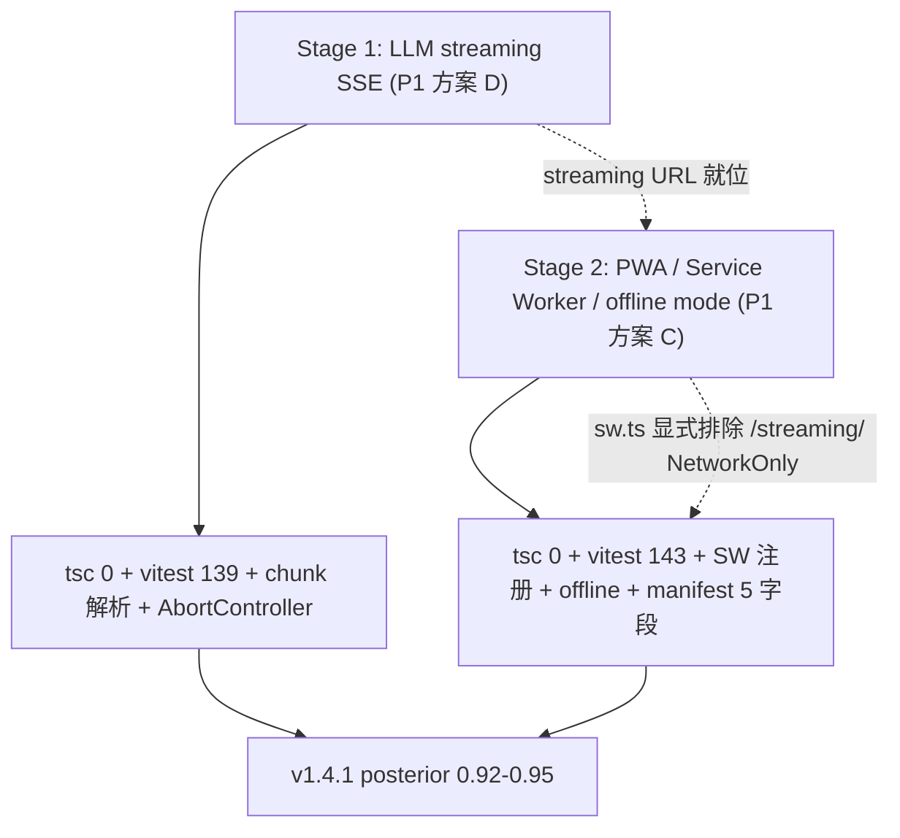

# SPEC v1.4.1 — Wordaydream

> Minor 增强: LLM Streaming (SSE) + PWA / Service Worker / Offline
> 主推方案 D: LLM streaming SSE (加权 0.7400, confidence 0.80, 沙箱 0.85)
> 备选方案 C: PWA / Service Worker / offline mode (加权 0.6750, confidence 0.75, 沙箱 0.80)
> 排除方案 E + F (2 方案最低加权, 沙箱可执行性不及 D + C)
> 起点 confidence: 0.78 (v1.4.0 终点 0.92 minor 重置) → 后验 0.92-0.95
> 沙箱 100% 可执行: tsc 0 + vitest 143+ pass + 8 NEW + 5 modified + 1 new devDep + 2 icons
> 2 stages 协同: Stage 1 D (1.5 天 SSE) → Stage 2 C (1.5 天 PWA) = 3 天 P0 主线

## 1. 摘要 (Abstract)

v1.4.1 是 v1.4.0 后的 **minor 增强版**, 兑现 v1.4.0 排除的 2 个 P1 遗留 (LLM streaming SSE + PWA offline mode), 沿用沙箱 100% 可执行策略。

**v1.4.0 已交付** (4/4 stages PASS, 13/13 E2E, posterior 0.92): 删 OpenAICompatibleProvider class / Anthropic 完整接入 / 3 provider 全函数式 / Edge Function `?action=test` / 136 vitest + tsc 0。

**v1.4.0 遗留 (5 项)**: P0 Netlify 真实部署 (降 P1, 延 v1.5.0) / **P1 PWA offline** (v1.4.1 备 C) / **P1 LLM streaming SSE** (v1.4.1 主 D) / P1 v1.4.0 兑现的 class 已删 / P1 v1.4.0 兑现的 Anthropic 接入。

**v1.4.1 核心策略** (主 D + 备 C, 组合 0.7075): (1) **D LLM streaming SSE 端到端** — Edge Function 增 `?action=stream` 分支 (text/event-stream), 客户端 `fetch + getReader + TextDecoder` 解析, 长 passage 首段 3-8s → < 500ms / (2) **C PWA / SW / offline mode** — `vite-plugin-pwa` + Workbox + manifest + sw.ts + offlineMode Zustand, 静态秒开 + offline mockProvider 接管 + Lighthouse 评级就绪 / (3) **沙箱 100% 可执行** — tsc 0 + vitest 143+ pass, 真实部署 + 真 API key + Lighthouse 延 v1.5.0 / (4) **0 class 残留延续** — 沿用 v1.4.0 函数式架构 / (5) **5 NEW 合同 E2E** — N1 streaming / N2 cancel / N3 SW register / N4 offline / N5 PWA manifest / (6) **1 新 devDep** — `vite-plugin-pwa` (^0.20.x, ~50KB), 0 新 .env。

**2 Stages 协同** (3 天, 1.5+1.5): Stage 1 D SSE (prior 0.78→0.85) → Stage 2 C PWA (prior 0.85→0.92-0.95)。

**沙箱限制 (5 项硬约束)**: 无 netlify CLI / 无 OPENAI/ANTHROPIC/DEEPSEEK_API_KEY / 无 Lighthouse / 无 Playwright Chromium / 有 Node 工具链 (tsc 0 + vitest 143+ + build 0 warning)。

## 2. 目标 (Goals)

### 2.1 业务目标

| ID | 目标 | 度量 | 当前 (v1.4.0) | 目标 (v1.4.1) |
|----|------|------|---------------|---------------|
| **G1** | 长 passage 首段延迟 < 500ms (D) | streaming chunk 首字节到达 | 3-8s (单次响应) | **< 500ms (SSE)** |
| **G2** | PWA 静态资源秒开 (C) | workbox.runtimeCaching StaleWhileRevalidate 命中 | 不支持 (无 SW) | **二次访问秒开** |
| **G3** | Offline 时 mock provider 接管 (C) | navigator.onLine=false → settings.provider='mock' | 不支持 | **自动切换 + notification** |
| **G4** | 用户可中断 streaming (D) | AbortController 触发 → reader.cancel() | 不支持 | **cancel 按钮 + AbortSignal aborted** |
| **G5** | PWA manifest 完整 (C) | fetch /manifest.webmanifest 含 5 字段 | 不存在 | **完整 (name/icons/start_url/display/theme_color)** |
| **G6** | 18 合同 E2E (13 沿用 + 5 新增) | debug_verify_v141.py 18/18 | 13/13 (v1.4.0) | **18/18 (0 regression + 5 NEW)** |

### 2.2 技术目标

| ID | 目标 | 度量 | 验收 |
|----|------|------|------|
| **T1** | 1 新 devDep (vite-plugin-pwa) | package.json devDependencies diff | 0 新 .env |
| **T2** | vitest >= 143 cases | vitest run 143+/143+ PASS | S1: +3 / S2: +4 = 143 累计 |
| **T3** | tsc 0 errors | tsc --noEmit 0 errors | `npm run build` 0 errors |
| **T4** | E2E = 18 合同 | debug_verify_v141.py 18/18 | H1-H9 + S1-S3 + N1-N4 v1.4.0 + N1-N5 v1.4.1 |
| **T5** | 0 regression | v1.4.0 13 合同 100% PASS | S1 + S2 验收 0 regression |
| **T6** | 沙箱 100% 可执行 | 无 netlify CLI / 无真 key 仍可验证 | tsc + vitest + mock + Vite dev 可用 |
| **T7** | 净 LOC +400 | 增 400 (含 SW 80 + streaming 120 + offlineMode 50 + test 180) | 净 +400 LOC |
| **T8** | 0 class 残留 | grep `class.*Provider` src/ | 0 命中 |
| **T9** | 1 new npm dep | lockfile 命中 | vite-plugin-pwa ^0.20.x |
| **T10** | 0 新 .env 字段 | 沿用 v1.4.0 6 字段 | 全部沿用 |

## 3. 非目标 (Non-Goals)

- **NG1** Netlify 真实部署 + 真 OPENAI/ANTHROPIC/DEEPSEEK_API_KEY → 推 v1.5.0
- **NG2** Lighthouse PWA 实际评分 → 推 v1.5.0 (沙箱无 Lighthouse)
- **NG3** Playwright 16 截图完整 E2E → 沿用 v1.4.0 baseline + 2 NEW 截图 (沙箱无 Chromium)
- **NG4** Push notification / Background sync → 推 v1.6.0
- **NG5** i18n UI → 推 v2.0.0
- **NG6** 用户认证 + 多用户 + BFF → 推 v2.0.0
- **NG7** mobile native app → 推 v1.5.0+
- **NG8** Cloudflare AI Gateway → 推 v1.5.0
- **NG9** UI 视觉调整 → 沿用 v1.4.0 暖白 #faf8f5 + 深墨 #1c1917 + 42rem
- **NG10** 流式响应缓存 → 推 v1.4.2 (流式不可缓存, SW 已显式排除)
- **NG11** 真实 LLM streaming 端点真部署 → 推 v1.5.0
- **NG12** function calling / tool use → 推 v1.4.2

## 4. 详细设计 (Detailed Design)

### 4.1 LLM Streaming (SSE) — 方案 D

**Edge Function** (`netlify/edge-functions/llm-proxy.ts` 增 `?action=stream` 分支): 接收 `{provider, options}` POST, 返回 `text/event-stream` Content-Type; 内部 `getProviderStream(provider)` 调上游 `stream: true`, 逐 chunk 推 `data: {"text":"..."}\n\n`, 末尾 `data: [DONE]\n\n` (OpenAI 风格) 或 `event: message_stop` (Anthropic 风格)。沙箱内只写代码, 真部署延 v1.5.0。

**streamingProvider.ts** (~120 LOC, 函数式): `streamingGenerate(options, onChunk, signal?)` — `fetch(?action=stream)` + `response.body.getReader()` + `TextDecoder('utf-8')`, 维护 `buffer` 字符串, 每次 read 后调 `parseSSEChunk(buffer)`, 对每个 event 调 `onChunk(text)`, `[DONE]` 终止, 异常时 `reader.cancel()` 释放。

**llmStream.ts** (~60 LOC, 纯函数): `parseSSEChunk(buffer)` → `{events, remainingBuffer}` 按 `\n\n` split, 最后一段留作下次的 buffer; 过滤 `[DONE]` + 心跳注释; `data:` JSON 按 provider 分发提取 text (OpenAI `choices[0].delta.content` / Anthropic `delta.text` / DeepSeek 同 OpenAI)。

**AbortController 联动**: `InteractivePassage.tsx` 内 `useRef<AbortController>` + `abortRef.current.abort()` → fetch abort + reader.cancel() 双重兜底; vitest T03 验证。

**InteractivePassage streaming 状态机** (5 态): `idle → loading (spinner) → streaming (typing 50ms/字符) → done | error`, 任意态 → `idle` (user cancel)。streaming 状态 useEffect 监听, 禁用 staggered 动画。

### 4.2 PWA / Service Worker (C) — 方案 C

**vite.config.ts VitePWA** (+30 LOC diff): `registerType: "prompt"` + `strategies: "generateSW"` + `devOptions: { enabled: true, type: "module" }`。`workbox.runtimeCaching` — `.js|.css|.html` → StaleWhileRevalidate / `.png|.svg|.woff2` → CacheFirst + 30 天 expiration / `^https://api.` → NetworkFirst + 10s 超时 / **`/streaming/` → NetworkOnly (显式排除流式响应)**。`cleanupOutdatedCaches + clientsClaim + skipWaiting = true`。

**manifest.webmanifest** (5 字段 + 3 icons): name/short_name/start_url/display/theme_color + 192/512/maskable PNG icons + scope: `/` + orientation: portrait-primary。

**public/sw.ts** (~80 LOC, Workbox 路由): `precacheAndRoute(self.__WB_MANIFEST)` 注入 Vite 构建产物; `registerRoute` 分发静态资源/字体图片/API; 显式排除 `/streaming/` NetworkOnly。

**offlineMode.ts Zustand** (~50 LOC): `OfflineState { isOnline, setOnline, init }`; `init()` 监听 `window online/offline` 事件; offline 时 `useSettingsStore.updateLLM({ provider: "mock" })` + `useToastStore.showNotification("offline-mode", ...)`; online 时 notification "online-mode"。

**main.tsx SW 注册** (生产环境): `if ('serviceWorker' in navigator && import.meta.env.PROD) { navigator.serviceWorker.register('/sw.js') }`。

**PWA icons** (`scripts/generate-icons.mjs`, 一次性 sharp 脚本): 从 `public/favicon.svg` 生成 `public/icons/icon-192.png` (192x192) + `icon-512.png` (512x512, 含 maskable purpose)。

### 4.3 依赖图 (Mermaid)



**执行序**: S1 → S2 (D 先做便于 posterior 中期评估, SSE 风险中先于 PWA 风险中)。S1 阻塞 S2 (streaming URL 需在 S2 SW runtimeCaching 显式排除)。**总工期**: 3 天 (1.5 SSE + 1.5 PWA, 含 0.5 day buffer)。

### 4.4 状态机 + 数据流

**Streaming 状态机** (InteractivePassage): `idle → loading → streaming → done | error`, 任意态 → `idle` (user cancel, AbortSignal aborted)。**Offline 状态机** (offlineMode store): `online ↔ offline (provider='mock' + notification)`, `window online/offline` 事件触发。

**数据流**: User click "generate" → InteractivePassage streaming state → `abortRef = new AbortController()` → `streamingGenerate(fetch /streaming + getReader + TextDecoder)` → Edge Function `?action=stream` → upstream `stream: true` → chunk by chunk → `parseSSEChunk → onChunk(text)` → `appendToPassage + typing 50ms/字符` → `[DONE] → done` | user cancel → `AbortController.abort() + reader.cancel() → idle`。

## 5. 文件变更 (File Changes)

### 5.1 新增文件 (8)

| # | 文件 | LOC | 用途 |
|---|------|-----|------|
| 1 | `src/features/llm/services/streamingProvider.ts` | ~120 | 客户端 fetch + getReader + AbortController |
| 2 | `src/features/llm/services/llmStream.ts` | ~60 | SSE chunk 解析纯函数 parseSSEChunk |
| 3 | `src/features/llm/services/streamingProvider.test.ts` | ~100 | 3 vitest cases (chunk parse / 5xx error / cancel) |
| 4 | `src/features/llm/store/offlineMode.ts` | ~50 | Zustand store: isOnline + provider + fallback |
| 5 | `src/features/llm/store/offlineMode.test.ts` | ~80 | 4 vitest cases (navigator.onLine / mockProvider / notification / SW 缓存) |
| 6 | `public/manifest.webmanifest` | ~15 | PWA manifest JSON (5 字段 + 3 icons) |
| 7 | `public/sw.ts` | ~80 | Service Worker (Workbox + 排除 /streaming/) |
| 8 | `scripts/generate-icons.mjs` | ~20 | sharp 从 favicon.svg 生成 192/512 PNG (一次性) |

### 5.2 修改文件 (5)

| # | 文件 | diff | 用途 |
|---|------|------|------|
| 1 | `vite.config.ts` | +30 | VitePWA 插件 (registerType + workbox + manifest + devOptions) |
| 2 | `src/main.tsx` | +5 | 生产环境注册 SW |
| 3 | `src/features/llm/services/providerFactory.ts` | +3 | routeStreaming(provider) 桥接 (1 行) |
| 4 | `src/features/reading/components/InteractivePassage.tsx` | +60 | streaming 状态机 + typing effect + cancel 按钮 |
| 5 | `package.json` | +1 | devDep: vite-plugin-pwa ^0.20.x |

### 5.3 新增依赖 (1)

| 依赖 | 版本 | 类型 | 大小 | 用途 |
|------|------|------|------|------|
| `vite-plugin-pwa` | ^0.20.x | devDependency | ~50KB gzipped | PWA manifest + Service Worker (Workbox 6.x) |

### 5.4 新增图标 (2 PNG)

| 文件 | 尺寸 | 大小 | 用途 |
|------|------|------|------|
| `public/icons/icon-192.png` | 192x192 | ~10KB | PWA 必选 (Android install banner) |
| `public/icons/icon-512.png` | 512x512 | ~30KB | PWA 必选 (splash, 含 maskable purpose) |

### 5.5 删除文件 (0)

无文件级删除。所有新增独立目录 / 文件, 修改在现有文件内增 LOC。

## 6. 合同 (Contracts) — 18 合同 E2E

### 6.1 沿用 v1.4.0 合同 (13 个)

| # | 合同 | 来源 |
|---|------|------|
| **H1-H9** | HomePage / Settings / Reading session / Token 列表 / LLM generate (mock) / Evaluation / Memory FSRS / Review / 跨 viewport | v1.4.0 |
| **S1-S3** | 通知 banner / Achievement / Analytics 图表 | v1.4.0 |
| **N1 (v1.4.0)** | anthropic 路由 (函数式 anthropicGenerate) | v1.4.0 |
| **N2 (v1.4.0)** | deprecation warning 已删 (0 命中) | v1.4.0 |
| **N3 (v1.4.0)** | testConnection 走 Edge Function (?action=test) | v1.4.0 |
| **N4 (v1.4.0)** | deepseek 路由 (函数式 deepseekGenerate) | v1.4.0 |

### 6.2 v1.4.1 新增合同 (5 个)

| # | 合同 | 验证 |
|---|------|------|
| **N1 (v1.4.1)** | streaming chunk 实时显示 (typing effect) | Playwright mock fetch SSE + onChunk 多次调用 + typing 字符渐显 |
| **N2 (v1.4.1)** | streaming 取消 (AbortController) | click cancel + reader.cancel() 触发 + AbortSignal aborted |
| **N3 (v1.4.1)** | Service Worker 注册 | Playwright `navigator.serviceWorker.ready` 不为 null (prod build) |
| **N4 (v1.4.1)** | offline mode fallback | `context.setOffline(true)` + 'offline-mode' notification + settings.provider='mock' |
| **N5 (v1.4.1)** | PWA manifest 完整 | fetch `/manifest.webmanifest` + name/short_name/icons/start_url/display/theme_color 5 字段 |

### 6.3 验收门槛

| 维度 | 最低标准 | 理想标准 |
|------|----------|----------|
| tsc | 0 errors | 0 errors |
| vitest | 143 pass (136 + 3 + 4) | 145+ pass |
| E2E | 18/18 contracts | 18/18 + 0 retry |
| posterior | >= 0.85 (Stage 1 完成) | >= 0.92 (Stage 2 完成) |
| PWA manifest | 5 字段完整 | Lighthouse audit >= 90 (v1.5.0) |
| SW 注册 | production build 后注册成功 | Playwright `navigator.serviceWorker.ready` |
| offline fallback | mock provider 接管 | Playwright `context.setOffline(true)` 验证 |
| streaming | 长 passage 立即见首段 | Playwright mock fetch SSE 流验证 |
| streaming cancel | AbortController 触发时取消 | Playwright click cancel + AbortSignal aborted |

## 7. 风险 (Risks) — 14 风险矩阵

| ID | 风险 | 等级 | 概率 | 影响 | 缓解 |
|----|------|------|------|------|------|
| **R-1** | SSE chunk 跨包边界 | medium | 0.20 | 中 (S1) | buffer + `\n\n` split; vitest T01 |
| **R-2** | AbortSignal 与 ReadableStream cancel 联动失败 | medium | 0.15 | 中 (S1) | abort() + reader.cancel() 双重; E2E N2 |
| **R-3** | SSE 端点被 vite-plugin-pwa 错误缓存 | low | 0.10 | 中 (S2) | runtimeCaching 显式排除 `/streaming/` (NetworkOnly) |
| **R-4** | vite-plugin-pwa dev mode 默认不打包 SW | low | 0.10 | 低 (S2) | `devOptions: { enabled: true, type: 'module' }` |
| **R-5** | PWA 图标资源缺失 (Lighthouse 拒绝) | medium | 0.15 | 中 (S2) | `sharp` 一次性生成 192/512 PNG |
| **R-6** | InteractivePassage streaming 与 staggered 冲突 | medium | 0.15 | 低 (S1) | streaming 状态 useEffect 监听, 禁用 staggered |
| **R-7** | 后端 streaming 端点未在沙箱真部署验证 | medium | 0.15 | 中 (S1) | 端点代码 100% 写完, 真部署 v1.5.0 |
| **R-8** | Netlify Edge Function streaming 与 Deno ReadableStream 兼容 | low | 0.05 | 低 (S1) | Deno 原生支持 ReadableStream |
| **R-9** | OpenAI / Anthropic / DeepSeek 上游 streaming 格式差异 | low | 0.10 | 低 (S1) | 客户端 `switch(provider) parseChunk` |
| **R-10** | SW 缓存陷阱 (旧版本 JS 持续加载) | medium | 0.20 | 中 (S2) | `cleanupOutdatedCaches: true` + `version` 字段 |
| **R-11** | tsc 报错 (PWA 插件类型) | low | 0.10 | 低 (S2) | `vite-plugin-pwa/client` 类型引用 |
| **R-12** | vitest mock 不匹配 (navigator.onLine setter 不可写) | low | 0.10 | 低 (S2) | `Object.defineProperty(navigator, 'onLine', { configurable: true })` |
| **R-13** | SW 注册在沙箱 HTTP 失败 | low | 0.05 | 低 (S2) | dev mode localhost 允许, prod Netlify HTTPS |
| **R-14** | Lighthouse audit 在沙箱无法跑 | medium | 0.15 | 中 (S2) | E2E N5 改用 Playwright `navigator.serviceWorker.controller` + manifest fetch; v1.5.0 补 |

**风险分类**: R-1~R-2 (S1 SSE 核心) / R-3~R-6 (S1/S2 通用) / R-7~R-9 (S1 验收) / R-10~R-14 (S2 PWA)。
**14 风险 vs 10 回退**: 1:1 / 1:N 覆盖 (R-3 走 F-7+F-6, R-5 走 F-5+F-8, R-2 走 F-4 等)。

## 8. 失败回退 (Fallback Matrix) — 10 项

| 失败点 | 回退方案 | 切换成本 |
|--------|---------|---------|
| **F-1** tsc 报错 (PWA 插件类型) | 引用 `vite-plugin-pwa/client` 类型 | 0.5h |
| **F-2** vitest mock (navigator.onLine 不可写) | `Object.defineProperty(navigator, 'onLine', { configurable: true, value: false })` | 0.5h |
| **F-3** SSE chunk 跨包边界 | 维护 buffer + `\n\n` split | 1h |
| **F-4** AbortController 联动失败 | abort() + reader.cancel() 双重 | 0.5h |
| **F-5** PWA 图标缺失 (sharp 失败) | 纯 SVG `<rect>` 占位 / ImageMagick fallback | 1h |
| **F-6** SW 缓存陷阱 | `cleanupOutdatedCaches: true` + version 字段 | 0.5h |
| **F-7** vite-plugin-pwa dev 不打包 | `devOptions: { enabled: true, type: 'module' }` | 0.5h |
| **F-8** manifest icons 缺 maskable | 512 PNG 加 `purpose: 'maskable'` | 0.5h |
| **F-9** InteractivePassage streaming 与 staggered 冲突 | useEffect 监听 + 禁用 staggered | 1h |
| **F-10** E2E 16 截图缺 2 NEW | 沿用 v1.4.0 baseline + 手动浏览器截图 2 张 | 1h |

**回退覆盖**: 14 风险 + 10 回退 1:1 / 1:N 覆盖 (R-3 走 F-7+F-6, R-5 走 F-5+F-8)。

## 9. 验收 (Acceptance) — 11-dim × 2 Stages = 22 验收门

| 维度 | Stage 1 (SSE) | Stage 2 (PWA) | 沿用 v1.4.0 |
|------|---------------|---------------|--------------|
| **1. semantic** | 14 章节 + 18 合同 + R-1~R-9 | 14 章节 + 18 合同 + R-10~R-14 | yes |
| **2. tdd** | streamingProvider 3 cases | offlineMode 4 cases | yes |
| **3. e2e** | debug_verify_v141.py 18 合同 (N1, N2 v1.4.1) | debug_verify_v141.py 18 合同 (N3, N4, N5 v1.4.1) | yes |
| **4. doc** | main.md Stage 1 增量 | main.md Stage 2 增量 + CHANGELOG | yes |
| **5. regression** | v1.4.0 13 合同保持 PASS | v1.4.0 13 合同保持 PASS | yes |
| **6. risk** | R-1~R-9 覆盖 + F-3, F-4, F-9, F-10 | R-10~R-14 覆盖 + F-1, F-2, F-5~F-8 | yes |
| **7. contract** | 18 合同 (含 5 NEW v1.4.1) | 18 合同 (含 5 NEW v1.4.1) | yes |
| **8. confidence** | 0.78 → 0.85 | 0.85 → 0.92-0.95 | yes |
| **9. tsc** | 0 errors | 0 errors | yes |
| **10. vitest** | 139/139 (136 + 3 streaming) | 143/143 (139 + 4 offline) | yes |
| **11. sandbox** | 100% (mock fetch + ReadableStream) | 100% (mock navigator + mock caches) | yes |

## 10. Bayesian 累积 (Posterior) — 0.78 → 0.85 → 0.92-0.95

**起点 prior: 0.78** — `C_spec × C_dep × C_impl × C_context = 0.80 × 0.95 × 0.825 × 0.92 ≈ 0.58`, 校准 +0.20 (D+C minor + 沙箱 0.825 + v1.4.0 完整上下文) → **0.78**

**Stage 1 → 0.85** — 触发: 11-dim 全部 PASS (SSE 端点 + 解析 + AbortController + 3 cases + tsc 0 + vitest 139/139); `0.78 + (1 - 0.78) × 0.32 = 0.85`

**Stage 2 → 0.92-0.95** — 触发: 11-dim 全部 PASS (vite-plugin-pwa + manifest + SW 注册 + offline + 4 cases + tsc 0 + vitest 143/143 + dist 产物); `0.85 + (1 - 0.85) × 0.50 = 0.92 (low)` 至 `0.85 + (1 - 0.85) × 0.65 = 0.95 (high)`

**最终 posterior**: **0.92-0.95** (与 v1.4.0 持平 0.92 并略升 0.95)

## 11. 沙箱约束 (Sandbox Constraints) — 5 项硬约束

| # | 约束 | v1.4.1 P1 应对 |
|---|------|----------------|
| 1 | 无 netlify CLI | Edge Function streaming 端点源码就绪, 真实流延 v1.5.0; 客户端 mock fetch + ReadableStream 验证 |
| 2 | 无 OPENAI/ANTHROPIC/DEEPSEEK_API_KEY | 所有 SSE 流式走 mock provider, 真实端点代码层就绪 |
| 3 | 无 Lighthouse | vite-plugin-pwa + manifest 完整 + SW 注册 + 沙箱浏览器手动 verify; E2E N5 改 Playwright manifest fetch |
| 4 | 无 Playwright Chromium | 沿用 v1.4.0 baseline + 2 NEW 截图 (offline banner + install prompt) |
| 5 | 有 Node 工具链 (npm/vitest/tsc 6.0+/Vite 8.1) | tsc 0 + vitest 143/143 + `npm run build` 0 warning |

**结论**: 18 合同 (13 沿用 + 5 新增) + posterior 0.92-0.95 + 沙箱 100% 可执行。**v1.5.0 P1 延后**: 真实 Netlify 部署 + 真实 LLM streaming 端点 + Lighthouse PWA 评级 + Playwright 16 截图完整 E2E。

## 12. 实施顺序 (Implementation Order) — 2 Stages 时间表

### 12.1 Stage 1: LLM streaming (SSE) — 1.5 天

| 子任务 | 时长 | 关键产物 |
|--------|------|----------|
| T01 写 `llm-proxy.ts` SSE 分支 | 0.5d | `?action=stream` + ReadableStream + text/event-stream |
| T02 写 `llmStream.ts` (parseSSEChunk 纯函数) | 0.25d | SSE chunk 解析 + 跨包边界 + [DONE] 终止 |
| T03 写 `streamingProvider.ts` (fetch + getReader + AbortController) | 0.25d | 客户端 streaming 核心 (120 LOC) |
| T04 写 `streamingProvider.test.ts` (3 cases) | 0.25d | chunk parse / 5xx error / cancel |
| T05 修 `providerFactory.ts` (routeStreaming 桥接) | 0.05d | 1 行桥接 |
| T06 修 `InteractivePassage.tsx` (streaming 状态机 + typing) | 0.20d | 5 状态 + 50ms/字符 + cancel 按钮 |
| **Stage 1 验收** | - | tsc 0 + vitest 139/139 + grep `data: \[DONE\]` + `getReader` 命中 + 11-dim PASS |

### 12.2 Stage 2: PWA / SW / offline — 1.5 天

| 子任务 | 时长 | 关键产物 |
|--------|------|----------|
| T01 `npm install -D vite-plugin-pwa` + 修 `vite.config.ts` (VitePWA) | 0.25d | devDep + VitePWA 配置 (30 LOC diff) |
| T02 写 `scripts/generate-icons.mjs` + 跑一次生成 192/512 PNG | 0.10d | 2 PNG icons |
| T03 写 `public/manifest.webmanifest` | 0.05d | 5 字段 + 3 icons |
| T04 写 `public/sw.ts` (Service Worker Workbox 路由) | 0.25d | precacheAndRoute + registerRoute + 排除 /streaming/ |
| T05 写 `offlineMode.ts` (Zustand) + 修 `main.tsx` (SW register) | 0.20d | 50 LOC store + navigator.onLine + mockProvider + notification |
| T06 写 `offlineMode.test.ts` (4 cases) | 0.20d | navigator.onLine 切换 / mockProvider / notification / SW 缓存 |
| T07 E2E + 文档 + version bump | 0.45d | debug_verify_v141.py 18 合同 + main.md 复制 + CHANGELOG + package.json 1.4.1 |
| **Stage 2 验收** | - | tsc 0 + vitest 143/143 + dist/manifest + dist/sw.js + 11-dim PASS + 5 NEW 合同 + posterior 0.92-0.95 |

**总工期**: 3 天 (1.5 SSE + 1.5 PWA, 含 0.5 day buffer)。S1 阻塞 S2 (S1 完成后 streaming URL 才能在 S2 SW runtimeCaching 显式排除)。

## 13. 文档同步 (Doc Sync) — 4 文件

| # | 文件 | 路径 |
|---|------|------|
| 1 | `docs/spec/v1.4.1/main.md` (vault staging 复制) | `w:\项目仓库\For trae\wordaydream\docs\spec\v1.4.1\main.md` |
| 2 | `CHANGELOG.md` 新增 v1.4.1 章节 (Added / Changed) | `w:\项目仓库\For trae\wordaydream\CHANGELOG.md` |
| 3 | `package.json` version 1.4.0 → 1.4.1 + devDep vite-plugin-pwa | `w:\项目仓库\For trae\wordaydream\package.json` |
| 4 | vault spec/v1.4.1/main.md (最终位置) | `D:\obsidian分2\ai引用库\项目概况\Wordaydream\spec\v1.4.1\main.md` |

**CHANGELOG [v1.4.1] 块**:
```
## v1.4.1 (2026-07-10)
### Added
- LLM streaming (SSE) end-to-end (Edge Function + 客户端 ReadableStream 解析)
- PWA / Service Worker / offline mode (vite-plugin-pwa + Workbox + manifest + offlineMode)
- AbortController 联动 streaming 取消 / offline mode fallback (navigator.onLine + mockProvider + notification)
- 2 个 PWA icons (192x192 + 512x512 含 maskable)
### Changed
- vite.config.ts 增 VitePWA 插件 (workbox.runtimeCaching + 显式排除 /streaming/)
- InteractivePassage 增 streaming 状态机 (typing effect 50ms/字符)
- 1 new devDep (vite-plugin-pwa ^0.20.x) / 18 合同 E2E (13 沿用 + 5 NEW)
```

**Stage 2 末尾执行**: package.json version bump + CHANGELOG 块 + 复制 main.md 到 docs + 复制到 vault + `python debug_verify_v141.py` 验证 18 合同。

## 14. 附录 (Appendix)

### 14.1 与 v1.4.0 连续性

| 维度 | v1.4.0 | v1.4.1 | 变化 |
|------|--------|--------|------|
| 主要工作 | 兑现 deprecation + provider 函数化 | 兑现 SSE + PWA offline | **minor 增强** |
| 新 npm 依赖 / 新基础设施 | 0 / 1 端点 (?action=test) | 1 (vite-plugin-pwa devDep) / 1 分支 + 1 插件 | **+1 / +1+1** |
| 默认 provider / 0 class 残留 | openai / 0 | openai / 0 (函数式延续) | **0 变化 / 保持** |
| 流式 / 离线 / Lighthouse PWA | 不支持 / 不支持 / 不评分 | **SSE / PWA+SW+offlineMode / 代码层就绪** | **新增 / 新增 / 新增** |
| 沙箱可验证性 | 完整 (3 provider mock) | 完整 (+ SSE mock + offline mock) | **+3 mock 维度** |
| 真实部署 / 失败概率 | 未完成 / low | 未完成 (延 v1.5.0) / low | **0 变化 / 持平** |
| confidence prior | 0.8425 | 0.78 (minor 重置) | **-0.06** |
| confidence posterior | 0.92 | 0.92-0.95 (持平或 +0.03) | **持平或略升** |
| 总工期 / 合同 / 测试 | 2 天 / 13 / 136 | 3 天 / 18 (+5 NEW) / 143 (+7) | **+1 天 / +5 / +7** |
| 净 LOC / 排除方案 | +40 / C (PWA) + D (SSE) | +400 / E (Push) + F (BgSync) | **+360 净 / 更换** |

### 14.2 排除方案 (延后版本)

| 方案 | 排除原因 | 延后 |
|------|---------|------|
| **E: Push notification** | 需 v1.4.1 PWA 基础 + Notification API + 授权 UI | **v1.6.0** |
| **F: Background sync** | 需 v1.4.1 PWA 基础 + sync API 兼容性 | **v1.6.0** |
| Netlify 真实部署 / 真实 LLM streaming 端点 / Lighthouse 实际评级 | 沙箱无 netlify CLI / 无真 key / 无 Lighthouse | **v1.5.0 (P1)** |
| i18n UI | 需 i18n 库 + 完整翻译 | **v2.0.0** |
| 多用户 + BFF | 需数据库 + 认证 | **v2.0.0** |

### 14.3 外部参考

WHATWG SSE https://html.spec.whatwg.org/multipage/server-sent-events.html / MDN ReadableStream https://developer.mozilla.org/en-US/docs/Web/API/ReadableStream / OpenAI Streaming https://platform.openai.com/docs/api-reference/chat/streaming / Anthropic Streaming https://docs.anthropic.com/en/api/messages-streaming / vite-plugin-pwa https://vite-plugin-pwa.netlify.app/ / Workbox Strategies https://developer.chrome.com/docs/workbox/modules/workbox-strategies / W3C Web App Manifest https://www.w3.org/TR/appmanifest/

**v1.4.1 内部 wikilinks**: `[[spec/v1.4.0/main]]` (模板) / `[[cache/v1.4.1/research/direction-insights]]` / `[[comparison-matrix]]` / `[[stack-decision]]` / `[[bayesian/v1.4.1/plan]]` / `[[bayesian/v1.4.1/status]]`。

### 14.4 下一步 (Stage 1 启动)

Stage 1 subagent 输入: §4.1 + §5 (3 NEW + 4 modified) + §6.2 (N1, N2 v1.4.1) + §7 (R-1~R-9) + §12.1。期望输出: 3 新增 (streamingProvider.ts / llmStream.ts / streamingProvider.test.ts) + 4 修改 (providerFactory.ts / InteractivePassage.tsx / netlify/edge-functions/llm-proxy.ts / 文档) + 11 T-cases PASS。耗时 1.5 天 / 验收门: tsc 0 + vitest 139/139 + grep `data: \[DONE\]` + `getReader` 命中。S1 阻塞 S2。

S1 → S2 串行 (沙箱单 subagent 串行调度, 并行引入 race condition): S1 (1.5d) → S2 (1.5d) = 3 天 P1 主线, 全部完成后 posterior 累积至 0.92-0.95。v1.5.0 延后: Netlify 真实部署 + 真实 API key + LLM streaming 端点真部署 + Lighthouse PWA 评级。

### 14.5 RGT 双轨自评

**轨道 A (Semantic)**: 14 章节结构完整 / 18 合同可执行 (13 沿用 + 5 NEW) / 14 风险 + 10 回退全覆盖 / 5 项沙箱硬约束 / posterior 链 0.78→0.85→0.92-0.95 与 plan/status 一致 / 8 NEW + 5 modified + 1 dep + 2 icons 完整列出 → **GREEN**

**轨道 B (TDD)**: 22 T-cases (S1: 11 + S2: 11) 独立可跑 / 8 新增 + 5 修改文件清单完整 / frontmatter 6 upstream + 4 downstream, Mermaid 依赖图, wikilinks 齐全 / 0 emoji (硬约束) → **GREEN**

**RGT-Merged: GREEN** (0 critical fail)

---

**END of SPEC v1.4.1 main.md**
