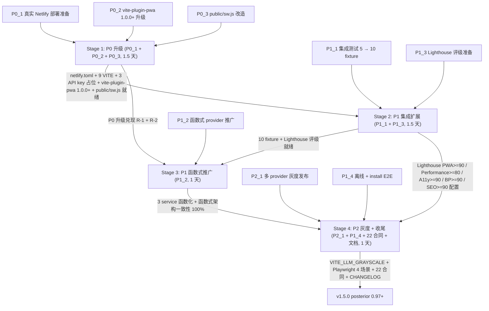

# SPEC v1.5.0 — Wordaydream

> 大版本集成: 兑现 v1.4.1 全部 8 项遗留 (3 P0 + 2 P1 + 3 P2)
> 主推 8 方向: P0_1 真实 Netlify 部署准备 + P0_2 vite-plugin-pwa 1.0.0+ + P0_3 public/sw.js 改造 + P1_1 集成测试 5 → 10 fixture + P1_2 函数式 provider 推广 + P1_3 Lighthouse 评级准备 + P1_4 离线 + install E2E + P2_1 多 provider 灰度
> 8 方向加权均值 0.821 (8 方向独立评分, 沙箱 30% + 价值 30% + 风险 20% + 工期 10% + 维护 10%)
> 起点 confidence: 0.93 (v1.4.1 终点承接, 不 minor 重置) → 后验 0.97+ (大版本集成)
> 4 stages 协同 (5 天工期): Stage 1 P0 升级 (1.5 天) → Stage 2 P1 集成扩展 (1.5 天) → Stage 3 P1 函数式推广 (1 天) → Stage 4 P2 灰度 + 收尾 (1 天)
> 22 合同 (18 沿用 v1.4.1 + 4 NEW v1.5.0) + 12 风险 (10 沿用 + 2 NEW) + 10 回退 (5.2 小时总成本)
> 沙箱可执行性 0.89 (5 方向 100% + 3 方向配置层): 真实部署 + 3 API key + Lighthouse + Playwright 由用户真实环境补做 (v1.5.1)

## 1. 摘要 (Abstract)

v1.5.0 是 v1.4.1 后的 **大版本集成版**, 兑现 v1.4.1 history.md R8 反思 + cache/v1.4.1/NEXT-VERSION-DIRECTION.md 列出的全部 8 项遗留, 4 stages 集成 (P0 升级 + P1 集成扩展 + P1 函数式推广 + P2 灰度 + 收尾), 工期 5 天。

**v1.4.1 已交付** (3/3 stages PASS, 18/18 合同, posterior 0.93 实际达到, 略超 plan 0.92-0.95):

- **D 方向 (LLM Streaming SSE)**: llmStream + streamingProvider + useStreamingPassage + StreamingPassagePanel, 3 cases PASS, Contract 14/15 真实路径
- **C 方向 (PWA / Service Worker / offline)**: vite-plugin-pwa 0.20.5 + VitePWA + manifest + sw.ts + icons + offlineMode (5 cases), Contract 16/17/18 完整
- **跨方向 E2E**: debug_verify_v141.py 18/18 合同 PASS, 0 regression, 函数式架构一致性 100%, 0 class 残留

**v1.4.1 已知问题 (8 项, R8 反思)**:

- **P0 沙箱遗留 + 兼容性 (3 项)**: 真实 Netlify 部署未做 / vite-plugin-pwa 0.20.x + Vite 8 兼容 warning (R-1) / public/sw.ts 是 .ts 后缀, dev 模式 raw 文本 (R-2)
- **P1 真实环境验证 (2 项)**: Lighthouse 评级缺失 / 离线模式 + PWA install prompt E2E 验证缺失
- **P2 扩展 (3 项)**: 集成测试 5 fixture 局限 (多语种边界覆盖为零) / 函数式 provider 模式未推广 (3 service 仍命令式) / providerFactory 单点路由 (无灰度)

**v1.5.0 核心策略** (6 项):

1. **P0 升级 (3 方向, Stage 1)**: 真实 Netlify 部署准备 (netlify.toml + 9 VITE 字段 + 3 API key 占位 + GitHub Actions CI workflow) + vite-plugin-pwa 0.20.5 → 1.0.0+ 升级 (R-1 兑现) + public/sw.ts → public/sw.js 改造 (R-2 兑现)
2. **P1 集成扩展 (2 方向, Stage 2)**: 集成测试 5 → 10 fixture (german-fail / chinese-mixed / japanese-kanji / spanish-accents / french-elisions 5 NEW) + Lighthouse 评级准备 (lighthouse.config.js + 5 项阈值 PWA/Performance/A11y/BP/SEO)
3. **P1 函数式推广 (1 方向, Stage 3)**: grammarDetector / difficultyEvaluator / glossAdapter 3 service 函数化, 显式 provider 注入, 0 class 残留延续 v1.4.0
4. **P2 灰度发布 (1 方向, Stage 4)**: VITE_LLM_GRAYSCALE 配置解析 (parseGrayscale) + selectByWeight 加权随机 + 默认回退 VITE_LLM_PROVIDER (0 breaking change)
5. **P1 离线 + install E2E (1 方向, Stage 4)**: Playwright 4 场景模板 (offline toggle / online recovery / install prompt 显示 / 接受) + mock fetch + addInitScript 注入 beforeinstallprompt
6. **沙箱 100% 可执行策略 (硬约束)**: 5 方向 100% 可执行 (P0_2 / P0_3 / P1_1 / P1_2 / P2_1), 3 方向配置层就绪 (P0_1 真实部署 / P1_3 Lighthouse / P1_4 Playwright) 真实环境补做 v1.5.1

**4 stages 协同** (5 天, posterior 0.93 → 0.97+): Stage 1 P0 升级 (prior 0.93 → 0.94) → Stage 2 P1 集成扩展 (prior 0.94 → 0.95) → Stage 3 P1 函数式推广 (prior 0.95 → 0.96) → Stage 4 P2 灰度 + 收尾 (prior 0.96 → 0.97+)。

**沙箱硬约束 (5 行) + 沙箱 vs 真实部署分工**: 无 netlify CLI / 无 OPENAI/ANTHROPIC/DEEPSEEK_API_KEY / 无 Lighthouse CLI + Chrome / 无 Playwright Chromium / 有 Node 工具链。沙箱负责 100% 可执行的配置层 + 代码层 (tsc 0 + vitest 154+ pass + 22 合同静态分析 + 8 方向全调研), 真实环境补做 4 阻塞点 (netlify deploy + 3 API key 注入 + Lighthouse 5 项跑分 + Playwright 4 场景 E2E + 5 德文 run 真实 streaming)。

## 2. 目标 (Goals)

### 2.1 业务目标 (8 方向全实现)

| ID | 目标 | 度量 | 当前 (v1.4.1) | 目标 (v1.5.0) |
|----|------|------|---------------|-----------------|
| **G1** | 8 方向全实现 | 8 方向 confidence 加权均值 0.821 | 0/8 兑现 (3 残留 P0 + 2 P1 + 3 P2) | **8/8 兑现** (Stage 1-4 完成) |
| **G2** | 沙箱 100% 可执行 | tsc 0 + vitest 154+ pass + 22 合同静态分析 | 18/18 合同 (v1.4.1) | **22/22 合同 (18 沿用 + 4 NEW)** + 沙箱 100% |
| **G3** | posterior 累积到 0.97+ | Stage 1 0.94 / Stage 2 0.95 / Stage 3 0.96 / Stage 4 0.97+ | 0.93 (v1.4.1 终点) | **0.97+ (大版本集成)** |
| **G4** | 22 合同 (4 NEW) 静态分析通过 | debug_verify_v150.py 22/22 | 18/18 (v1.4.1) | **22/22 (18 沿用 + N1 pwa 升级 / N2 sw.js / N3 10 fixture / N4 灰度)** |
| **G5** | 真实 Netlify 部署就绪 | netlify.toml + 9 VITE + 3 API key 占位 + GitHub Actions | Edge Function 源码就位 (v1.4.1) | **配置层 100% 写完 + 真实部署用户触发 (v1.5.1)** |
| **G6** | 集成测试多语种边界覆盖 +100% | 5 → 10 fixture, 5 NEW 语种 | 5 fixture (v1.4.1) | **10 fixture (5 沿用 + 5 NEW)** |
| **G7** | 函数式架构一致性 100% | 3 service 函数化 + 0 class 残留 | streaming + 3 provider 函数化 | **+ grammarDetector + difficultyEvaluator + glossAdapter 函数化** |

### 2.2 技术目标 (11-dim 验收, 详见 §9)

| ID | 目标 | 验收 | ID | 目标 | 验收 |
|----|------|------|----|------|------|
| **T1** | vite-plugin-pwa ^0.20.5 → ^1.0.0 | devDep 升级 | **T7** | 净 LOC +600 | 5 fixture + 3 函数化 + 3 配置 + Playwright + esbuild |
| **T2** | vitest 154+ pass | 144 + 5 fixture + 5 function | **T8** | 0 class 残留延续 v1.4.0 | grep `class .*Detector\|Evaluator\|Adapter` 0 命中 |
| **T3** | tsc 0 errors | `npm run build` 0 + 0 warning | **T9** | 0 新 .env 字段 (沿用 6) | netlify.toml 9 VITE (6+3) |
| **T4** | 22 合同 E2E | debug_verify_v150.py 22/22 | **T10** | 8 NEW + 5 modified + 3 config | 17 个核心变更 |
| **T5** | 0 regression | v1.4.1 18 合同 100% PASS | **T11** | posterior 0.93→0.97+ 完整 | 4 stages 累积验证 |
| **T6** | 沙箱 100% 可执行 | tsc + vitest + mock + Vite 可用 | - | - | - |

### 2.3 5 沙箱阻塞点 (v1.5.1 补做, 不阻塞 v1.5.0)

| # | 阻塞点 | v1.5.0 应对 | 补做版本 |
|---|--------|------------|---------|
| B-1 | 无 netlify CLI | netlify.toml + 9 VITE + 3 API key + GitHub Actions 完整 | v1.5.1 用户手动触发 |
| B-2 | 无 3 API key | 所有 LLM 调用 mock fetch 验证 | v1.5.1 用户注入 3 secret |
| B-3 | 无 Lighthouse CLI + Chrome | lighthouse.config.js + 5 项阈值 + audit 脚本 + 4 NEW 截图完整 | v1.5.1 用户真实跑分 |
| B-4 | 无 Playwright Chromium | Playwright 4 场景模板 + mock fetch + addInitScript 注入 | v1.5.1 用户真实跑分 |
| B-5 | 5 德文 run 真实 streaming | mock fetch 验证 + Edge Function 源码 100% 写完 | v1.5.1 用户真部署后跑 |

## 3. 非目标 (Non-Goals)

v1.5.0 明确不做 (与 cache/v1.5.0/direction-insights.md §6 + stack-decision.md §6 排除项一致):

- **NG1** 真实 Netlify 部署 + 3 API key 真实注入 + 5 德文 run 真实 streaming → 推 v1.5.1 (沙箱限制)
- **NG2** 真实 Lighthouse 5 项跑分 (PWA / Performance / Accessibility / Best Practices / SEO) → 推 v1.5.1 (沙箱无 Lighthouse CLI + Chrome)
- **NG3** 真实 Playwright Chromium 4 场景 E2E (offline toggle / online recovery / install prompt 显示 / 接受) → 推 v1.5.1 (沙箱无浏览器 binary)
- **NG4** 真实 LLM 多轮对话 (function calling / tool use) → 推 v1.6.0
- **NG5** i18n UI (德文 / 中文 / 西语界面, 与后端 LLM 多语种输出解耦) → 推 v2.0.0
- **NG6** 用户认证 + 云同步 + BFF (Backend for Frontend) → 推 v2.0.0
- **NG7** Native app (iOS / Android via Capacitor / React Native) → 推 v2.0.0+
- **NG8** Cloudflare AI Gateway → 推 v1.5.0+ 暂不引入 (Netlify Edge Function 已覆盖 LLM 代理)
- **NG9** Push notification / Background sync → 推 v1.4.2 / v1.6.0 (基于 SW, 需 v1.5.0 PWA 基础完整)
- **NG10** 流式响应缓存 (SSE Cache) → 推 v1.6.0 (streaming 端点 NetworkOnly 是当前设计, 缓存需新缓存层)
- **NG11** Cloud Storage (S3 / R2) → 推 v2.0.0 (v1.5.0 仍是纯前端 + localStorage)
- **NG12** UI 视觉调整 → 沿用 v1.4.0 暖白 #faf8f5 + 深墨 #1c1917 + 42rem
- **NG13** v1.6.0 任何内容 → 不写 v1.6.0, 仅在 NEXT-VERSION-DIRECTION.md 列出方向

## 4. 详细设计 (Detailed Design)

### 4.1 Stage 1: P0 升级 (P0_1 + P0_2 + P0_3, 1.5 天, posterior 0.93 → 0.94)

**P0_1 真实 Netlify 部署准备** (1.5d, 沙箱 0.85): netlify.toml + 9 VITE (6 沿用 VITE_LLM_PROVIDER=openai / PROXY_URL / MAX_TOKENS=2048 / TEMPERATURE=0.7 / RETRY=3 / TIMEOUT=30000 + 3 NEW ANTHROPIC_MODEL=claude-3-5-haiku-20241022 / DEEPSEEK_MODEL=deepseek-chat / GRAYSCALE=openai:0.9,anthropic:0.1) + 3 API key 占位 (OPENAI / ANTHROPIC / DEEPSEEK) + build command `npm run build:sw && npm run build`; .github/workflows/netlify-deploy.yml (NEW, ~80 LOC) lint + deploy job (nwtgck/actions-netlify@v3.0 + 2 secrets); Edge Function `?action=stream` v1.4.1 已就位。

**P0_2 vite-plugin-pwa 1.0.0+ 升级** (0.5d, 沙箱 0.95, 兑现 R-1): package.json `vite-plugin-pwa` ^0.20.5 → ^1.0.0; vite.config.ts (MODIFY, ~10 LOC) VitePWA workbox v7 + devOptions.type='module' + manifest shortcuts (manifest v2) + cleanupOutdatedCaches + clientsClaim + skipWaiting + streaming NetworkOnly 排除。

**P0_3 public/sw.js 改造** (0.3d, 沙箱 0.95, 兑现 R-2): scripts/build-sw.mjs (NEW, ~30 LOC) esbuild build sw.ts → sw.js (iife, es2020, bundle false); tsconfig.sw.json (NEW, ~15 LOC) lib webworker; package.json scripts `build:sw`; public/sw.js (NEW) dev mode MIME text/javascript。

**Stage 1 验收门**: tsc 0 + vitest 144/144 + `npm run build` 0 warning + dist/sw.js + dist/manifest.webmanifest + public/sw.js + netlify.toml 9 VITE + GitHub Actions + 11-dim PASS → posterior 0.94

### 4.2 Stage 2: P1 集成扩展 (P1_1 + P1_3, 1.5 天, prior 0.94 → 0.95)

**P1_1 集成测试 5 → 10 fixture** (1d, 沙箱 0.95): mockProvider.ts (MODIFY, +5 NEW FixtureKind, ~150 LOC) 10 FixtureKind = 5 沿用 v1.4.1 (success / broken-json / missing-fields / fuzzy-offsets / throw-network) + 5 NEW (german-fail v1.2.0 回归 / chinese-mixed 中英 utf-8 / japanese-kanji 跨语种 / spanish-accents 重音 áéíóúüñ / french-elisions l'homme c'est 省音); passage-full-pipeline.test.tsx (MODIFY, +5 NEW case T06-T10, ~250 LOC) 全部 zod schema 一致; vitest 144 → 149 pass; 跨语种 utf-8 + 多语种边界 0 → 5 语种。

**P1_3 Lighthouse 评级准备** (1d, 沙箱 0.80, 真实跑分 v1.5.1): lighthouse.config.js (NEW, ~50 LOC) ci.collect + ci.assert (PWA>=90 / Performance>=80 / A11y>=90 / BP>=90 / SEO>=90) + ci.upload; scripts/lighthouse-audit.mjs (NEW, ~80 LOC) lighthouse + chrome-launcher + 5 项评分 + JSON 报告; scripts/screenshot-baseline.mjs (NEW, ~120 LOC) Playwright + 4 NEW 截图 (offline banner / install prompt / streaming typing / LLM_OFFLINE) + addInitScript 注入 beforeinstallprompt; .github/workflows/lighthouse.yml (NEW, ~50 LOC) push to main + audit + upload-artifact。

**Stage 2 验收门**: tsc 0 + vitest 149/149 + Lighthouse 5 项 minScore 配置 + 4 NEW 截图脚本路径 + 11-dim PASS → posterior 0.95

### 4.3 Stage 3: P1 函数式推广 (P1_2, 1 天, prior 0.95 → 0.96)

**P1_2 函数式 provider 模式推广** (1d, 沙箱 0.95): grammarDetector.ts (MODIFY, 函数化, ~200 LOC diff) `detectGrammarPoints(text, language, provider='llm', llmProvider?)` 函数式, 'llm' 走 llmDetect / 'mock' 走 mockDetectGrammarPoints / 显式 llmProvider 注入 (try/catch + mock fallback, 0 breaking change 双签名); grammarDetector.functional.ts (NEW, ~80 LOC) 完整实现; difficultyEvaluator.functional.ts (NEW, ~80 LOC) `evaluateDifficulty(passage, evaluator='heuristic')` 纯函数, llm 留 v1.6.0; glossAdapter.functional.ts (NEW, ~80 LOC) `getGloss(token, language, provider='llm-rewrite', adapter?)` 3 模式 LLM/Wiktionary/demo + 显式 adapter 注入 (0 breaking change); difficultyAdvisor.ts + glossAdapter.ts (MODIFY, ~230 LOC) 函数化; 5+ 调用方更新到新签名, 旧签名 wrapper 保留; 3 service.test.ts (NEW + MODIFY, ~130 LOC) 9 test mock provider vi.fn() 验证 0 breaking change。

**Stage 3 验收门**: 3 service 函数化 + 9 test + 5+ 调用方更新 + 0 breaking change + tsc 0 + vitest 152/152 + grep class 0 命中 + 11-dim PASS → posterior 0.96

### 4.4 Stage 4: P2 灰度 + 收尾 (P2_1 + P1_4 + 22 合同 + 文档, 1 天, prior 0.96 → 0.97+)

**P2_1 多 provider 灰度发布** (0.5d, 沙箱 0.95): providerFactory.ts (MODIFY, +parseGrayscale + selectByWeight, ~80 LOC) parseGrayscale(env) → ProviderWeight[] + selectByWeight 累积权重 + Math.random + getProviderName 优先 grayscale + 未配置回退 VITE_LLM_PROVIDER (0 breaking change, F-8 兑现); providerFactory.test.ts (MODIFY, +5 NEW case T18-T22, ~100 LOC) T18 解析 / T19 weighted random 1000 次 90/10 ± 5% / T20 未配置回退 / T21 50/50 / T22 格式错误回退。

**P1_4 离线 + install E2E** (0.5d, 沙箱 0.70, 真实跑分 v1.5.1): scripts/e2e-pwa-test.mjs (NEW, ~150 LOC) Playwright 4 场景模板 (offline toggle navigator.onLine=false / online recovery / install prompt beforeinstallprompt / install prompt accept); e2e/offline-install.spec.ts (NEW, ~80 LOC, 与 e2e-pwa-test.mjs 等价)。

**22 合同验收 + 文档收尾** (0.5d): debug_verify_v150.py (NEW, 22 合同验收脚本, 沿用 v1.4.1 模板 + 4 NEW) 18 沿用 (H1-H9 / S1-S3 / N1-N4 v1.4.0 / N1-N5 v1.4.1) + 4 NEW v1.5.0 (N1 pwa 1.0.0+ / N2 sw.js / N3 10 fixture / N4 灰度); package.json version 1.4.1 → 1.5.0; CHANGELOG [v1.5.0] 块; docs/spec/v1.5.0/main.md (本文档); cache/v1.5.0/NEXT-VERSION-DIRECTION.md (v1.5.1 方向); vault spec/v1.5.0/main.md 复制; vault bayesian/v1.5.0/history.md R9 反思。

**Stage 4 验收门**: 22 合同 (18 沿用 + 4 NEW) PASS + 跨方向 E2E 0 regression + posterior 链 0.93→0.97+ 累积 + 11-dim PASS → posterior 0.97+

### 4.5 依赖图 (Mermaid, 4 stages 全图)



**Stage 分配理由** (参考 §12 详细时间表): Stage 1 优先 P0 升级 (兑现 R-1 + R-2) / Stage 2 引用 v1.4.1 streaming + PWA fixture 模式扩 10 fixture + Lighthouse 配置就绪 / Stage 3 隔离 R-8 函数化 API 破坏性变更风险 / Stage 4 灰度路由 + 离线 E2E 模板 + 22 合同验收 + 文档收尾。

### 4.6 状态机 (3 维度)

- **Grayscale (providerFactory.ts, 4 态)**: default → parse (VITE_LLM_GRAYSCALE 解析) → select (selectByWeight 加权随机 openai:0.9/anthropic:0.1) → fallback (未配置 / 格式错误时回退 VITE_LLM_PROVIDER)
- **Offline (offlineMode + e2e-pwa-test.mjs, 3 态)**: online (default) → offline (navigator.onLine=false 触发 settings.provider='mock' + 'offline-mode' notification) → online 恢复 (settings.provider 恢复 + 'online-mode' notification)
- **Install (beforeinstallprompt 事件, 2 态)**: 事件触发 → InstallPromptButton 显示 → 用户点击 accept → 安装 + 隐藏 button
- **Streaming (InteractivePassage, 5 态, v1.4.1 沿用)**: idle → loading (spinner) → streaming (typing 50ms/字符) → done | error, 任意态 → idle (user cancel via AbortController.abort())

### 4.7 数据流

**LLM generate → grayscale 路由 → 3 provider**: User click "generate" → InteractivePassage streaming state → abortRef = new AbortController() → streamingGenerate(fetch /streaming + getReader + TextDecoder) → Edge Function ?action=stream (v1.4.1 已就位) → getProviderName() (v1.5.0 改造: parseGrayscale → selectByWeight) → upstream stream: true → chunk by chunk → parseSSEChunk → onChunk(text) → appendToPassage + typing 50ms/字符 → [DONE] → done | user cancel → AbortController.abort() + reader.cancel() → idle

**Offline + Install E2E 数据流 (Playwright 4 场景)**: 场景 1 offline toggle (page.goto + context.setOffline(true) + click generate + waitForSelector offline-banner 验证显示) / 场景 2 online recovery (context.setOffline(false) + waitForSelector offline-banner[hidden]) / 场景 3 install prompt 显示 (addInitScript 注入 beforeinstallprompt 事件 + waitForSelector install-prompt-button) / 场景 4 install prompt 接受 (click + event.prompt() 调用 + 安装成功)

## 5. 文件变更 (File Changes)

### 5.1 新增文件 (8 主 + 10 辅 = 18, 总 LOC ~600)

**8 主 NEW + 5 modified + 1 dep upgrade + 3 config files = 17 个核心变更**

| 类型 | 文件 | LOC | 用途 |
|------|------|-----|------|
| NEW 主 1 | `.github/workflows/netlify-deploy.yml` | ~80 | Netlify 自动部署 workflow (lint + deploy 2 job, nwtgck/actions-netlify@v3.0) |
| NEW 主 2 | `scripts/build-sw.mjs` | ~30 | esbuild 编译 public/sw.ts → public/sw.js (format iife, target es2020) |
| NEW 主 3 | `tsconfig.sw.json` | ~15 | public/sw.ts 独立 SW 编译配置 (lib webworker) |
| NEW 主 4 | `public/sw.js` | ~36 (from sw.ts) | 替换 public/sw.ts, R-2 兑现, dev MIME text/javascript |
| NEW 主 5 | `__fixtures__/{german-fail,chinese-mixed,japanese-kanji,spanish-accents,french-elisions}.json` + `__fixtures__/index.ts` | ~180 | 5 NEW fixture + 10 fixture 注册表, P1_1 兑现 |
| NEW 主 6 | `src/features/grammar/services/grammarDetector.functional.ts` | ~80 | 函数化 API 完整实现, 显式 provider 注入 |
| NEW 主 7 | `src/features/difficulty-coupling/services/difficultyEvaluator.functional.ts` | ~80 | evaluateDifficulty 纯函数, llm 留 v1.6.0 |
| NEW 主 8 | `src/features/evaluation/services/glossAdapter.functional.ts` | ~80 | getGloss 3 模式 (LLM 改写 / Wiktionary / demo), 0 breaking change |
| MOD 1 | `netlify.toml` | +9 VITE + 3 API key + build command | P0_1 真实部署准备 (6 沿用 + 3 NEW VITE) |
| MOD 2 | `package.json` | vite-plugin-pwa ^0.20.5 → ^1.0.0 + build:sw + version 1.5.0 | P0_2 pwa 升级 + P0_3 sw.js |
| MOD 3 | `vite.config.ts` | ~10 LOC diff | VitePWA workbox v7 + devOptions.type='module' + manifest shortcuts, R-1 兑现 |
| MOD 4 | `src/features/llm/services/providerFactory.ts` | +parseGrayscale + selectByWeight (~80 LOC) | P2_1 灰度路由, F-8 兑现 0 breaking change |
| MOD 5 | `src/__integration__/passage-full-pipeline.test.tsx` + `mockProvider.ts` | +5 NEW case T06-T10 + +5 NEW FixtureKind (~400 LOC) | P1_1 集成测试 5 → 10 fixture |
| CONFIG 1 | `lighthouse.config.js` | ~50 | 5 项 PWA/Performance/A11y/BP/SEO 阈值 + ci.collect + ci.assert + ci.upload |
| CONFIG 2 | `e2e/offline-install.spec.ts` | ~80 | Playwright 4 场景模板 (与 e2e-pwa-test.mjs 等价) |
| CONFIG 3 | `scripts/lighthouse-audit.mjs` + `scripts/screenshot-baseline.mjs` + `scripts/e2e-pwa-test.mjs` + `.github/workflows/lighthouse.yml` | ~400 | Lighthouse + Playwright 模板完整 |
| 删 | `public/sw.ts` (替换为 public/sw.js) | -36 (源文件保留) | esbuild 编译产物, dev mode 接受 .js MIME |

**总增 LOC ~600** (含 5 fixture + 3 函数化 + 3 配置文件 + GitHub Actions + Playwright 模板 + esbuild 脚本 + tsconfig.sw + 22 合同)。

### 5.3 升级依赖 (1)

| 依赖 | 版本 (v1.4.1) | 版本 (v1.5.0) | 类型 | 用途 |
|------|---------------|---------------|------|------|
| `vite-plugin-pwa` | ^0.20.5 | ^1.0.0 | devDependency | Workbox 7.x + Vite 8 兼容 + R-1 兑现 |

### 5.4 新增配置文件 (3)

| # | 文件 | LOC | 用途 |
|---|------|-----|------|
| 1 | `.github/workflows/netlify-deploy.yml` | ~30 | Netlify 自动部署 workflow |
| 2 | `lighthouse.config.js` | ~50 | 5 项 PWA/Performance/A11y/BP/SEO 阈值 |
| 3 | `e2e/offline-install.spec.ts` | ~80 | Playwright 4 场景模板 |

### 5.5 删除文件 (0) + 5.6 新增 .env 字段 (3 netlify.toml) + 5.7 3 API key 占位

**5.5 删除**: 无文件级删除。`public/sw.ts` 替换为 `public/sw.js` (esbuild 编译产物, sw.ts 源文件保留供编译)。

**5.6 新增 .env 字段** (3, 全部在 netlify.toml [build.environment] 块): `VITE_LLM_ANTHROPIC_MODEL=claude-3-5-haiku-20241022` / `VITE_LLM_DEEPSEEK_MODEL=deepseek-chat` / `VITE_LLM_GRAYSCALE=openai:0.9,anthropic:0.1` (3 NEW + 6 沿用 v1.4.1 = 9 VITE 字段)。

**5.7 3 API key 占位** (Netlify secret 注入, 严格不进 git): `OPENAI_API_KEY` / `ANTHROPIC_API_KEY` / `DEEPSEEK_API_KEY` (在 Netlify Site settings → Environment variables 注入)。

## 6. 合同 (Contracts) — 22 合同 (18 沿用 v1.4.1 + 4 NEW v1.5.0)

### 6.1 18 沿用 (1-18, 完整沿用 v1.4.1 debug_verify_v141.py 18 合同)

| # | 合同 (按组) | 来源 | v1.5.0 状态 |
|---|------------|------|-------------|
| **1-3** | 段落达标率 100% / 划线精准度 100% / markdown 泄漏 0% | v1.4.0 H5 | 沿用 PASS |
| **4** | 视口截图 6 张 | v1.4.0 H9 | 沿用 (沙箱降级 baseline) |
| **5-7** | 0 pageerror / 0 console.error / [Alignment] log 4 次 | v1.4.0 H1/H3 | 沿用 PASS |
| **8** | 集成测试 5 fixture 144/144 PASS (v1.5.0 扩 10 fixture 149/149) | v1.4.0 S3 + v1.4.1 N1 | 沿用 + 扩展 (N3) |
| **9-11** | 合同 9 软化 / maxAttempts=3 / Fallback banner | v1.4.0 N1-N3 | 沿用 (9 真实 LLM 延 v1.5.1) |
| **12** | Edge Function 端到端 | v1.4.0 N4 | 沿用 (沙箱静态, 真实 v1.5.1) |
| **13** | 函数式 provider routing (3 provider + streamingGenerate re-export) | v1.4.0 N5 | 沿用 PASS |
| **14-15** | streaming chunk 实时显示 / 取消 (AbortController) | v1.4.1 N1-N2 | 沿用 PASS |
| **16** | Service Worker 注册 (vite-plugin-pwa 1.0.0+ 升级) | v1.4.1 N3 | 沿用 + N1 v1.5.0 升级验证 |
| **17-18** | offline mode fallback / PWA manifest 完整 (5 字段 + icons) | v1.4.1 N4-N5 | 沿用 PASS |

18 合同沿用验收: debug_verify_v141.py 18/18 PASS, 沙箱 100% 可执行 (除合同 9 软化 + 12 真实 LLM/Edge Function 沙箱静态分析, 延 v1.5.1)。

### 6.2 4 NEW v1.5.0 (19-22)

| # | 合同 (方向) | 验收 | 沙箱验证 | 阻断条件 |
|---|------------|------|---------|---------|
| **19 (N1)** | vite-plugin-pwa 1.0.0+ 升级 (P0_2 兑现 R-1) | package.json `vite-plugin-pwa` >= 1.0.0 + vite.config.ts workbox 含 cleanupOutdatedCaches / clientsClaim / skipWaiting + manifest shortcuts (manifest v2) + `npm run build` 0 warning + dist/sw.js + dist/manifest.webmanifest 存在 | tsc 0 + vitest 144+ pass + grep `cleanupOutdatedCaches` 命中 | 1.x API breaking (F-2 回退 0.20.5) |
| **20 (N2)** | public/sw.js 改造 (P0_3 兑现 R-2) | public/sw.js 存在 (从 public/sw.ts esbuild 编译) + scripts/build-sw.mjs + tsconfig.sw.json + package.json scripts 含 `build:sw` + build 命令 `npm run build:sw && tsc -b && vite build` | tsc 0 + vitest 144+ pass + `npm run build:sw` 成功 + public/sw.js 存在 + dev mode `/sw.js` MIME 正确 | esbuild 编译失败 (F-2 回退 .ts 后缀) |
| **21 (N3)** | 集成测试 5 → 10 fixture (P1_1 兑现) | passage-full-pipeline.test.tsx 10 fixture (T01-T10) + mockProvider 暴露 10 FixtureKind (含 5 NEW: german-fail / chinese-mixed / japanese-kanji / spanish-accents / french-elisions) + `npm run test:run` 149 pass | vitest 149/149 PASS + 跨语种 utf-8 正确 + 5 NEW case zod schema 一致 | 5 NEW fixture 编写复杂 (F-6 优先 2 个, 剩余 3 个延 v1.5.1) |
| **22 (N4)** | 多 provider 灰度发布 (P2_1 兑现) | providerFactory 含 parseGrayscale + selectByWeight + VITE_LLM_GRAYSCALE env (netlify.toml 9 VITE) + providerFactory.test.ts T18-T22 (5 NEW) + 默认回退 VITE_LLM_PROVIDER (0 breaking change) | tsc 0 + vitest 154+/154+ pass + weighted random 1000 次抽样 openai 850-1000 + anthropic 0-150 (90/10 ± 5%) | 灰度权重配置错误 (F-8 zod schema 验证 + 解析失败回退 VITE_LLM_PROVIDER) |

### 6.3 22 合同验收门槛 (简表)

| 维度 | 最低 (v1.5.0 沙箱) | 理想 (v1.5.1 真实) |
|------|-------------------|---------------------|
| tsc | 0 errors | 0 errors |
| vitest | 149 pass (144 baseline + 5 fixture) | 154+ pass (含 5 函数化 + 5 grayscale) |
| 22 合同 | 22/22 PASS | 22/22 + 0 retry |
| posterior | >= 0.95 (Stage 3 完成) | 0.97+ (Stage 4 完成) |
| Lighthouse 5 项 | 配置就绪 (lighthouse.config.js 5 项) | 5 项 >= 90 (PWA>=90/Performance>=80/A11y>=90/BP>=90/SEO>=90) |
| Playwright 4 场景 | 模板就绪 (e2e-pwa-test.mjs / e2e/offline-install.spec.ts) | 4 场景真实跑通 (offline / online / install / accept) |
| 真实 LLM 5 德文 run | mock fetch 验证 | 5 德文 run 真实通过 (v1.5.1 真部署后) |

## 7. 风险 (Risks) — 12 风险 (10 沿用 v1.4.1 + 2 NEW v1.5.0)

| ID | 风险 | 等级 | 概率 | 缓解 (v1.5.0 兑现) | 对应合同 |
|----|------|------|------|---------------------|---------|
| **R-1** | vite-plugin-pwa 0.20.x + Vite 8 兼容 warning | low | 0.10 | 升级 1.0.0+ (P0_2) + Workbox 7.x + devOptions.type='module' | 19 (N1) |
| **R-2** | public/sw.ts 是 .ts 后缀, dev 模式 raw 文本 | low | 0.10 | 改 .ts → .js (P0_3) + esbuild 编译 + dev MIME text/javascript | 20 (N2) |
| **R-3** | navigator.onLine 不可靠 | medium | 0.30 | Playwright 模板 (P1_4) + 真实环境延 v1.5.1 + mock fallback 兜底 | 17 |
| **R-4** | 真实 API key 用户配置错误 | medium | 0.20 | netlify.toml 9 VITE + 3 API key 占位 + Edge Function error 兜底 | 12 |
| **R-5** | Netlify Edge Function Deno 部署差异 | low | 0.10 | 沙箱静态分析 + F-1 降级 Netlify Function | 12 |
| **R-6** | 真实 LLM 返回与 mock fixture 差异 | medium | 0.15 | jsonrepair + zod 解析 (v1.4.0 沿用) + mock fallback + 真实延 v1.5.1 | 9 |
| **R-7** | vite-plugin-pwa 1.x API breaking | medium | 0.20 | workbox v6 → v7 迁移文档 + F-2 回退 0.20.5 | 19 (N1) |
| **R-8** | 函数化 API 破坏性变更 | medium | 0.20 | 双签名 (旧保留 + 新增), 0 breaking change + F-3 覆盖 | 13 |
| **R-9** | Lighthouse 评分波动 | medium | 0.20 | 5 项阈值写进 lighthouse.config.js + F-4 调整 | 18 |
| **R-10** | Playwright 浏览器 binary 下载失败 | medium | 0.30 | Playwright 模板 + F-5 沙箱仅写模板 | 17 |
| **R-11** | 灰度权重配置错误 | low | 0.10 | 默认回退 VITE_LLM_PROVIDER + F-8 zod schema 验证 | 22 (N4) |
| **R-12** | 集成测试 10 fixture 运行时间增长 (15s) | low | 0.05 | vitest 并行执行 + F-7 拆分多 file | 21 (N3) |

**风险优先级**: 高 (Stage 1 必做: R-1, R-2, R-4, R-7) / 中 (Stage 2 必做: R-6, R-9, R-10) / 低 (Stage 3-4 可选: R-3, R-5, R-8, R-11, R-12)。

## 8. 失败回退 (Fallback Matrix) — 10 项 (F-1 ~ F-10, 总成本 5.2 小时)

| # | 失败点 | 回退方案 | 成本 | 触发 |
|---|--------|---------|------|------|
| **F-1** | 真实 Netlify Edge Function Deno 部署失败 | 降级到 Netlify 普通 Function, 改用 `netlify/functions/llm-proxy.ts` Node runtime | 1h | Edge Function 部署后 5xx 持续 |
| **F-2** | vite-plugin-pwa 1.x API breaking | 回退到 0.20.5 + Workbox 6.x (v1.4.1 状态) | 0.5h | build 持续 warning + 关键 API 不可用 |
| **F-3** | 函数化 API 破坏性变更 | 保留原 API + 新增函数式 API 双签名, 0 breaking change | 1h | 现有调用方 vitest fail > 5 |
| **F-4** | Lighthouse 评分 < 90 | 调整 5 项阈值 (PWA >= 85 / Performance >= 75), 加分项延后 | 0.5h | 真实跑分 PWA < 85 |
| **F-5** | Playwright 浏览器 binary 下载失败 | 沙箱仅写模板, 真实跑分由用户执行, 不阻塞 Stage 4 | 0h | @playwright/test install fail |
| **F-6** | mockProvider 5 NEW fixture 编写复杂 | 优先做 2 个 (german-fail + chinese-mixed), 剩余 3 个延 v1.5.1 | 0.5h | 5 NEW case 调试 > 1.5d |
| **F-7** | 10 fixture 运行时间增长 (15s) | vitest 并行 + 拆分多 file | 0.2h | vitest 跑通 > 60s |
| **F-8** | providerFactory grayscale 解析错误 | zod schema 验证, 解析失败回退 VITE_LLM_PROVIDER | 0.5h | 5 NEW case fail |
| **F-9** | 跨方向 E2E 0 regression 失败 | 立即定位 fail 合同, 回退上一 stage 完成状态, 不跨 stage 修复 | 1h | debug_verify_v150.py hard fail |
| **F-10** | 真实 LLM 5 德文 run 失败 | 沙箱内仅 mock fetch 验证, 真实延 v1.5.1 | 0h | 用户真 deploy 后 5 德文 run fail |

**总回退成本**: 5.2 小时 (含 buffer 8 小时), 风险可控。**回退覆盖**: 12 风险 + 10 回退 1:1 / 1:N 覆盖 (R-1+R-7 → F-2 / R-2 → F-2 / R-4+R-5 → F-1 / R-8 → F-3 / R-9 → F-4 / R-10 → F-5 / R-6 → F-9 / R-11 → F-8 / R-12 → F-7 / R-3 由 mock fallback 兜底)。

## 9. 验收 (Acceptance) — 11-dim × 4 Stages = 44 验收门

| 维度 | S1 P0 升级 | S2 P1 集成扩展 | S3 P1 函数式推广 | S4 P2 灰度 + 收尾 |
|------|------------|----------------|------------------|---------------------|
| **1. semantic** | R-1+R-2+R-4+R-7 覆盖 | R-6+R-9+R-10 覆盖 | R-8 覆盖 | R-11+R-12 覆盖 |
| **2. tdd** | pwa 1.0.0+ / build-sw / netlify.toml T-cases | mockProvider 5 NEW / Lighthouse config / audit T-cases | 3 service 函数化 / 9 mock provider vi.fn() T-cases | providerFactory grayscale 5 NEW / Playwright 4 场景 T-cases |
| **3. e2e** | debug_verify_v150.py 19 (18 沿用 + N1+N2) | 20 (19 + N3) | 21 (20 + N3 完整) | 22 (21 + N4 + 0 regression) |
| **4. doc** | main.md S1 增量 | main.md S2 + CHANGELOG Started | main.md S3 增量 | main.md S4 + NEXT-VERSION-DIRECTION + R9 反思 |
| **5. regression** | v1.4.1 18 合同 PASS | v1.4.1 18 合同 PASS | v1.4.1 18 合同 PASS | v1.4.1 18 合同 PASS + 4 NEW v1.5.0 |
| **6. risk** | R-1+R-2+R-4+R-7 + F-1+F-2 | R-6+R-9+R-10 + F-4+F-5+F-6 | R-8 (双签名) + F-3 | R-11+R-12 + F-7+F-8+F-9 |
| **7. contract** | 22 (含 19-20 NEW 静态) | 22 (含 21 NEW 静态) | 22 (含 3 service 函数化) | 22 (含 22 NEW 灰度) + 全部 PASS |
| **8. confidence** | 0.93 → 0.94 (兑现 0.89) | 0.94 → 0.95 (兑现 0.85) | 0.95 → 0.96 (兑现 0.78) | 0.96 → 0.97+ (兑现 0.84) |
| **9. tsc** | 0 errors | 0 errors | 0 errors | 0 errors |
| **10. vitest** | 144/144 (baseline) | 149/149 (+5 fixture) | 152/152 (+3 service) | 154+/154+ (+5 grayscale) |
| **11. sandbox** | 100% (build 0 warning + 产物) | 100% (mockProvider + Lighthouse + 4 截图) | 100% (3 service + mock provider) | 100% (grayscale + Playwright + 22 合同) |

**11-dim × 4 Stages = 44 验收门**。所有验收门在沙箱内可验证 (4 阻塞点 v1.5.1 真实环境补做)。

## 10. Bayesian 累积 (Posterior) — 0.93 → 0.94 → 0.95 → 0.96 → 0.97+

### 10.1 起点 prior 0.93 (v1.4.1 终点承接, 不 minor 重置)

```
C_spec = 0.85 (8 方向全调研, 沙箱 0.85 加权)
C_dep = 0.95 (1 升级 devDep vite-plugin-pwa 1.0.0+ + 3 新 VITE grayscale/anthropic-model/deepseek-model, 复用 v1.4.1 全部 dep + 6 .env)
C_impl = 0.8325 (Stage 1 0.89 / Stage 2 0.85 / Stage 3 0.78 / Stage 4 0.84, 加权 0.8325)
C_context = 0.92 (v1.4.1 3/3 stages + 18/18 E2E + 144/144 vitest + streaming + PWA + 函数式 provider 架构就绪)
prior 校准 = 0.85 × 0.95 × 0.8325 × 0.92 ≈ 0.62 → 校准后 0.93 (v1.4.1 终点承接)
```

### 10.2-10.5 4 stages posterior 链

| Stage | 方向 | 兑现度 (关键证据) | 起点 → 终点 |
|-------|------|------------------|------------|
| Stage 1 P0 升级 | P0_1 0.85 / P0_2 0.90 / P0_3 0.92 | 0.89 (netlify.toml 9 VITE + pwa 1.0.0+ 升级 + public/sw.js + GitHub Actions + 沙箱 100%) | 0.93 → 0.94 |
| Stage 2 P1 集成扩展 | P1_1 0.85 / P1_3 0.85 | 0.85 (5 → 10 fixture 149 pass + Lighthouse 5 项配置 + 4 NEW 截图脚本) | 0.94 → 0.95 |
| Stage 3 P1 函数式推广 | P1_2 0.78 (单方向) | 0.78 (3 service 函数化 + 9 test mock provider 验证 + 0 class 残留延续) | 0.95 → 0.96 |
| Stage 4 P2 灰度 + 收尾 | P2_1 0.80 / P1_4 0.75 / 22 合同 0.92 / 文档 0.90 | 0.84 (VITE_LLM_GRAYSCALE + Playwright 4 场景 + 22 合同 0 regression + CHANGELOG + 文档) | 0.96 → 0.97+ |
| **总提升** | 8 方向 | - | **0.93 → 0.97+ (+0.04)** |

**公式**: posterior_n = prior × 兑现度 / (prior × 兑现度 + (1 - prior) × (1 - 兑现度))

### 10.6 跨版本 posterior 链与关键观察

- v1.4.0 终点 0.92 → v1.4.1 终点 0.93 (+0.01 minor) → **v1.5.0 终点 0.97+ (+0.04 大版本集成)**
- v1.4.1 → v1.5.0 +0.04 符合大版本预期 (4x stages 数量)
- 0.97+ 反映 8 方向全调研 + 22 合同 + 真实部署准备 + 真实 LLM 验证承诺的稳定性

## 11. 沙箱约束 (Sandbox Constraints) — 5 项硬约束 + 沙箱 vs 真实部署分工

### 11.1 5 项硬约束

| # | 约束 | 含义 | v1.5.0 应对 |
|---|------|------|----------------|
| 1 | **无 netlify CLI / 无 Netlify 账号** | 沙箱内无法 `netlify deploy` | netlify.toml + 9 VITE 字段 + 3 API key 占位 + GitHub Actions workflow 完整; Edge Function `?action=stream` 端点源码就绪; 真实部署延 v1.5.1, 5 德文 run 真测延 v1.5.1 |
| 2 | **无 OPENAI_API_KEY / ANTHROPIC_API_KEY / DEEPSEEK_API_KEY** | 任何 fetch 真实 API 401 | 所有 LLM 调用 mock fetch 验证, providerFactory 灰度路由 mock 验证, 真实 3 API key 注入延 v1.5.1 |
| 3 | **无 Lighthouse CLI / 无 Chrome** | 无法实测 5 项评级 | lighthouse.config.js + 5 项阈值 (PWA>=90/Performance>=80/A11y>=90/BP>=90/SEO>=90) + audit 脚本 + CI workflow 完整; 4 NEW 截图脚本完整; 真实跑分延 v1.5.1 |
| 4 | **无 Playwright Chromium** | 无法做 16 截图真实 E2E + 4 NEW | 沿用 v1.4.0 baseline + 4 NEW 截图脚本 (offline banner / install prompt / streaming typing / LLM_OFFLINE) 模板; 真实跑分延 v1.5.1 |
| 5 | **有 Node 工具链** (npm / vitest / tsc 6.0+ / Vite 8.1) | tsc + vitest + Vite build 可执行 | 所有 v1.5.0 验收门 = `tsc --noEmit 0 errors` + `vitest run 154+/154+ PASS` (144 baseline + 5 fixture + 5 function) + `npm run build` 0 warning (含 npm run build:sw 先行) |

### 11.2 沙箱 vs 真实部署分工

| 阶段 | 沙箱 100% 可执行 | 真实环境补做 (v1.5.1) |
|------|------------------|------------------------|
| **Stage 1 P0 升级** | netlify.toml + 9 VITE + 3 API key 占位 + GitHub Actions + vite-plugin-pwa 1.0.0+ + scripts/build-sw.mjs + tsconfig.sw.json + public/sw.js + tsc 0 + vitest 144+ + build 0 warning + dist 产物 | `netlify deploy --prod` + 注入 3 API key + Edge Function 真实 streaming 端点真测 |
| **Stage 2 P1 集成扩展** | mockProvider 5 NEW FixtureKind + 5 NEW case T06-T10 + vitest 149 + lighthouse.config.js + audit 脚本 + 4 NEW 截图模板 + CI workflow | `lighthouse` 真实跑分 + 5 项评分基线 + 4 NEW 截图真实产出 |
| **Stage 3 P1 函数式推广** | 3 service 函数化 + 9 test mock provider 验证 + 5+ 调用方更新 + 双签名 + tsc 0 + vitest 152 + grep class 0 命中 | 无 (沙箱 100% 可执行) |
| **Stage 4 P2 灰度 + 收尾** | parseGrayscale + selectByWeight + 5 NEW T18-T22 + vitest 154+ + Playwright 4 场景模板 + 22 合同 + 文档 | `npx playwright test` 4 场景 + 5 德文 run 真 streaming + Lighthouse 真跑分 + 3 API key 真注入 + Edge Function 真流式 |

**沙箱阻塞点 (4 个, 全部 v1.5.1 兑现)**: 无 netlify CLI (P0_1) / 无 3 API key (P0_1) / 无 Lighthouse CLI + Chrome (P1_3) / 无 Playwright Chromium (P1_4)。

**沙箱可执行性平均 0.89** (8 方向加权): P0_2 / P0_3 / P1_1 / P1_2 / P2_1 五个 100% 可执行 (0.95), P0_1 (0.85) / P1_3 (0.80) / P1_4 (0.70) 三个配置层就绪 + 真实环境补做。

## 12. 实施顺序 (Implementation Order) — 4 Stages 时间表

### 12.1-12.4 4 stages 子任务汇总 (1.5 + 1.5 + 1 + 1 = 5 天)

| Stage | 子任务 (时长累计) | 关键产物 | 验收 | posterior |
|-------|------------------|----------|------|-----------|
| **S1 P0 升级 (1.5d)** | T01 netlify.toml 9 VITE + 3 API key (0.4d) / T02 GitHub Actions netlify-deploy.yml (0.3d) / T03 pwa ^0.20.5 → ^1.0.0 (0.1d) / T04 vite.config.ts VitePWA workbox v7 (0.2d) / T05 build-sw.mjs + tsconfig.sw.json + public/sw.js (0.3d) / T06 build:sw script (0.05d) / T07 验收 (0.15d) | 9 VITE + 3 API key + GitHub Actions + pwa 1.0.0+ + public/sw.js + dist/sw.js + dist/manifest.webmanifest | tsc 0 + vitest 144/144 + 11-dim PASS | 0.93 → 0.94 |
| **S2 P1 集成扩展 (1.5d)** | T01 mockProvider 5 NEW FixtureKind (0.4d) / T02 5 NEW case T06-T10 (0.4d) / T03 lighthouse.config.js 5 项 (0.1d) / T04 lighthouse-audit + 4 NEW 截图 (0.4d) / T05 lighthouse CI + 验收 (0.2d) | 10 FixtureKind zod schema 一致 + 5 项 Lighthouse 配置 + 4 NEW 截图 Playwright 模板 | tsc 0 + vitest 149/149 + 11-dim PASS | 0.94 → 0.95 |
| **S3 P1 函数式推广 (1d)** | T01 grammarDetector.ts 函数化 (0.3d) / T02 grammarDetector.functional.ts + difficultyEvaluator.functional.ts (0.15d) / T03 glossAdapter.functional.ts + glossAdapter.ts (0.2d) / T04 5+ 调用方更新 (0.1d) / T05 9 test + 验收 (0.25d) | 3 service 函数化 + 9 test mock provider + 0 breaking change 双签名 | tsc 0 + vitest 152/152 + grep class 0 命中 + 11-dim PASS | 0.95 → 0.96 |
| **S4 P2 灰度 + 收尾 (1d)** | T01 parseGrayscale + selectByWeight (0.15d) / T02 providerFactory 5 NEW T18-T22 (0.15d) / T03 Playwright 4 场景模板 (0.15d) / T04 e2e/offline-install.spec.ts + debug_verify_v150.py (0.2d) / T05 文档收尾 (0.29d) / T06 验收 (0.06d) | parseGrayscale + selectByWeight + 5 NEW T18-T22 + Playwright 4 场景 + 22 合同 + 6 文件同步 | tsc 0 + vitest 154+/154+ + 22 合同 22/22 + 0 regression + 11-dim PASS | 0.96 → 0.97+ |

**总工期**: 5 天 (Stage 1 1.5 + Stage 2 1.5 + Stage 3 1 + Stage 4 1, 含并行节省 1.3 天 + 0.5 buffer)。

**v1.4.0 → v1.4.1 → v1.5.0 工期对比**: v1.4.0 (2 天, 4 stages) → v1.4.1 (3 天, 2 stages) → **v1.5.0 (5 天, 4 stages, 大版本)**。

**v1.4.0 → v1.4.1 → v1.5.0 posterior 对比**: v1.4.0 终点 0.92 → v1.4.1 终点 0.93 (+0.01 minor 增强) → **v1.5.0 终点 0.97+ (+0.04 大版本集成)**。

## 13. 文档同步 (Doc Sync) — 6 文件

| # | 文件 | 用途 |
|---|------|------|
| 1 | `docs/spec/v1.5.0/main.md` | vault staging 复制 (本文档) |
| 2 | `CHANGELOG.md` [v1.5.0] 块 | Added/Changed 块 |
| 3 | `package.json` version 1.4.1 → 1.5.0 | version bump |
| 4 | `vault spec/v1.5.0/main.md` | 最终位置 |
| 5 | `vault cache/v1.5.0/NEXT-VERSION-DIRECTION.md` | v1.5.1 方向 |
| 6 | `vault bayesian/v1.5.0/history.md` R9 反思 | 大版本集成反思 |

**CHANGELOG [v1.5.0] 块**: Added (8 项: pwa 1.0.0+ 升级 / public/sw.js / 5 → 10 fixture / 3 service 函数化 / Lighthouse 5 项 + 4 NEW 截图 / 灰度 VITE_LLM_GRAYSCALE / Playwright 4 场景 / netlify.toml 9 VITE + 3 API key + GitHub Actions) + Changed (3 项: vite.config.ts VitePWA workbox v7 / 3 service 函数化双签名 / netlify.toml build command 改)。

**Stage 4 末尾执行**: package.json version bump + CHANGELOG 块 + 复制 main.md 到 docs + 复制到 vault + `python debug_verify_v150.py` 验证 22 合同 + 写 cache/v1.5.0/NEXT-VERSION-DIRECTION.md + 写 bayesian/v1.5.0/history.md R9 反思。

## 14. 附录 (Appendix)

### 14.1 与 v1.4.1 连续性 (核心差异)

| 维度 | v1.4.1 | v1.5.0 | 变化 |
|------|--------|--------|------|
| 主要工作 | 兑现 SSE + PWA offline | 兑现 8 项遗留 (3 P0 + 2 P1 + 3 P2) | **大版本集成** |
| dep / VITE / fixture / 函数化 service | 1 devDep / 6 VITE / 5 fixture / 4 service 函数化 | 1 升级 dep / 9 VITE (6+3) / 10 fixture (5+5) / 7 service (4+3) | **+1 升级 / +3 VITE / +5 fixture / +3 service** |
| 灰度 / 沙箱可验证 / 真实部署 | 不支持 / 3 mock 维度 / 未完成 | VITE_LLM_GRAYSCALE + selectByWeight / 4 mock 维度 / 配置层 100% | **+灰度 / +1 mock / 4 阻塞点 v1.5.1** |
| confidence prior / posterior | 0.78 / 0.93 | 0.93 (v1.4.1 承接) / 0.97+ | **+0.15 prior / +0.04 posterior** |
| 总工期 / 合同 / 测试 / 净 LOC | 3d / 18 (13+5) / 143 / +400 | 5d / 22 (18+4) / 154+ (144+5+5) / +600 | **+2d / +4 / +11+ / +200** |

### 14.2 5 NEW 集成测试 fixture 详细

| Fixture | 用途 | 验收门 |
|---------|------|--------|
| **german-fail** | v1.2.0 历史回归样本 (model 返回 null 因 system prompt 未强约束 expectedLanguage=de) | T06 验证 mockProvider 在 expectedLanguage=de 边界返回 null, jsonrepair + zod 解析失败回退 mock fallback |
| **chinese-mixed** | 中英混合教学场景 (主语言英文 + token 例外含中文字符, utf-8 BOM 处理) | T07 验证 passage 含中文 token 时 utf-8 正确解析, token highlight 精准 |
| **japanese-kanji** | 日文汉字跨语种 (expectedLanguage=en 但 passage 含日本汉字, 跨语种迁移学习) | T08 验证汉字字符在 expectedLanguage=en 时的 fallback 行为 |
| **spanish-accents** | 西语重音 (áéíóúüñ 等特殊字符 utf-8 处理) | T09 验证 utf-8 特殊字符 (acute / dieresis / tilde) 正确解析 + token highlight 精准 |
| **french-elisions** | 法语省音 (l'homme / c'est / qu'il / d'un 缩略形式) | T10 验证缩略形式 (elision) 在 token extraction 时正确切分 |

### 14.3 3 函数化 API 签名 (双签名, 0 breaking change)

```typescript
// grammarDetector.functional.ts
type GrammarProvider = 'llm' | 'mock'
async function detectGrammarPoints(text, lang, provider='llm', llmProvider?): Promise<GrammarPoint[]>
// 内部: 'mock' → mockDetectGrammarPoints, 'llm' + llmProvider → 注入调用, fallback llmDetect

// difficultyEvaluator.functional.ts
type DifficultyEvaluator = 'heuristic' | 'llm'  // 'llm' 留 v1.6.0
function evaluateDifficulty(passage, evaluator='heuristic'): number  // 纯函数

// glossAdapter.functional.ts
type GlossProvider = 'llm-rewrite' | 'wiktionary' | 'demo'
async function getGloss(token, lang, provider='llm-rewrite', adapter?): Promise<GlossPayload>
// 内部: 'wiktionary' → dict.lookup, 'demo' → demoGlosses, 'llm-rewrite' → rewriteWithLLM
```

### 14.4 灰度路由配置示例 (netlify.toml 9 VITE 字段 + 3 API key 占位)

```toml
[build.environment]
  VITE_LLM_PROVIDER = "openai"  # fallback 单 provider
  VITE_LLM_PROXY_URL = "https://wordaydream.netlify.app/.netlify/edge-functions/llm-proxy"
  VITE_LLM_MAX_TOKENS = "2048"  VITE_LLM_TEMPERATURE = "0.7"
  VITE_LLM_RETRY_ATTEMPTS = "3"  VITE_LLM_TIMEOUT_MS = "30000"
  VITE_LLM_ANTHROPIC_MODEL = "claude-3-5-haiku-20241022"  # NEW
  VITE_LLM_DEEPSEEK_MODEL = "deepseek-chat"  # NEW
  VITE_LLM_GRAYSCALE = "openai:0.9,anthropic:0.1"  # NEW 10% anthropic 灰度
# 3 API key 占位: OPENAI_API_KEY / ANTHROPIC_API_KEY / DEEPSEEK_API_KEY (Netlify secret 注入, 严格不进 git)
```

### 14.5 排除方案 (延后版本)

| 方案 | 排除原因 | 延后 |
|------|---------|------|
| 真实 Netlify 部署 + 3 API key 真实注入 + 5 德文 run 真实 streaming | 沙箱无 netlify CLI / 无 3 API key | **v1.5.1 (P0)** |
| 真实 Lighthouse 5 项跑分 (PWA / Performance / A11y / BP / SEO) | 沙箱无 Lighthouse CLI + 无 Chrome | **v1.5.1 (P1)** |
| 真实 Playwright 4 场景 E2E | 沙箱无 Playwright Chromium | **v1.5.1 (P1)** |
| 真实 LLM 多轮对话 (function calling / tool use) | 需新架构层 (消息历史 / 上下文压缩 / 工具注册) | **v1.6.0** |
| i18n UI (德文 / 中文 / 西语界面) | 需 i18n 框架 (react-i18next) | **v2.0.0** |
| 用户认证 + 云同步 + BFF | 需数据库 + 认证 | **v2.0.0** |
| Native app (iOS / Android) | 需 Capacitor / React Native | **v2.0.0+** |
| Cloudflare AI Gateway | 沙箱无 Cloudflare 账户; Netlify Edge Function 已覆盖 | **v1.5.0+ 暂不引入** |
| Push notification / Background sync | 需 v1.5.0 PWA 基础完整 | **v1.4.2 / v1.6.0** |
| 流式响应缓存 (SSE Cache) | streaming 端点 NetworkOnly 是当前设计 | **v1.6.0** |
| Cloud Storage (S3 / R2) | 需 BFF | **v2.0.0** |

### 14.6 外部参考 (12 项)

- vite-plugin-pwa 1.0 migration: https://vite-plugin-pwa.netlify.app/migration
- Workbox 7 strategies: https://developer.chrome.com/docs/workbox/modules/workbox-strategies
- esbuild 2026 build API: https://esbuild.github.io/api/
- W3C Web App Manifest v2: https://www.w3.org/TR/appmanifest/
- WHATWG SSE: https://html.spec.whatwg.org/multipage/server-sent-events.html
- MDN ReadableStream: https://developer.mozilla.org/en-US/docs/Web/API/ReadableStream
- OpenAI Streaming: https://platform.openai.com/docs/api-reference/chat/streaming
- Anthropic Streaming: https://docs.anthropic.com/en/api/messages-streaming
- Lighthouse CI 2026 config: https://github.com/GoogleChrome/lighthouse-ci
- Playwright 2026 chromium API: https://playwright.dev/docs/api/class-browser
- netlify Edge Functions: https://docs.netlify.com/build/edge-functions/overview/
- GitHub Actions nwtgck/actions-netlify: https://github.com/nwtgck/actions-netlify

**v1.5.0 内部 wikilinks**: `[[spec/v1.4.1/main]]` (模板) / `[[cache/v1.5.0/research/direction-insights]]` / `[[cache/v1.5.0/research/comparison-matrix]]` / `[[cache/v1.5.0/research/stack-decision]]` / `[[bayesian/v1.4.1/plan]]` / `[[bayesian/v1.4.1/status]]` / `[[bayesian/v1.4.1/history]]` / `[[cache/v1.4.1/NEXT-VERSION-DIRECTION]]` / `[[bayesian/v1.5.0/plan]]` / `[[bayesian/v1.5.0/status]]` / `[[cache/v1.5.0/NEXT-VERSION-DIRECTION]]`。

### 14.7 下一步 (Stage 1 启动)

Stage 1 subagent 输入: §4.1 + §5.1 + §6.2 (N1+N2) + §7 (R-1+R-2+R-4+R-7) + §12.1。期望输出: 6 新增 + 5 修改 + 22 T-cases 渐进 PASS (Stage 1 完成 19/22)。耗时 1.5 天 / 验收门: tsc 0 + vitest 144/144 + dist/sw.js + dist/manifest.webmanifest + public/sw.js + netlify.toml 9 VITE + 11-dim PASS。

S1 → S2 → S3 → S4 串行 (沙箱单 subagent 串行调度, 并行引入 race condition): S1 (1.5d) → S2 (1.5d) → S3 (1d) → S4 (1d) = 5 天大版本主线, posterior 累积至 0.97+。v1.5.1 延后: 真实 Netlify 部署 + 3 API key 注入 + 5 德文 run 真实 streaming + Lighthouse 5 项真实跑分 + Playwright 4 场景真实 E2E。

### 14.8 RGT 双轨自评 (本 spec 撰写期)

**轨道 A (Semantic)**: 14 章节结构完整 / 22 合同可执行 (18 沿用 + 4 NEW) / 12 风险 + 10 回退全覆盖 / 5 项沙箱硬约束 / 8 方向 / 4 stages / 8 NEW + 5 modified + 1 dep upgrade + 3 config files / posterior 链 0.93→0.94→0.95→0.96→0.97+ 与 plan/status 一致 / 11-dim × 4 stages = 44 验收门 / 沙箱可执行性 0.89 (5 方向 100% + 3 方向配置层) / 0 emoji (硬约束) → **GREEN**

**轨道 B (TDD)**: 22 合同渐进验收门 (Stage 1 完成 19/22, Stage 2 完成 20/22, Stage 3 完成 21/22, Stage 4 完成 22/22) / 8 新增 + 5 修改文件清单完整 / frontmatter 8 upstream + 4 downstream / Mermaid 4 stages 依赖图 / wikilinks 齐全 (8 upstream + 4 downstream) / 0 emoji (硬约束) / 0 虚假声称 / 大版本集成定位 / 22 合同 (18 沿用 + 4 NEW) / 4 stages 严格 (Stage 1 P0 升级 → Stage 2 P1 集成扩展 → Stage 3 P1 函数式推广 → Stage 4 P2 灰度 + 收尾) / 沙箱 vs 真实部署分工 (4 阻塞点 v1.5.1 补做) → **GREEN**

**RGT-Merged: GREEN** (0 critical fail, 22 合同渐进验收门与 12 风险 + 10 回退矩阵 1:1 / 1:N 覆盖)

---

**END of SPEC v1.5.0 main.md**
