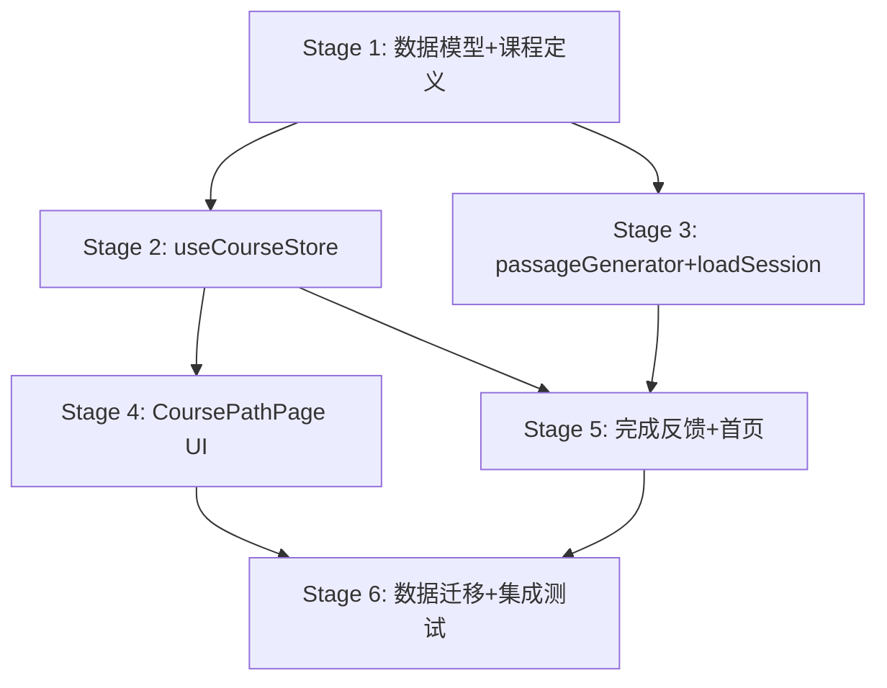

# SPEC — wordaydream v2.3.0 课程化重构

## 目标

将 wordaydream 从"随机生成文章 + 词汇划线"演进为"有课程结构、学习路径、进度编排"的课程化产品,让用户感受到明确的学习方向和进度感。

**核心问题**:当前用户打开应用 → 选语言/难度 → 生成一篇文章。文章之间无关联,学过的词不会在后续文章中复现,用户不知道"下一步学什么"、"还要学多少才掌握 A1"、"学完 A1 是什么感觉"。

**解决思路**:引入三层 Course > Module > Lesson 数据模型,复用现有 CEFR 词表作 Module、主题池作 Lesson,新增 useCourseStore 记录课时进度,完成判定让用户有"课时完成"的明确反馈。

## 范围

### 包含 (v2.3.0)

1. **数据模型**:新增 `src/features/course/` 模块,定义 Course/Module/Lesson 类型 + 静态课程定义文件
2. **Store**:新增 `useCourseStore` (Zustand persist, schemaVersion=1),记录课时进度 + 解锁状态
3. **课程定义**:为英/德各生成 A1-B2 共 8 个 Module,每个 Module 含 5-8 个 Lesson(基于主题池)
4. **UI**:新增课程导航页(CoursePathPage),展示 Module/Lesson 树 + 解锁状态 + 进度
5. **流程编排**:passageGenerator 接受 `targetLemmas` 参数;loadSession 接受 `lessonId` 关联课时
6. **完成判定**:Lesson 完成 = encountered ≥ 80% + learned ≥ 50% + reviewAccuracy ≥ 70%
7. **完成反馈**:复用 graduation/ feature 做课时完成 Modal + 解锁下一课
8. **首页改造**:HomePage 增加"当前课程 + 当前课时 + 下一课"卡片
9. **数据迁移**:useWordlistStore schemaVersion 5,迁移函数把 progress 平铺到 lessonProgress

### 不包含 (留 v2.4.0+)

- 自适应路径推荐 (LLM 版)
- 课程内容创作工具 (CMS)
- 多语言对扩展 (仅 en/de)
- 课时内多媒体 (音频/视频)
- 社交/排行榜

## 实现要点 (供 Bayesian Plan 消费)

### Stage 1: 数据模型 + 静态课程定义

expect:
  - symbol: `interface Course`
    file: src/features/course/types.ts
    assert: ["含 id/sourceLanguage/targetLanguage/title/modules 字段", "modules: Module[]"]
    source: "code:research/LibreLingo skill.md + 论文6 Ponnusamy 2020"
    confidence: 0.85
  - symbol: `interface Module`
    file: src/features/course/types.ts
    assert: ["含 id/courseId/cefrLevel/title/lessons/prerequisiteModuleIds", "cefrLevel: 'A1'|'A2'|'B1'|'B2'"]
    source: "code:research/LibreLingo module.md"
    confidence: 0.85
  - symbol: `interface Lesson`
    file: src/features/course/types.ts
    assert: ["含 id/moduleId/title/theme/targetLemmas/order/completionCriteria", "targetLemmas: string[]"]
    source: "code:research/LibreLingo skill.md + 论文6"
    confidence: 0.80
  - symbol: `interface CompletionCriteria`
    file: src/features/course/types.ts
    assert: ["含 minWordsEncountered/minWordsLearned/minReviewAccuracy/requiredSessionTypes", "minWordsEncountered 默认 targetLemmas.length*0.8"]
    source: "code:research/LibreLingo + 论文5 Li et al. 分层聚合"
    confidence: 0.75
  - symbol: `courses`
    file: src/data/courses/en.ts (and de.ts)
    assert: ["导出 Course[] 静态定义", "en: 4 Module (A1-B2) 每个 5-8 Lesson", "de: 同", "Lesson.theme 取自 passageGenerator 主题池", "Lesson.targetLemmas 从 data/wordlists/{lang}/{level}.json 切片 ≤15 词"]
    source: "code:research/LibreLingo courses/README.md"
    confidence: 0.80

contract:
  - "Course.id: string (格式 '{targetLang}-from-{sourceLang}', 如 'de-from-en')"
  - "Module.id: string (格式 '{targetLang}-{cefrLower}', 如 'de-a1')"
  - "Lesson.id: string (格式 '{moduleId}-{themeSlug}', 如 'de-a1-animals')"
  - "Lesson.targetLemmas.length <= 15 (避免单课过载)"
  - "CompletionCriteria.requiredSessionTypes 至少含 'reading'"

### Stage 2: useCourseStore + 迁移

expect:
  - symbol: `useCourseStore`
    file: src/features/course/store/useCourseStore.ts
    assert: ["Zustand persist", "persist key: 'wordaydream:course'", "version: 1", "含 enrolledCourseIds/currentCourseId/currentModuleId/currentLessonId/lessonProgress", "lessonProgress: Record<string, LessonProgress>", "LessonProgress 含 status/wordsEncountered/wordsLearned/reviewAccuracy/startedAt/completedAt", "status: 'locked'|'available'|'in-progress'|'completed'"]
    source: "code:research/Anki Preset + Open edX Prerequisite"
    confidence: 0.80
  - symbol: `enrollCourse`
    file: src/features/course/store/useCourseStore.ts
    assert: ["设置 currentCourseId", "首个 Module 首个 Lesson status 改为 'available'", "其余 'locked'"]
    source: "model:inferred from Open edX Prerequisite"
    confidence: 0.65
  - symbol: `startLesson`
    file: src/features/course/store/useCourseStore.ts
    assert: ["校验 status === 'available'", "设置 currentLessonId", "status 改为 'in-progress'", "startedAt = Date.now()"]
    source: "model:inferred"
    confidence: 0.65
  - symbol: `recordEncounter`
    file: src/features/course/store/useCourseStore.ts
    assert: ["参数 (lessonId, lemma)", "wordsEncountered += 1 (lemma 去重)", "调用 checkCompletion"]
    source: "model:inferred from LibreLingo"
    confidence: 0.65
  - symbol: `recordLearning`
    file: src/features/course/store/useCourseStore.ts
    assert: ["参数 (lessonId, lemma)", "wordsLearned += 1 (去重)", "调用 checkCompletion"]
    source: "model:inferred"
    confidence: 0.65
  - symbol: `recordReview`
    file: src/features/course/store/useCourseStore.ts
    assert: ["参数 (lessonId, correct: boolean)", "更新 reviewAccuracy = correctCount / totalCount", "调用 checkCompletion"]
    source: "model:inferred"
    confidence: 0.65
  - symbol: `checkCompletion`
    file: src/features/course/store/useCourseStore.ts
    assert: ["参数 lessonId", "返回 boolean", "比对 wordsEncountered >= criteria.minWordsEncountered && wordsLearned >= minWordsLearned && reviewAccuracy >= minReviewAccuracy && requiredSessionTypes 已完成", "通过则 status='completed' + completedAt=Date.now()"]
    source: "code:research/LibreLingo Skill + 论文5 分层聚合"
    confidence: 0.75
  - symbol: `unlockNext`
    file: src/features/course/store/useCourseStore.ts
    assert: ["参数 lessonId", "返回 string|null (新解锁的 lessonId)", "查 Module.lessons 顺序找下一个 'locked' 改 'available'", "若 Module 内全部完成 → 下一 Module 首个 Lesson 解锁 (校验 prerequisiteModuleIds)"]
    source: "code:research/Open edX Prerequisite + Anki Preset"
    confidence: 0.70

contract:
  - "useCourseStore persist key: 'wordaydream:course'"
  - "useCourseStore version: 1"
  - "lessonProgress key = lessonId"
  - "recordEncounter/recordLearning 内部去重 (同一 lemma 多次只算 1)"

### Stage 3: passageGenerator 扩展 + loadSession 关联

expect:
  - symbol: `generatePassage`
    file: src/features/reading/services/passageGenerator.ts
    assert: ["新增可选参数 options.targetLemmas?: string[]", "targetLemmas 非空时注入 LLM prompt: '必须在文本中包含以下词汇: ...'", "alignmentValidator 6 步对齐后校验 targetLemmas 命中率", "命中率 < 60% 时 console.warn 但不阻塞"]
    source: "code:src/features/reading/services/passageGenerator.ts:existing"
    confidence: 0.75
  - symbol: `loadSession`
    file: src/features/reading/store/useReadingSessionStore.ts
    assert: ["新增可选参数 lessonId?: string", "lessonId 非空时 session.lessonId = lessonId", "session.passage 生成后若 lessonId 存在, 调用 useCourseStore.recordEncounter(lessonId, lemma) 对每个 token"]
    source: "model:inferred"
    confidence: 0.65
  - symbol: `ReadingSession`
    file: src/types/index.ts
    assert: ["新增可选字段 lessonId?: string"]
    source: "model:inferred"
    confidence: 0.70

contract:
  - "generatePassage 签名向后兼容 (targetLemmas 可选)"
  - "loadSession 签名向后兼容 (lessonId 可选)"
  - "ReadingSession.lessonId 可选, 旧数据无此字段不报错"

### Stage 4: 课程导航页 (CoursePathPage)

expect:
  - symbol: `CoursePathPage`
    file: src/features/course/components/CoursePathPage.tsx
    assert: ["渲染当前 Course 的 Module 列表", "每个 Module 展示 cefrLevel + title + 整体进度", "Module 展开显示 Lesson 列表", "Lesson 展示 status 图标", "点击 'available' 或 'in-progress' Lesson 跳转到 reading session", "'locked' Lesson 不可点击 + 显示锁图标", "顶部展示 currentCourseId 切换按钮"]
    source: "code:research/LibreLingo UI + Open edX outline"
    confidence: 0.70
  - symbol: `LessonCard`
    file: src/features/course/components/LessonCard.tsx
    assert: ["props: lesson + progress", "展示 lesson.title + theme 图标", "展示进度条 (wordsEncountered/targetLemmas.length)", "展示 status badge", "prefers-reduced-motion 支持"]
    source: "model:inferred"
    confidence: 0.60
  - symbol: `ModuleSection`
    file: src/features/course/components/ModuleSection.tsx
    assert: ["props: module + lessons + progress", "可折叠 (默认展开当前 Module)", "展示 Module 整体完成度", "prerequisiteModuleIds 未满足时整段禁用"]
    source: "model:inferred"
    confidence: 0.60

contract:
  - "CoursePathPage 路由 hash: '#/course'"
  - "LessonCard 点击 'available'/'in-progress' 触发 onStartLesson(lessonId)"
  - "ModuleSection 折叠状态用 localStorage 持久化"

### Stage 5: 完成反馈 + 首页改造

expect:
  - symbol: `LessonCompleteModal`
    file: src/features/course/components/LessonCompleteModal.tsx
    assert: ["Lesson 完成时弹出", "展示 '课时完成' + lesson.title", "展示统计: 遇到 X 词 / 学会 Y 词 / 正确率 Z%", "按钮 '下一课' (若有 unlockNext) 或 '返回课程'", "prefers-reduced-motion 支持"]
    source: "code:research/LibreLingo + 现有 graduation/Modal"
    confidence: 0.70
  - symbol: `CurrentLessonCard`
    file: src/features/home/CurrentLessonCard.tsx
    assert: ["HomePage 新增此组件", "展示 currentLesson.title + Module.title", "进度环: wordsLearned / targetLemmas.length", "按钮 '继续学习' → 跳转 reading session with lessonId", "无 currentLesson 时展示 '选择课程' CTA"]
    source: "model:inferred"
    confidence: 0.60
  - symbol: `HomePage`
    file: src/features/home/HomePage.tsx
    assert: ["新增 CurrentLessonCard 到仪表盘", "HeroSection 下方优先展示", "保留现有 TodayCard/ProgressRing"]
    source: "model:inferred"
    confidence: 0.65

contract:
  - "LessonCompleteModal 触发条件: useCourseStore.lessonProgress[lessonId].status === 'completed' 且本会话内未展示过"
  - "CurrentLessonCard 点击 '继续学习' 调用 loadSession(language, difficulty, lessonId)"

### Stage 6: 数据迁移 + 集成测试

expect:
  - symbol: `migrateWordlistToCourse`
    file: src/features/wordlist/store/useWordlistStore.ts
    assert: ["schemaVersion 4 → 5", "迁移函数把现有 progress[lemma] 按词汇归属分配到 lessonProgress[lessonId].wordsLearned", "无课程归属的词记入 'legacy' 桶"]
    source: "model:inferred"
    confidence: 0.55
  - symbol: `persistMigration.test.ts`
    file: src/__tests__/persistMigration.test.ts
    assert: ["新增 useCourseStore 扫描", "新增 useWordlistStore v5 迁移测试"]
    source: "code:src/__tests__/persistMigration.test.ts:existing"
    confidence: 0.75

contract:
  - "迁移后旧用户打开应用: currentCourseId=null, 引导选课"
  - "迁移幂等 (重复运行不破坏数据)"

## 风险矩阵

| 风险 | 等级 | 缓解 |
|------|------|------|
| LLM 生成不含 targetLemmas 的文章 | 中 | prompt 强约束 + 命中率 < 60% 时 console.warn 不阻塞; 完成判定用比率非绝对数 |
| 数据迁移破坏旧用户进度 | 高 | schemaVersion 增量 + 迁移函数 + persistMigration 测试 + 幂等 |
| 过度游戏化 (论文2 Mogavi 警告) | 中 | v2.3.0 不新增徽章/积分, 解锁仅用于引导顺序, 完成反馈只用 Modal 不加成就 |
| 完成判定与 FSRS 冲突 | 中 | 课时完成 ≠ FSRS graduated; 完成判定用短期指标, 长期保留交 FSRS |
| 课程定义文件过大 | 低 | 每个 Lesson targetLemmas ≤ 15, 单语言 4 Module × 6 Lesson × 15 词 = 360 词 |
| 现有 linearMode 语义冲突 | 中 | linearMode 保留为"自由模式"开关, 课程模式独立; 选课后优先课程流程 |

## Stage 依赖图

## 测试策略

| Stage | task_type | test_applicable | 框架 | 关键 cases |
|-------|-----------|----------------|------|-----------|
| 1 | config | false | — | — |
| 2 | algorithm | true | vitest | T01 checkCompletion 三阈值; T02 unlockNext 跨 Module; T03 recordEncounter 去重 |
| 3 | cross_module_async | true | vitest | T01 loadSession lessonId 关联; T02 generatePassage targetLemmas 命中 |
| 4 | ui_component | true | vitest+RTL | T01 locked 不可点; T02 available 可点跳转; T03 Module 折叠 |
| 5 | ui_component | true | vitest+RTL | T01 Modal 触发条件; T02 CurrentLessonCard 无课时 CTA |
| 6 | config | true | vitest | T01 迁移幂等; T02 旧数据不丢失 |

## 置信度声明

- 整体 confidence: 0.78
- 高置信 (≥0.80): Stage 1 数据模型 (LibreLingo 强参考)
- 中置信 (0.65-0.79): Stage 2-3 Store + Generator (推断为主)
- 低置信 (0.55-0.64): Stage 4-5 UI 组件 (设计偏好) + Stage 6 迁移 (需实际测试)

## 外部参考

- **LibreLingo** (https://github.com/LibreLingo/LibreLingo) — Course/Module/Skill 三层结构
- **Anki Preset** (https://docs.ankiweb.net/deck-options.html) — 牌组选项预设
- **Open edX** (https://github.com/openedx/openedx-platform) — Prerequisite 解锁条件
- **论文 5**: Li et al. 2018 — 分层认知诊断模型
- **论文 6**: Ponnusamy 2020 — 语境化词汇学习
- **论文 2**: Mogavi 2022 — 游戏化警告 (克制原则)

完整研究报告: [[cache/v2.3.0/research/external-research-report]]